# Procesos y Flujos — Sistema de Mantención Preventiva por Punto (`x_maintenance_plan`)

> **Propósito:** documento técnico-funcional que grafica, proceso por proceso, qué hace una persona (capa manual) y qué dispara el sistema (capa automática: Server Actions + Automated Actions). Complementa al `PLAN_IMPLEMENTACION.md`, que tiene el detalle de campos, código y nombres técnicos.
>
> **Audiencia:** implementador funcional, soporte y cualquiera que necesite entender "qué pasa cuando…".
>
> **Versión Odoo:** 16.0 (Studio + `base_automation`).

---

## 0. Convenciones y leyenda

### Las dos capas

| Capa        | Quién la ejecuta                              | Ejemplos                                                                                            |
| ----------- | ---------------------------------------------- | --------------------------------------------------------------------------------------------------- |
| Manual      | Una persona en la interfaz                     | Crear un plan, mover el `state` en el statusbar, apretar un botón, mover un equipo de ubicación |
| Automática | El ORM, vía Automated Action → Server Action | Generar hijas, calcular la próxima fecha, validar, registrar la bitácora                          |

### Cómo se enganchan SA y AA

- **Server Action (SA):** el *qué hacer* (código Python). No corre sola.
- **Automated Action (AA):** el *cuándo* (escucha un evento del ORM y ejecuta la SA).
- Algunas SA no cuelgan de una AA sino de un **botón** del formulario (SA-03, SA-04, SA-07).

> El detalle de este enganche está en `PLAN_IMPLEMENTACION.md`, sección "Vinculación SA ↔ AA".

### Colores de los diagramas

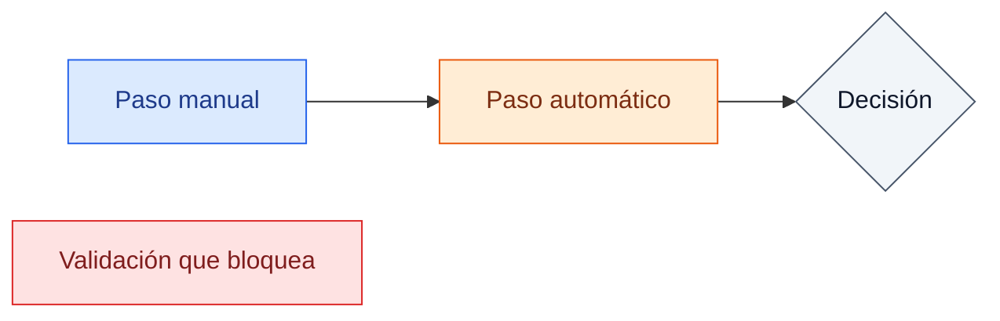
```mermaid
flowchart LR
    M["Paso manual"]:::manual
    A["Paso automático"]:::auto
    V["Validación que bloquea"]:::val
    D{"Decisión"}:::dec
    M --> A --> D
    classDef manual fill:#dbeafe,stroke:#2563eb,color:#1e3a8a;
    classDef auto fill:#ffedd5,stroke:#ea580c,color:#7c2d12;
    classDef val fill:#fee2e2,stroke:#dc2626,color:#7f1d1d;
    classDef dec fill:#f1f5f9,stroke:#475569,color:#0f172a;
```

> **Nombres:** este documento usa nombres lógicos (`plan`, `state`, `scheduled_date`, `hija`) por legibilidad. En la instancia real llevan prefijo (`x_studio_state`, `x_studio_scheduled_date`, modelo `x_plan_de_mantencion_p`, bitácora `x_bitacora_de_movimien`). La tabla de transposición está en `PLAN_IMPLEMENTACION.md`.

---

## 1. Mapa general del sistema

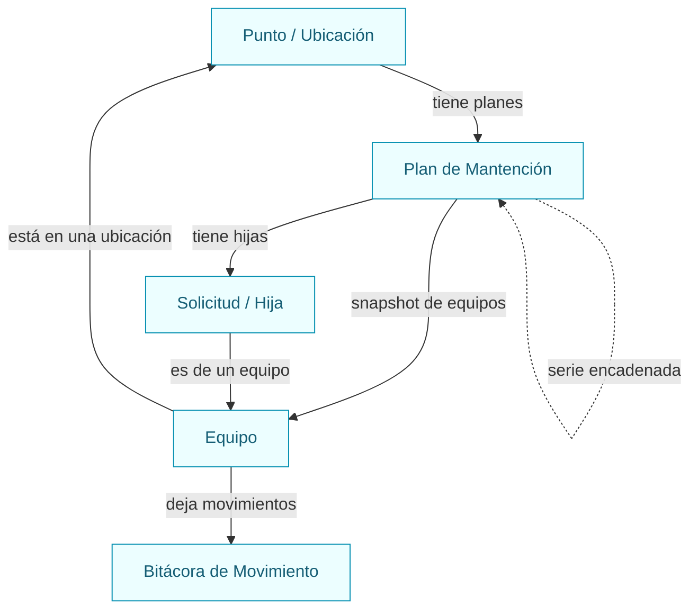
```mermaid
flowchart TD
    LOC["Punto / Ubicación"]:::ent
    PLAN["Plan de Mantención"]:::ent
    REQ["Solicitud / Hija"]:::ent
    EQ["Equipo"]:::ent
    MOV["Bitácora de Movimiento"]:::ent

    LOC -->|"tiene planes"| PLAN
    PLAN -->|"snapshot de equipos"| EQ
    PLAN -->|"tiene hijas"| REQ
    REQ -->|"es de un equipo"| EQ
    EQ -->|"está en una ubicación"| LOC
    EQ -->|"deja movimientos"| MOV
    PLAN -.->|"serie encadenada"| PLAN

    classDef ent fill:#ecfeff,stroke:#0891b2,color:#155e75;
```

| Entidad                 | Modelo                     | Rol                                                                      |
| ----------------------- | -------------------------- | ------------------------------------------------------------------------ |
| Punto / Ubicación      | `x_maintenance_location` | Dónde viven los equipos; guarda el contrato (inicio/fin)                |
| Plan de Mantención     | `x_maintenance_plan`     | Una**ocurrencia** de una **serie** de mantenciones del punto |
| Solicitud / Hija        | `maintenance.request`    | El trabajo concreto sobre un equipo, dentro de un plan                   |
| Equipo                  | `maintenance.equipment`  | El instrumento (sonda, etc.)                                             |
| Bitácora de Movimiento | `x_equipment_movement`   | Historial de dónde estuvo cada equipo                                   |

**Idea central:** el plan es del **punto**, no del equipo. Cada plan es una ocurrencia de una serie (cadena `previous/next_plan_id` con un `series_id` común). La serie avanza al **cerrar** una ocurrencia, no al crearla.

---

## 2. Ciclo de vida del plan

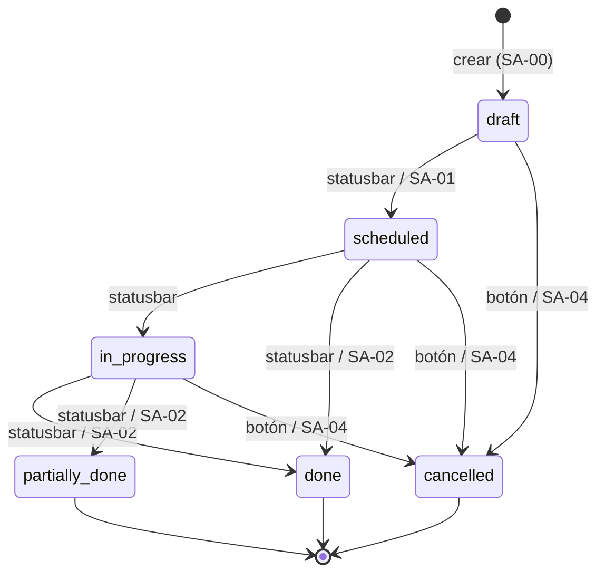
```mermaid
stateDiagram-v2
    [*] --> draft: crear (SA-00)
    draft --> scheduled: statusbar / SA-01
    scheduled --> in_progress: statusbar
    scheduled --> done: statusbar / SA-02
    in_progress --> done: statusbar / SA-02
    in_progress --> partially_done: statusbar / SA-02
    draft --> cancelled: botón / SA-04
    scheduled --> cancelled: botón / SA-04
    in_progress --> cancelled: botón / SA-04
    done --> [*]
    partially_done --> [*]
    cancelled --> [*]
```

| Transición                         | Qué dispara                                                                  |
| ----------------------------------- | ----------------------------------------------------------------------------- |
| `→ scheduled`                    | SA-01: congela el snapshot y genera las hijas                                 |
| `→ done` / `→ partially_done` | SA-02: cascada (próxima ocurrencia) y, si es parcial, arrastre de pendientes |
| `→ cancelled` (botón)           | SA-04: archiva hijas, puentea la cadena, cierra la serie                      |
| `→ in_progress`                  | Nada                                                                          |

> Las validaciones (SA-C01 a SA-C06) corren en cada guardado y pueden bloquearlo (ver §11).

---

## 3. P1 — Crear el plan

**Disparador:** una persona crea el registro del plan.

| Capa manual                                                     | Capa automática           |
| --------------------------------------------------------------- | -------------------------- |
| Elegir punto, fecha, frecuencia, slack y responsables. Guardar. | AA-00 (On Create) → SA-00 |

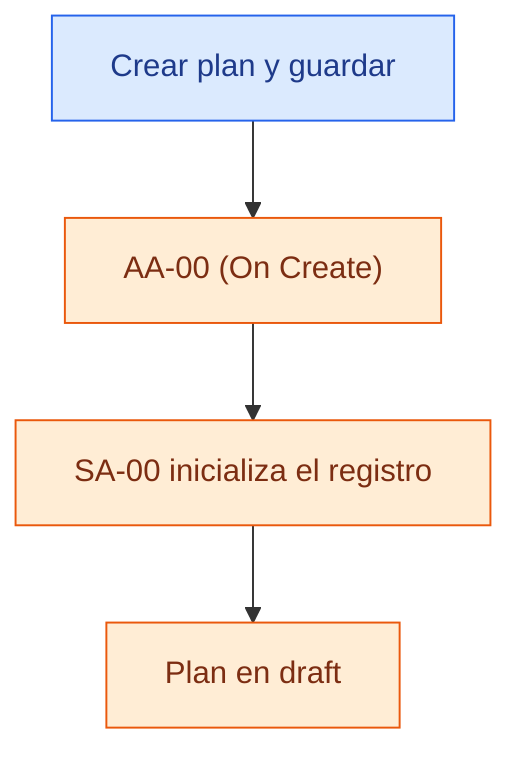
```mermaid
flowchart TD
    A["Crear plan y guardar"]:::manual
    B["AA-00 (On Create)"]:::auto
    C["SA-00 inicializa el registro"]:::auto
    D["Plan en draft"]:::auto
    A --> B --> C --> D
    classDef manual fill:#dbeafe,stroke:#2563eb,color:#1e3a8a;
    classDef auto fill:#ffedd5,stroke:#ea580c,color:#7c2d12;
```

**SA-00 completa, después del insert:** `series_id` (de una secuencia), `seq_in_series = 1`, `original_scheduled_date` y `name` con el patrón `PMP-{año}-{nnnn} / {punto}`.

> El `name` se asigna después de crear el registro; por eso el campo no es obligatorio (default `'New'` mientras tanto).

---

## 4. P2 — Programar el plan y generar hijas

**Disparador:** la persona mueve el `state` a `scheduled`.

| Capa manual                | Capa automática |
| -------------------------- | ---------------- |
| Statusbar →`scheduled`. | AA-01 → SA-01   |

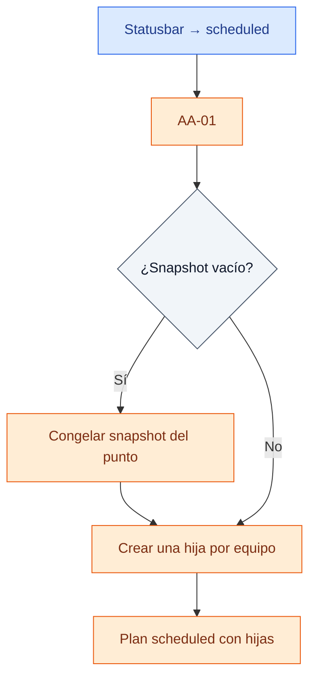
```mermaid
flowchart TD
    A["Statusbar → scheduled"]:::manual
    B["AA-01"]:::auto
    C{"¿Snapshot vacío?"}:::dec
    D["Congelar snapshot del punto"]:::auto
    E["Crear una hija por equipo"]:::auto
    G["Plan scheduled con hijas"]:::auto
    A --> B --> C
    C -->|Sí| D --> E
    C -->|No| E
    E --> G
    classDef manual fill:#dbeafe,stroke:#2563eb,color:#1e3a8a;
    classDef auto fill:#ffedd5,stroke:#ea580c,color:#7c2d12;
    classDef dec fill:#f1f5f9,stroke:#475569,color:#0f172a;
```

**Qué hace SA-01:**

1. **Congela el snapshot:** busca los equipos activos cuya ubicación es el punto y los guarda en el plan. Los equipos en servicio externo (Laboratorio 593 o Bodega 594) no están en el punto, así que quedan fuera por sí solos.
2. **Crea las hijas:** una `maintenance.request` por equipo del snapshot, con la fecha del plan y los responsables.
3. **Etiqueta:** cada hija nace con `tipo_de_trabajo = 'Mantención Preventiva'`.

> El snapshot se toma **en este momento**, contra la realidad del punto al programar. Esa es la razón por la que las ocurrencias proyectadas (§8) esperan en `draft` hasta que se las programa.

---

## 5. P3 — Ejecutar y cerrar el plan (cascada de la serie)

Es el corazón del sistema. La parte manual es el trabajo del técnico; la automática es la cascada (SA-02).

### 5.1 Capa manual

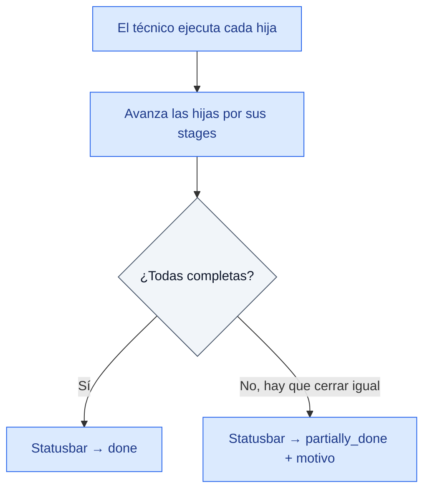
```mermaid
flowchart TD
    A["El técnico ejecuta cada hija"]:::manual
    B["Avanza las hijas por sus stages"]:::manual
    C{"¿Todas completas?"}:::dec
    D["Statusbar → done"]:::manual
    E["Statusbar → partially_done + motivo"]:::manual
    A --> B --> C
    C -->|Sí| D
    C -->|No, hay que cerrar igual| E
    classDef manual fill:#dbeafe,stroke:#2563eb,color:#1e3a8a;
    classDef dec fill:#f1f5f9,stroke:#475569,color:#0f172a;
```

> Cerrar como `done` con hijas pendientes lo bloquea SA-C05. Cerrar como `partially_done` sin motivo lo bloquea SA-C03 (§11).

### 5.2 Capa automática — SA-02 (cascada)

**Disparador:** AA-02 (state → `done` o `partially_done`).

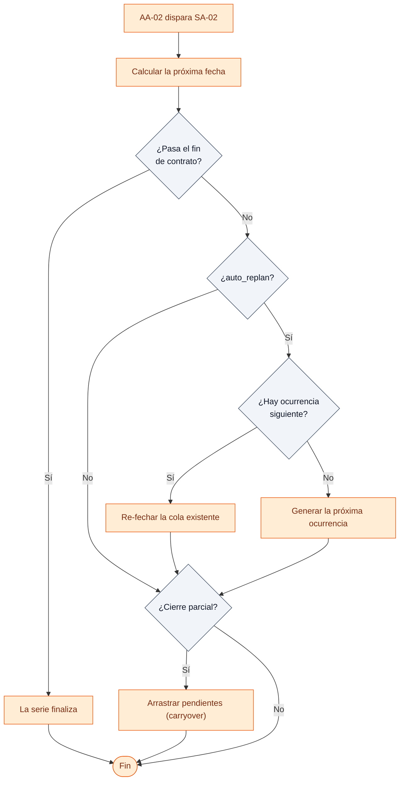
```mermaid
flowchart TD
    A["AA-02 dispara SA-02"]:::auto
    B["Calcular la próxima fecha"]:::auto
    G{"¿Pasa el fin<br/>de contrato?"}:::dec
    H["La serie finaliza"]:::auto
    I{"¿auto_replan?"}:::dec
    J{"¿Hay ocurrencia<br/>siguiente?"}:::dec
    K["Re-fechar la cola existente"]:::auto
    L["Generar la próxima ocurrencia"]:::auto
    M{"¿Cierre parcial?"}:::dec
    N["Arrastrar pendientes (carryover)"]:::auto
    Z(["Fin"]):::auto

    A --> B --> G
    G -->|Sí| H --> Z
    G -->|No| I
    I -->|No| M
    I -->|Sí| J
    J -->|Sí| K --> M
    J -->|No| L --> M
    M -->|Sí| N --> Z
    M -->|No| Z
    classDef auto fill:#ffedd5,stroke:#ea580c,color:#7c2d12;
    classDef dec fill:#f1f5f9,stroke:#475569,color:#0f172a;
```

**Cómo calcula la próxima fecha:**

1. Si no hay `close_date`, usa hoy.
2. Si el cierre cae dentro del slack, parte de `scheduled_date`; si cae fuera, parte de `close_date` (cadencia deslizada).
3. Suma la frecuencia y ajusta al primer día hábil del calendario laboral.

**Qué pasa después:**

- **Fin de contrato:** si la próxima fecha supera `contract_end_date`, la serie finaliza con un aviso en el chatter y no se genera nada más.
- **Hay cola pre-generada (SA-07):** re-fecha la ocurrencia siguiente y desliza el resto de la cola en bloque; lo que quede más allá del contrato se cancela.
- **No hay cola:** genera la próxima ocurrencia con `copy()` (en `draft`, mismo `series_id`, `seq + 1`, snapshot vacío).
- **Cierre parcial:** arrastra las hijas pendientes a la ocurrencia siguiente (carryover) y archiva las originales.

### 5.3 Secuencia de un cierre que genera la siguiente ocurrencia

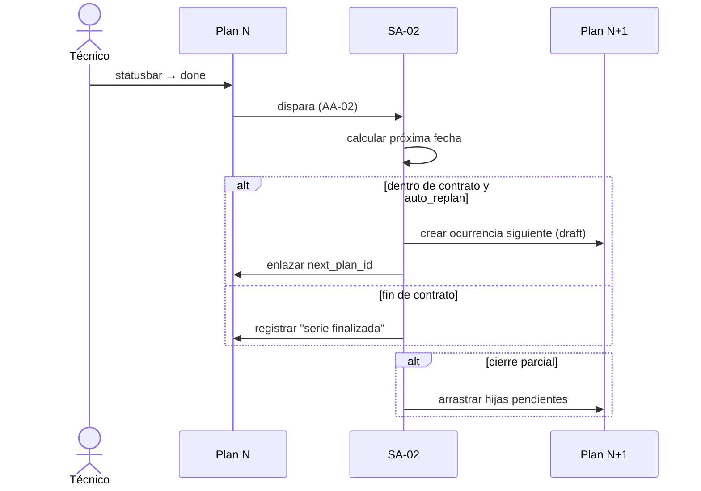
```mermaid
sequenceDiagram
    actor T as Técnico
    participant P as Plan N
    participant SA as SA-02
    participant P2 as Plan N+1

    T->>P: statusbar → done
    P->>SA: dispara (AA-02)
    SA->>SA: calcular próxima fecha
    alt dentro de contrato y auto_replan
        SA->>P2: crear ocurrencia siguiente (draft)
        SA->>P: enlazar next_plan_id
    else fin de contrato
        SA->>P: registrar "serie finalizada"
    end
    alt cierre parcial
        SA->>P2: arrastrar hijas pendientes
    end
```

> Cada ocurrencia dispara su **propia** cascada cuando ella cierra; la serie no se recalcula sola hacia adelante. El re-fechado de la cola (cuando existe) solo ajusta fechas, sin volver a crear planes.

---

## 6. P4 — Cancelar el plan

**Disparador:** botón "Cancelar" del formulario → SA-04. Mover el statusbar a `cancelled` a mano **no** ejecuta esta lógica.

| Capa manual                                       | Capa automática |
| ------------------------------------------------- | ---------------- |
| Apretar el botón "Cancelar" (con confirmación). | SA-04            |

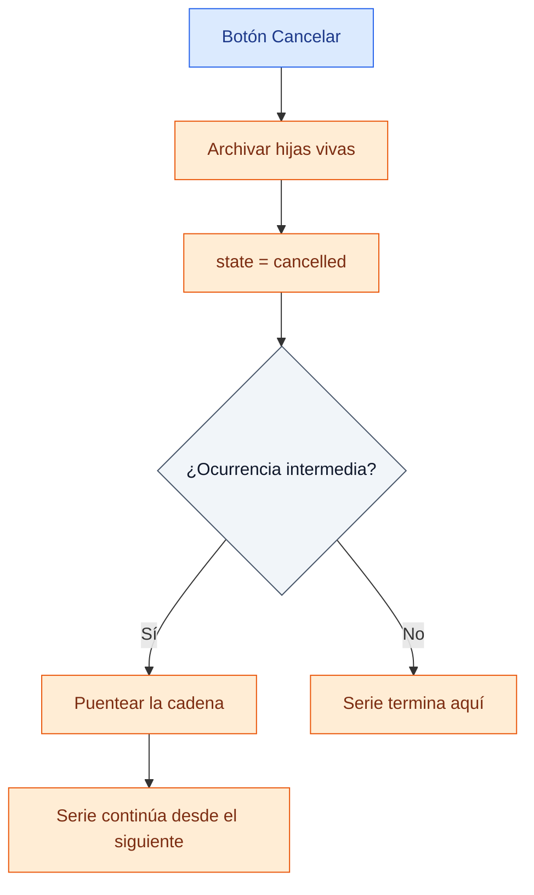
```mermaid
flowchart TD
    A["Botón Cancelar"]:::manual
    B["Archivar hijas vivas"]:::auto
    C["state = cancelled"]:::auto
    E{"¿Ocurrencia intermedia?"}:::dec
    F["Puentear la cadena"]:::auto
    G["Serie continúa desde el siguiente"]:::auto
    H["Serie termina aquí"]:::auto
    A --> B --> C --> E
    E -->|Sí| F --> G
    E -->|No| H
    classDef manual fill:#dbeafe,stroke:#2563eb,color:#1e3a8a;
    classDef auto fill:#ffedd5,stroke:#ea580c,color:#7c2d12;
    classDef dec fill:#f1f5f9,stroke:#475569,color:#0f172a;
```

- **Ocurrencia intermedia** (tiene anterior y siguiente): SA-04 reconecta `previous ↔ next` para que la serie no quede trabada.
- **Cabeza de la serie** (no tiene siguiente): la serie termina ahí.

> Cancelar no genera la siguiente ocurrencia. Para continuar después de cancelar la cabeza: crear un plan nuevo (serie nueva) o usar "Proyectar serie".

---

## 7. P5 — Sincronizar con el punto

**Disparador:** botón "Sync con punto" → SA-03. Es la herramienta para reconciliar el snapshot del plan con los equipos que hay realmente en el punto. **Es la pieza clave para operar los cambios de equipos** (ver §10).

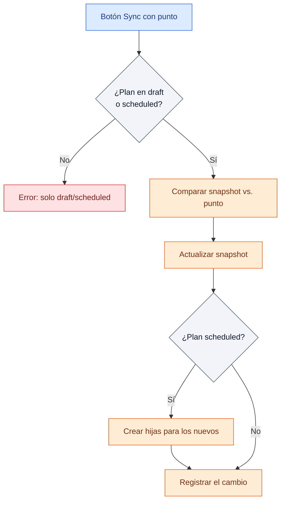
```mermaid
flowchart TD
    A["Botón Sync con punto"]:::manual
    B{"¿Plan en draft<br/>o scheduled?"}:::dec
    X["Error: solo draft/scheduled"]:::val
    C["Comparar snapshot vs. punto"]:::auto
    E["Actualizar snapshot"]:::auto
    F{"¿Plan scheduled?"}:::dec
    G["Crear hijas para los nuevos"]:::auto
    H["Registrar el cambio"]:::auto
    A --> B
    B -->|No| X
    B -->|Sí| C --> E --> F
    F -->|Sí| G --> H
    F -->|No| H
    classDef manual fill:#dbeafe,stroke:#2563eb,color:#1e3a8a;
    classDef auto fill:#ffedd5,stroke:#ea580c,color:#7c2d12;
    classDef val fill:#fee2e2,stroke:#dc2626,color:#7f1d1d;
    classDef dec fill:#f1f5f9,stroke:#475569,color:#0f172a;
```

**Qué hace SA-03:**

- Calcula **faltantes** (están en el punto pero no en el snapshot) y **sobrantes** (están en el snapshot pero ya no en el punto).
- Actualiza el snapshot a los equipos actuales y sella `last_sync_with_location`.
- Si el plan está `scheduled`, crea hijas para los faltantes.
- Las hijas de los equipos sobrantes **no se borran**: se conservan y se registra el cambio en el chatter.

---

## 8. P6 — Proyectar la serie

**Disparador:** botón "Proyectar serie" → SA-07. Pre-genera las ocurrencias futuras en `draft`, sin hijas ni snapshot, para que la carta Gantt muestre el plan completo del contrato.

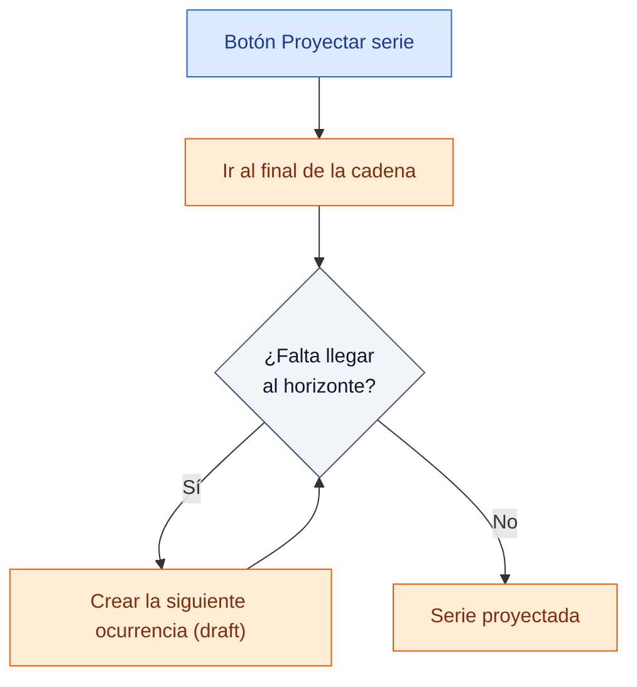
```mermaid
flowchart TD
    A["Botón Proyectar serie"]:::manual
    B["Ir al final de la cadena"]:::auto
    C{"¿Falta llegar<br/>al horizonte?"}:::dec
    D["Crear la siguiente ocurrencia (draft)"]:::auto
    F["Serie proyectada"]:::auto
    A --> B --> C
    C -->|Sí| D --> C
    C -->|No| F
    classDef manual fill:#dbeafe,stroke:#2563eb,color:#1e3a8a;
    classDef auto fill:#ffedd5,stroke:#ea580c,color:#7c2d12;
    classDef dec fill:#f1f5f9,stroke:#475569,color:#0f172a;
```

- **Horizonte:** hasta `contract_end_date` si el punto tiene contrato, o 12 ocurrencias si no. Tope duro de seguridad: 60.
- **Idempotente:** re-ejecutar no duplica; solo completa lo que falte.
- Las hijas de cada ocurrencia nacen recién cuando esa ocurrencia pasa a `scheduled` (§4).

---

## 9. P7 — Reprogramar la fecha del plan

**Disparador:** la persona edita `scheduled_date` en un plan `draft` o `scheduled` → AA-03 → SA-06. También lo usa la cascada cuando re-fecha una ocurrencia.

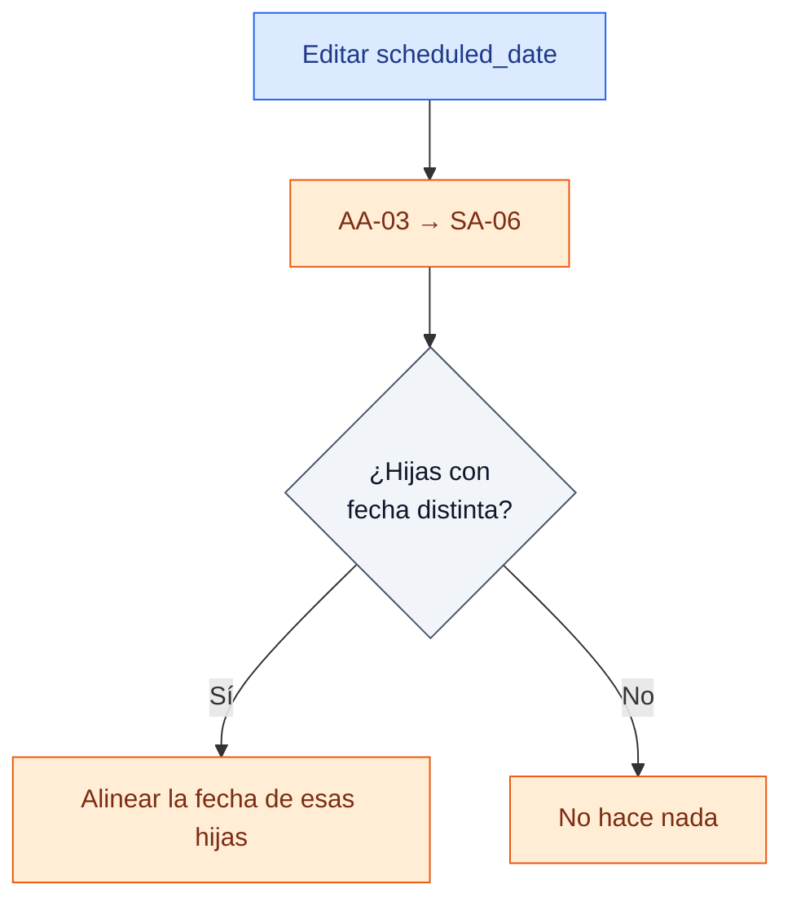
```mermaid
flowchart TD
    A["Editar scheduled_date"]:::manual
    B["AA-03 → SA-06"]:::auto
    D{"¿Hijas con<br/>fecha distinta?"}:::dec
    E["Alinear la fecha de esas hijas"]:::auto
    F["No hace nada"]:::auto
    A --> B --> D
    D -->|Sí| E
    D -->|No| F
    classDef manual fill:#dbeafe,stroke:#2563eb,color:#1e3a8a;
    classDef auto fill:#ffedd5,stroke:#ea580c,color:#7c2d12;
    classDef dec fill:#f1f5f9,stroke:#475569,color:#0f172a;
```

> AA-03 dispara ante cualquier guardado del plan, pero SA-06 se autofiltra: solo escribe en las hijas cuya fecha difiere de la del plan. Es el único punto que propaga la fecha a las hijas.

---

## 10. Gestión de equipos y movimientos

Este capítulo es crítico: los equipos no son fijos. Salen a calibrar, se dañan, se reasignan, se dan de baja y se reemplazan. Acá se explica **qué hace el operario** ante cada situación y **qué hace el sistema** en consecuencia.

### 10.1 Las ubicaciones y lo que significan

Toda la gestión gira en torno al campo `x_studio_location` del equipo. Hay tres tipos de ubicación:

| Ubicación                           | Significado                                                                                                         | ¿Participa de los planes?                   |
| ------------------------------------ | ------------------------------------------------------------------------------------------------------------------- | -------------------------------------------- |
| Un**punto**                    | El equipo está instalado y operando en terreno                                                                     | Sí: entra al snapshot del plan de ese punto |
| **Laboratorio Metrocal (593)** | Servicio externo de calibración                                                                                    | No: está fuera de todo punto                |
| **Bodega cliente (594)**       | Stock / no instalado. Es también la ubicación por defecto al crear un equipo, y el destino de "daño/reparación" | No: está fuera de todo punto                |

> Mientras un equipo esté en 593 o 594, simplemente no está en ningún punto y queda fuera de los snapshots por sí solo. No hace falta ningún campo "en servicio externo".

### 10.2 Regla de oro operativa

**Cambiar la ubicación de un equipo solo actualiza la bitácora de movimientos de forma automática. No toca el snapshot ni las hijas de los planes ya programados.**

Para reflejar el cambio en un plan en curso, el operario debe correr **"Sync con punto"** (§7) en ese plan. Esta separación es deliberada: el snapshot es una foto congelada del compromiso, y se actualiza solo cuando alguien lo decide.

### 10.3 Mapa de movimientos

Cada flecha es un cambio de `x_studio_location`, y la etiqueta es el motivo (`reason`) que el sistema infiere y guarda en la bitácora.

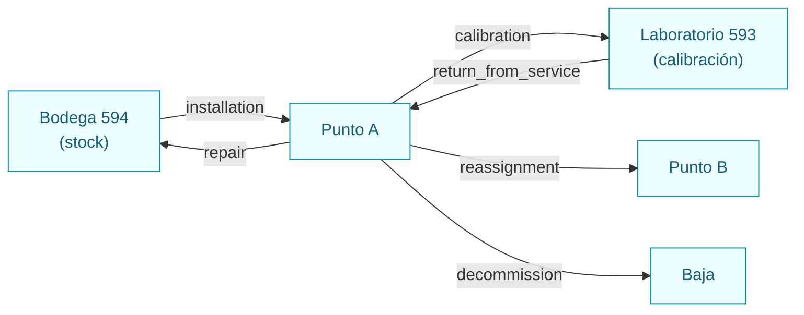
```mermaid
flowchart LR
    STOCK["Bodega 594<br/>(stock)"]:::loc
    LAB["Laboratorio 593<br/>(calibración)"]:::loc
    P1["Punto A"]:::loc
    P2["Punto B"]:::loc
    OUT["Baja"]:::loc

    STOCK -->|installation| P1
    P1 -->|calibration| LAB
    LAB -->|return_from_service| P1
    P1 -->|repair| STOCK
    P1 -->|reassignment| P2
    P1 -->|decommission| OUT
    classDef loc fill:#ecfeff,stroke:#0891b2,color:#155e75;
```

### 10.4 Cómo el sistema registra el movimiento

**Disparador:** cualquier cambio de `x_studio_location` (manual desde Studio, o vía el pipeline `pipeline_registro_II`) → AA-06 → SA-09.

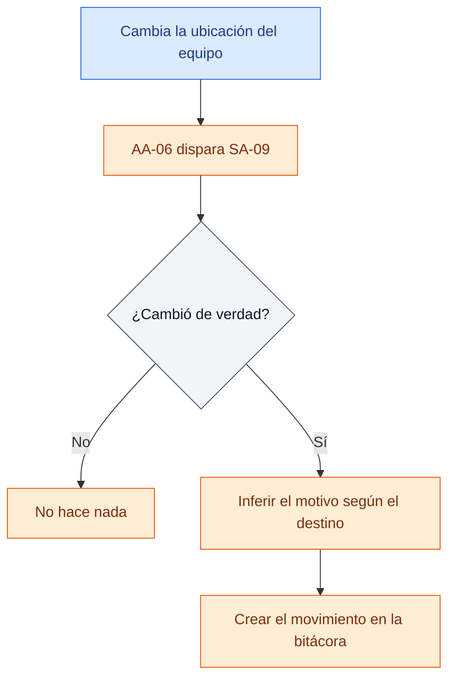
```mermaid
flowchart TD
    A["Cambia la ubicación del equipo"]:::manual
    B["AA-06 dispara SA-09"]:::auto
    C{"¿Cambió de verdad?"}:::dec
    E["No hace nada"]:::auto
    F["Inferir el motivo según el destino"]:::auto
    H["Crear el movimiento en la bitácora"]:::auto
    A --> B --> C
    C -->|No| E
    C -->|Sí| F --> H
    classDef manual fill:#dbeafe,stroke:#2563eb,color:#1e3a8a;
    classDef auto fill:#ffedd5,stroke:#ea580c,color:#7c2d12;
    classDef dec fill:#f1f5f9,stroke:#475569,color:#0f172a;
```

**Cómo infiere el motivo** (según de dónde venía y a dónde va):

| Destino                                       | Motivo (`reason`)     |
| --------------------------------------------- | ----------------------- |
| Laboratorio (593)                             | `calibration`         |
| Bodega (594)                                  | `repair`              |
| Un punto, viniendo de Lab o Bodega            | `return_from_service` |
| Un punto, viniendo de otro punto              | `reassignment`        |
| Un punto, sin movimiento previo (desde stock) | `installation`        |
| Sin destino (se vacía la ubicación)         | `decommission`        |

> El movimiento se registra como hecho consumado (`date_in = date_out = hoy`, estado `completed`). No existe un estado "en tránsito". El nombre del movimiento (`MOV-{año}-{nnnn}`) lo pone SA-MOV-00 al crearse.

### 10.5 Escenarios operativos

Para cada situación real: qué hace el operario, qué registra el sistema y qué hacer con el plan.

| Situación                                       | Acción del operario                    | El sistema registra                 | Qué hacer con el plan                                                                                    |
| ------------------------------------------------ | --------------------------------------- | ----------------------------------- | --------------------------------------------------------------------------------------------------------- |
| **Instalar un equipo nuevo** (desde stock) | Mover su ubicación al punto            | Movimiento `installation`         | Si el plan del punto está `scheduled`, correr "Sync con punto" para sumarlo al snapshot y crearle hija |
| **Enviar a calibrar**                      | Mover la ubicación a Laboratorio (593) | Movimiento `calibration`          | Sale del punto. Su hija del plan en curso queda pendiente hasta que vuelva (ver 10.6)                     |
| **Recibir de calibración**                | Mover la ubicación de vuelta al punto  | Movimiento `return_from_service`  | Correr "Sync con punto" para reincorporarlo si hace falta                                                 |
| **Equipo dañado**                         | Mover la ubicación a Bodega (594)      | Movimiento `repair`               | Sale del punto; se gestiona el reemplazo aparte                                                           |
| **Reasignar a otro punto**                 | Mover la ubicación al punto B          | Movimiento `reassignment`         | Correr "Sync con punto" en el plan del punto B                                                            |
| **Dar de baja**                            | Vaciar la ubicación                    | Movimiento `decommission`         | Sale de todos los snapshots                                                                               |
| **Reemplazo (sale B, entra B')**           | Instalar B' en el punto                 | Movimiento `installation` para B' | Correr "Sync con punto": entra B' (con hija nueva); la hija de B queda como sobrante y se gestiona a mano |

> Sobre el reemplazo: la idea de que el equipo entrante "herede" automáticamente las solicitudes del saliente se evaluó y se **descartó**. Hoy el reemplazo se opera con "Sync con punto", de forma explícita.

### 10.6 Caso destacado: ciclo de calibración (ida y vuelta)

Es el movimiento más frecuente y el que más conviene tener claro.

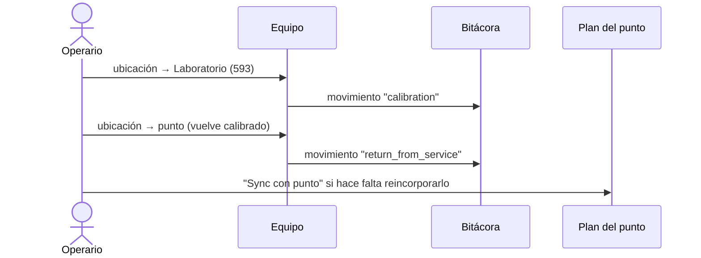
```mermaid
sequenceDiagram
    actor O as Operario
    participant E as Equipo
    participant B as Bitácora
    participant PL as Plan del punto

    O->>E: ubicación → Laboratorio (593)
    E->>B: movimiento "calibration"
  
    O->>E: ubicación → punto (vuelve calibrado)
    E->>B: movimiento "return_from_service"
    O->>PL: "Sync con punto" si hace falta reincorporarlo
```

**Efecto sobre el trabajo en curso:** si el plan ya estaba `scheduled`, la hija del equipo se creó antes de la salida. Si el equipo no volvió a tiempo para cerrar el plan, esa hija queda pendiente y se arrastra como carryover al cerrar el plan como `partially_done` (§5).

### 10.7 Puesta en marcha (go-live)

Antes de activar AA-06, hay que sembrar la bitácora con un movimiento inicial por equipo, **excepto** los que estén en Bodega (594): esos representan stock y los cubre el sistema con un baseline implícito. El detalle del script está en `PLAN_IMPLEMENTACION.md`, sección 3.bis.5-bis.

> El `period` nativo del equipo (su ciclo de calibración propio) no se toca en ningún movimiento: corre en paralelo a las hijas del plan.

---

## 11. P8 — Validaciones que bloquean un guardado

En Odoo 16 no hay disparador "antes de guardar". Cada restricción es una SA que hace `raise UserError`, disparada por una AA en cada creación o edición. Si el `raise` ocurre, se revierte todo el guardado.

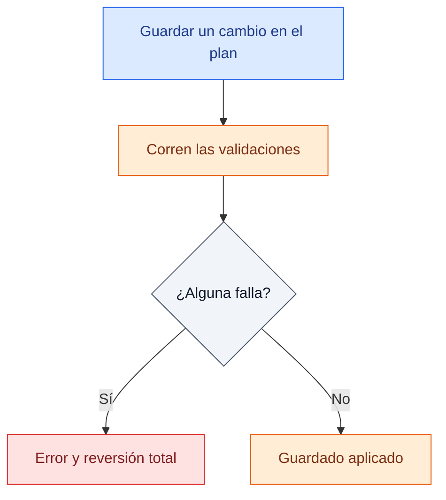
```mermaid
flowchart TD
    A["Guardar un cambio en el plan"]:::manual
    B["Corren las validaciones"]:::auto
    C{"¿Alguna falla?"}:::dec
    NO["Error y reversión total"]:::val
    OK["Guardado aplicado"]:::auto
    A --> B --> C
    C -->|Sí| NO
    C -->|No| OK
    classDef manual fill:#dbeafe,stroke:#2563eb,color:#1e3a8a;
    classDef auto fill:#ffedd5,stroke:#ea580c,color:#7c2d12;
    classDef val fill:#fee2e2,stroke:#dc2626,color:#7f1d1d;
    classDef dec fill:#f1f5f9,stroke:#475569,color:#0f172a;
```

| Validación | Qué exige                                                                      |
| ----------- | ------------------------------------------------------------------------------- |
| SA-C01      | La frecuencia debe ser mayor a 0                                                |
| SA-C02      | El slack debe ser menor que la mitad del período base                          |
| SA-C03      | Cerrar `partially_done` exige el motivo (`force_close_reason`)              |
| SA-C04      | No solapar planes activos del mismo punto (la cascada se exceptúa con un flag) |
| SA-C05      | Cerrar `done` exige todas las hijas resueltas                                 |
| SA-C06      | No archivar un plan vivo (primero hay que cancelarlo)                           |

> Las validaciones tienen prioridad baja de ejecución, para fallar antes de que la lógica de negocio cree registros.

---

## 12. P9 — Etiquetado de las hijas nativas del equipo

Conviven dos orígenes de hijas en `maintenance.request`:

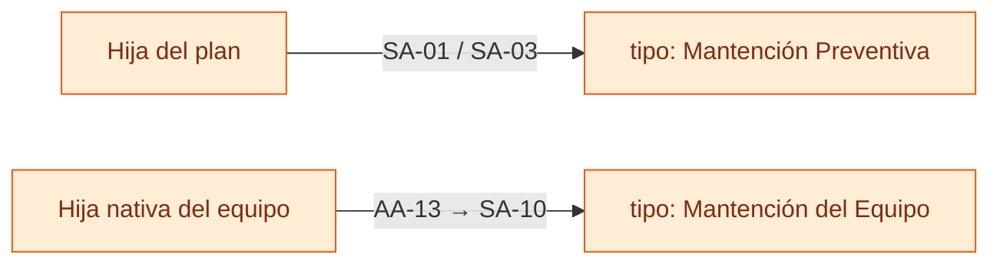
```mermaid
flowchart LR
    P["Hija del plan"]:::auto
    N["Hija nativa del equipo"]:::auto
    P -->|"SA-01 / SA-03"| TP["tipo: Mantención Preventiva"]:::auto
    N -->|"AA-13 → SA-10"| TN["tipo: Mantención del Equipo"]:::auto
    classDef auto fill:#ffedd5,stroke:#ea580c,color:#7c2d12;
```

- **Hija del plan:** la crea SA-01/SA-03 con `plan_id` y tipo "Mantención Preventiva".
- **Hija nativa:** la crea el cron del `period` del equipo (sin `plan_id`); SA-10 la etiqueta como "Mantención del Equipo".

> Así no se confunden en kanban ni en listas, y el `progress` del plan solo cuenta sus propias hijas.

---

## 13. Tabla resumen de disparadores

| Proceso              | Cómo se inicia                           | Automatización  | SA               |
| -------------------- | ----------------------------------------- | ---------------- | ---------------- |
| P1 Crear plan        | Manual (crear)                            | AA-00            | SA-00            |
| P2 Programar         | Manual (statusbar → scheduled)           | AA-01            | SA-01            |
| P3 Cerrar            | Manual (statusbar → done/partially_done) | AA-02            | SA-02            |
| P4 Cancelar          | Manual (botón)                           | —               | SA-04            |
| P5 Sync con punto    | Manual (botón)                           | —               | SA-03            |
| P6 Proyectar serie   | Manual (botón)                           | —               | SA-07            |
| P7 Reprogramar fecha | Manual (editar) o cascada                 | AA-03            | SA-06            |
| Movimiento de equipo | Manual / pipeline (cambio de ubicación)  | AA-06, AA-MOV-00 | SA-09, SA-MOV-00 |
| P8 Validaciones      | Manual (cualquier guardado)               | AA-07 a AA-12    | SA-C01 a SA-C06  |
| P9 Etiquetar nativas | Automático (cron crea hija)              | AA-13            | SA-10            |

---

## 14. Vista integral de un ciclo completo

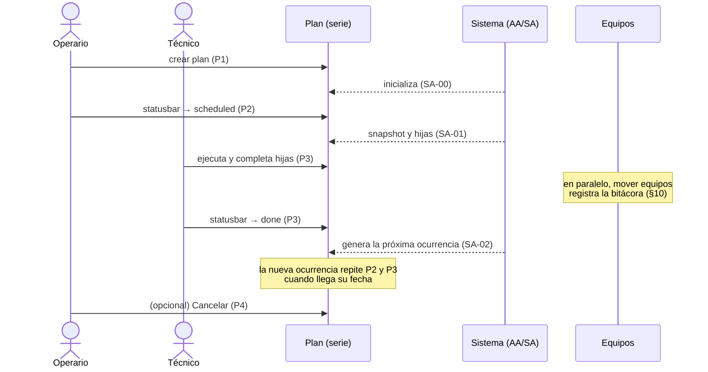
```mermaid
sequenceDiagram
    actor U as Operario
    actor T as Técnico
    participant PL as Plan (serie)
    participant SYS as Sistema (AA/SA)
    participant EQ as Equipos

    U->>PL: crear plan (P1)
    SYS-->>PL: inicializa (SA-00)
    U->>PL: statusbar → scheduled (P2)
    SYS-->>PL: snapshot y hijas (SA-01)
    T->>PL: ejecuta y completa hijas (P3)
    Note over EQ: en paralelo, mover equipos<br/>registra la bitácora (§10)
    T->>PL: statusbar → done (P3)
    SYS-->>PL: genera la próxima ocurrencia (SA-02)
    Note over PL: la nueva ocurrencia repite P2 y P3<br/>cuando llega su fecha
    U->>PL: (opcional) Cancelar (P4)
```

---

## 15. Reglas de oro

1. El plan es del punto; cada plan es una ocurrencia de una serie encadenada.
2. La serie avanza al **cerrar** (`done` o `partially_done`), nunca al crear ni al cancelar.
3. Pasar a `scheduled` congela el snapshot y genera las hijas; los equipos en Laboratorio o Bodega quedan fuera por sí solos.
4. Cambiar la ubicación de un equipo solo alimenta la bitácora; para reflejarlo en un plan hay que correr "Sync con punto".
5. Cancelar es terminal y va por botón (SA-04), no por el statusbar.
6. El contrato del punto es el límite duro: la cascada no genera ocurrencias más allá de `contract_end_date`.
7. La bitácora es solo de agregado (append-only) y se alimenta de cada cambio de ubicación.
8. Las validaciones bloquean con error y reversión, y corren primero.
9. El ciclo de calibración propio del equipo (`period`) coexiste con el plan y no se gestiona desde acá.
