# Procesos y Flujos — Sistema de Mantención Preventiva por Punto (`x_maintenance_plan`)

> **Propósito:** documento técnico-funcional que grafica, proceso por proceso, **qué hace una persona** (capa manual) y **qué dispara el sistema** (capa automática: Server Actions + Automated Actions). Complementa al `PLAN_IMPLEMENTACION.md` (que tiene el detalle de campos, código y nombres técnicos).
>
> **Audiencia:** implementador funcional, soporte, y cualquiera que necesite entender "qué pasa cuando…".
>
> **Versión Odoo:** 16.0 (Studio + `base_automation`).

---

## 0. Convenciones y leyenda

### Capas

| Capa | Quién la ejecuta | Ejemplos |
|---|---|---|
| **Manual** | Una persona en la UI | Crear un plan, mover el `state` en el statusbar, apretar un botón, mover un equipo de ubicación |
| **Automática** | El ORM, vía Automated Action → Server Action | Generar hijas, calcular la próxima fecha, validar, registrar la bitácora |

### Cómo se enganchan SA y AA

- **Server Action (SA)** = el *qué hacer* (código Python). No corre sola.
- **Automated Action (AA)** = el *cuándo* (escucha un evento del ORM y ejecuta la SA).
- Algunas SA no cuelgan de una AA sino de un **botón** del formulario (SA-03, SA-04, SA-07).

> Detalle de este enganche en `PLAN_IMPLEMENTACION.md` §"Vinculación SA ↔ AA".

### Leyenda de los diagramas

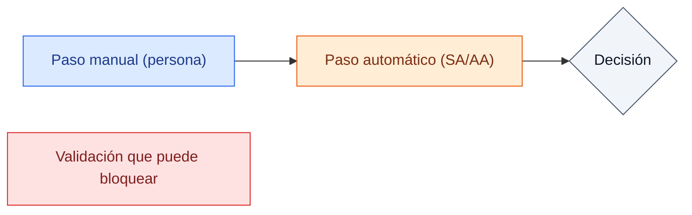

> **Naming:** este documento usa **nombres lógicos** (`plan`, `state`, `scheduled_date`, `hija`) por legibilidad. En la instancia real llevan prefijo (`x_studio_state`, `x_studio_scheduled_date`, modelo `x_plan_de_mantencion_p`, bitácora `x_bitacora_de_movimien`). Ver la tabla de transposición en `PLAN_IMPLEMENTACION.md`.

---

## 1. Mapa general del sistema

Entidades y cómo se relacionan:

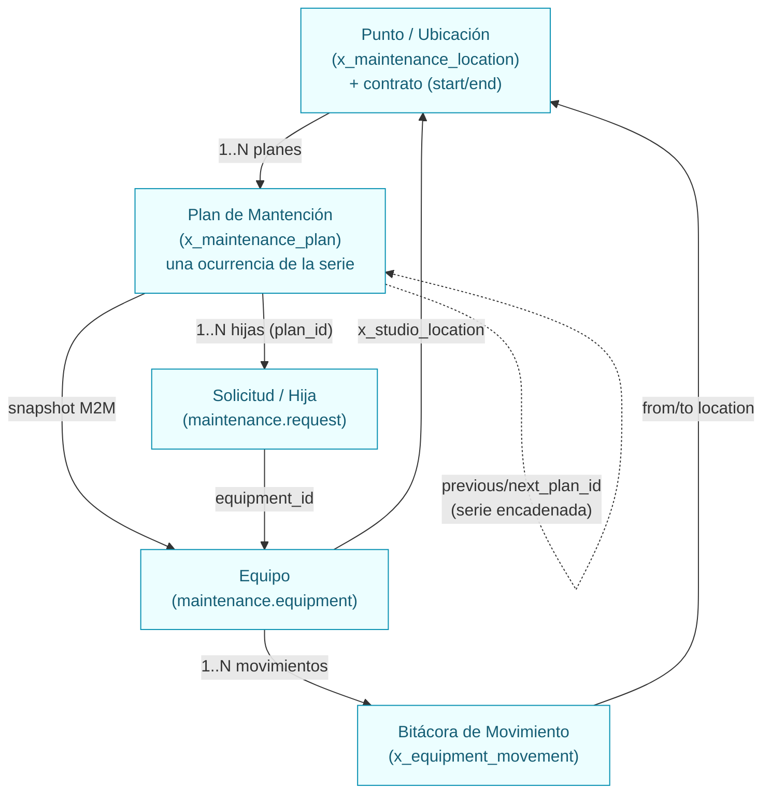

**Idea central:** el **plan es del punto**, no del equipo. Cada plan es **una ocurrencia** de una **serie** (cadena `previous/next_plan_id` con un `series_id` común). La serie avanza al **cerrar** una ocurrencia, no al crearla.

---

## 2. Ciclo de vida del plan (máquina de estados)

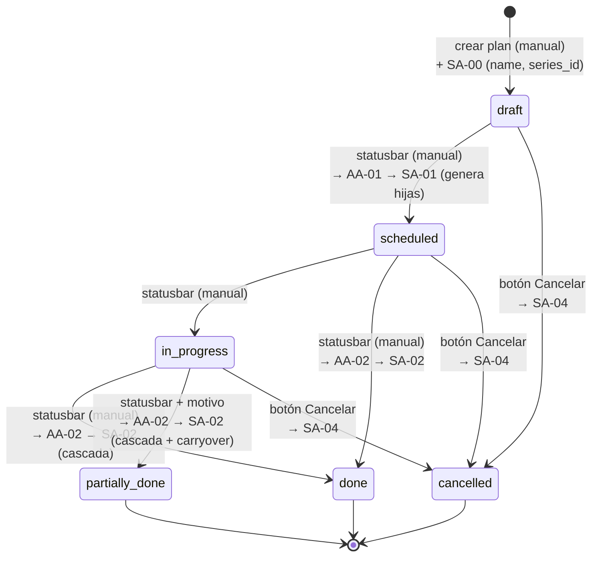

> **Transiciones que disparan automatización:** solo **`→ scheduled`** (SA-01), **`→ done`/`→ partially_done`** (SA-02) y **`→ cancelled`** vía botón (SA-04). Mover a `in_progress` no dispara nada.
>
> **Validaciones** (SA-C01…C06) corren On Create & Update sobre todo cambio y pueden **bloquear** el guardado (ver §10).

---

## 3. Proceso P1 — Crear el plan

**Disparador:** una persona crea un registro de plan.

| Capa manual | Capa automática |
|---|---|
| Elegir punto, `scheduled_date`, frecuencia, slack, responsables. Guardar. | **AA-00 (On Create) → SA-00**: asigna `series_id` (secuencia), `seq_in_series=1`, `original_scheduled_date`, y `name` (`PMP-{año}-{seq} / {punto}`). |

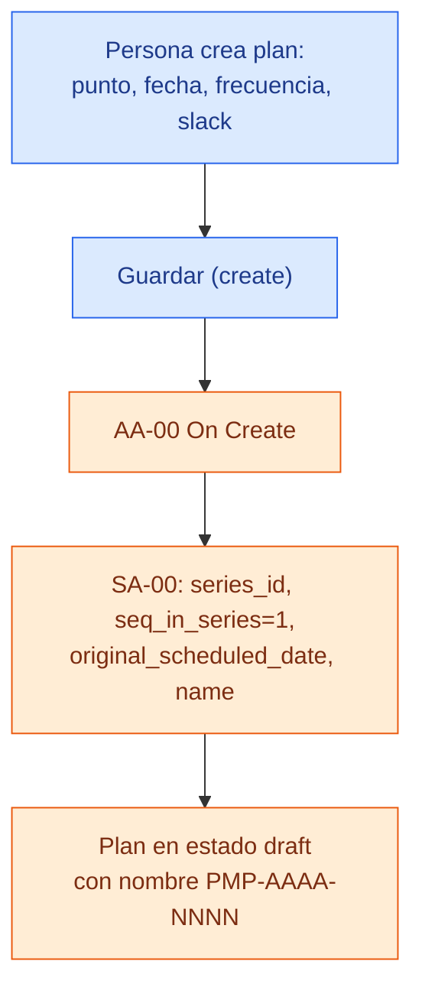

> El `name` se completa **después** del insert (por eso el campo no es Required). Default `'New'` mientras tanto.

---

## 4. Proceso P2 — Programar el plan (`→ scheduled`) y generar hijas

**Disparador:** la persona mueve el `state` a `scheduled` en el statusbar.

| Capa manual | Capa automática |
|---|---|
| Statusbar → `scheduled`. | **AA-01 → SA-01**: (1) congela el **snapshot** de equipos del punto; (2) crea una **hija** por equipo; (3) estampa `tipo_de_trabajo = 'Mantención Preventiva'`. |

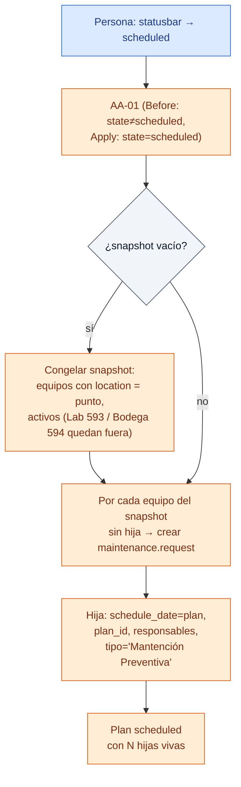

> Los equipos en **servicio externo** (Lab 593 / Bodega cliente 594) caen fuera del snapshot solos: su `x_studio_location` ya no es el punto.

---

## 5. Proceso P3 — Ejecutar y cerrar el plan (cascada de la serie)

Este es el corazón del sistema. Tiene una parte **manual** (el técnico hace el trabajo) y una **automática** muy rica (SA-02).

### 5.1 Capa manual

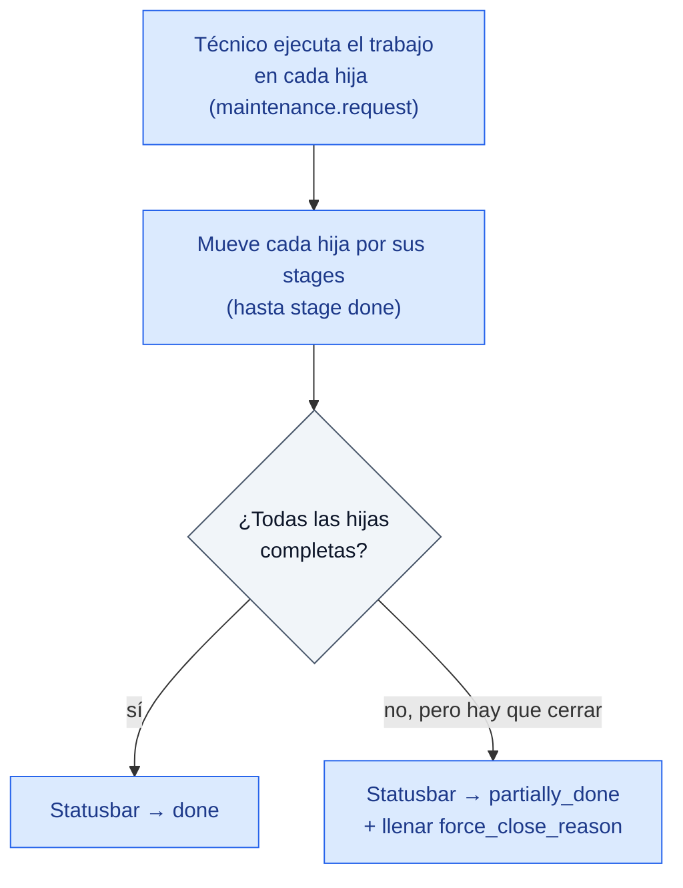

> Si intentás `done` con hijas pendientes → **SA-C05 bloquea** (ver §10). Si cerrás `partially_done` sin motivo → **SA-C03 bloquea**.

### 5.2 Capa automática — SA-02 (cascada)

**Disparador:** `AA-02` (state → `done` o `partially_done`).

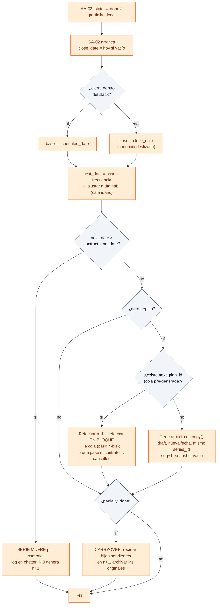

### 5.3 Secuencia completa de un cierre que genera la siguiente ocurrencia

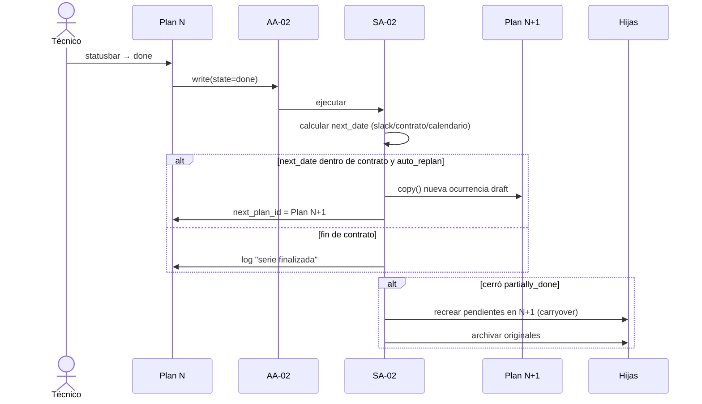

> La serie **no** se re-ejecuta sola hacia el futuro: cada ocurrencia dispara su **propia** cascada cuando *ella* cierra. El paso 4-bis solo *re-fecha* la cola ya proyectada (sin recursión).

---

## 6. Proceso P4 — Cancelar el plan

**Disparador:** **botón "Cancelar"** en el formulario → SA-04. (No hay AA; cambiar el statusbar a `cancelled` a mano **no** ejecuta esta lógica.)

| Capa manual | Capa automática |
|---|---|
| Apretar botón "Cancelar" (con confirmación). | **SA-04**: archiva hijas vivas, pone `state=cancelled`, **puentea la cadena** si era una ocurrencia intermedia, log en chatter. |

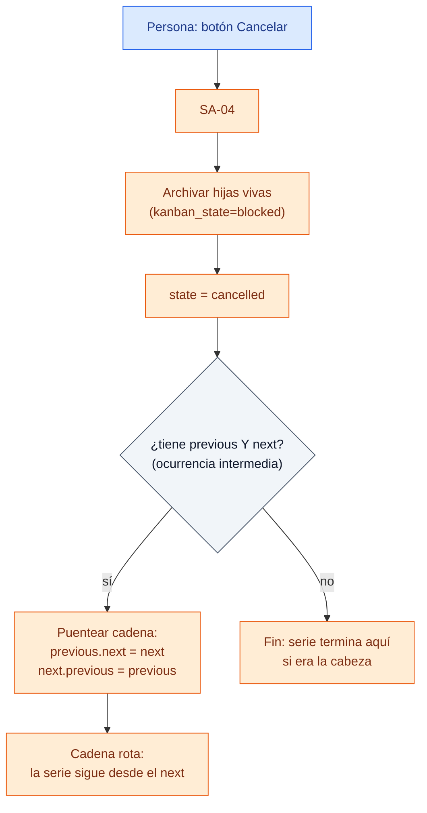

> **Cancelar NO genera la siguiente ocurrencia.** Si cancelás la última viva, la serie muere. Para continuar: crear un plan nuevo (serie nueva) o "Proyectar serie".

---

## 7. Proceso P5 — Sync con punto (reconciliar snapshot)

**Disparador:** **botón "Sync con punto"** → SA-03. Útil cuando cambiaron los equipos del punto después de programar.

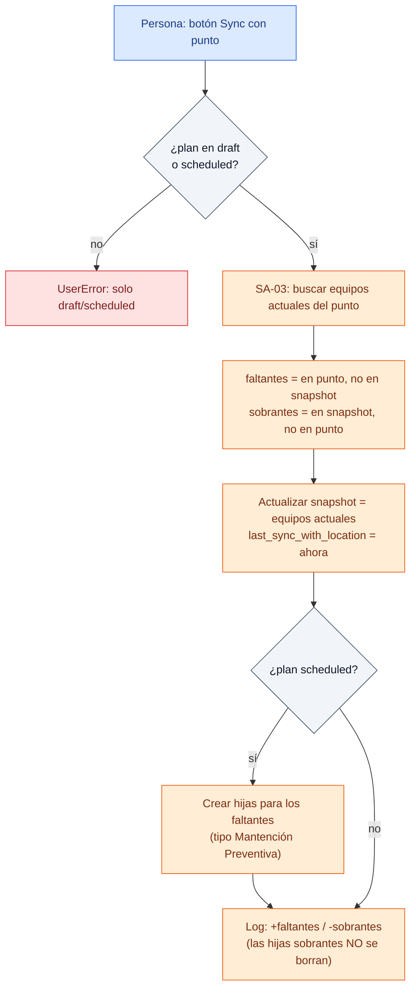

---

## 8. Proceso P6 — Proyectar serie (pre-generar ocurrencias futuras)

**Disparador:** **botón "Proyectar serie"** → SA-07. Pre-genera las ocurrencias futuras **en draft, sin hijas ni snapshot**, para que la Gantt muestre el plan completo del contrato.

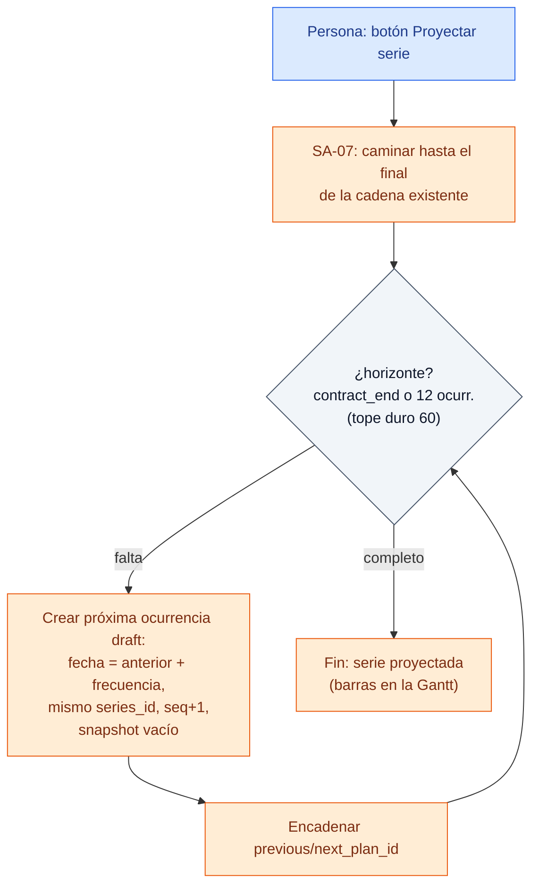

> **Idempotente:** re-ejecutar no duplica; completa solo lo que falte hasta el horizonte. Las hijas de cada ocurrencia nacen recién cuando esa ocurrencia pasa a `scheduled` (P2).

---

## 9. Proceso P7 — Reprogramar fecha del plan (propagación a hijas)

**Disparador:** la persona edita `scheduled_date` en un plan `draft`/`scheduled` → **AA-03 → SA-06**.

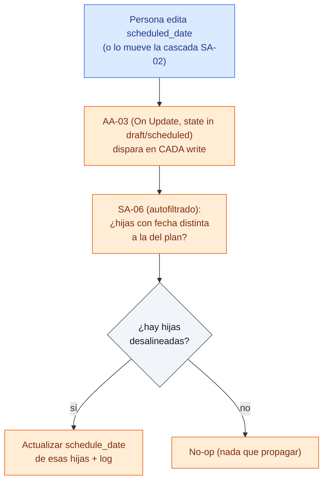

> SA-06 es el **único** punto de propagación de fecha: la cascada (SA-02) escribe `scheduled_date` en n+1 y deja que AA-03 → SA-06 alinee las hijas.

---

## 10. Proceso P8 — Movimiento de equipos (bitácora)

**Disparador:** cambia el `x_studio_location` de un equipo (manual desde Studio, o vía el pipeline `pipeline_registro_II`) → **AA-06 → SA-09**.

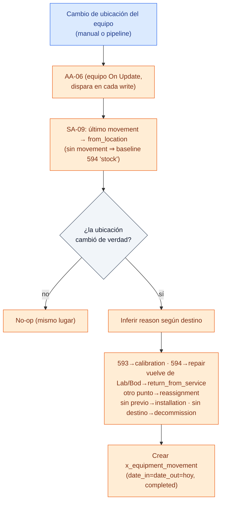

| Capa manual | Capa automática |
|---|---|
| Mover el equipo de ubicación (o lo hace el pipeline). **Go-live:** correr el *seed* de bitácora (excepto equipos en 594). | **AA-06 → SA-09** crea el movimiento. **AA-MOV-00 → SA-MOV-00** le pone el `name` (`MOV-{año}-{seq}`). |

> El `period` nativo del equipo **no se toca**: su ciclo propio sigue corriendo en paralelo a las hijas del plan.

---

## 11. Proceso P9 — Validaciones (lo que puede bloquear un guardado)

En Odoo 16 no hay "Before save"; cada constraint es una SA con `raise UserError` disparada por una AA On Create & Update. Si el raise ocurre, **se revierte todo el guardado**.

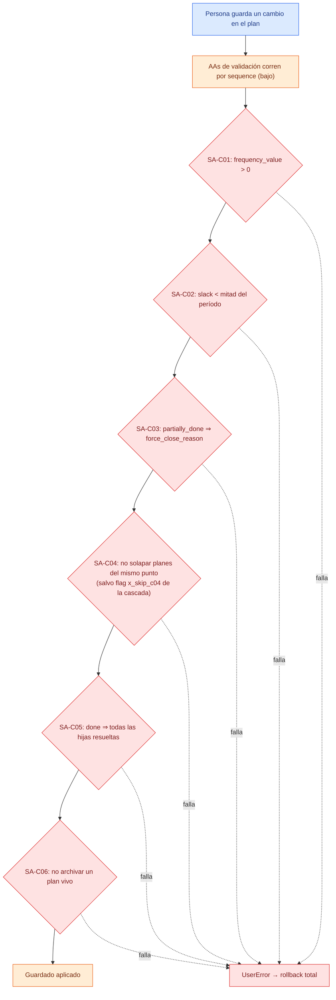

> Las validaciones tienen `sequence` **bajo** para reventar *antes* de que la lógica de negocio (AA-01/02/03) cree registros.

---

## 12. Proceso P10 — Etiquetado de hijas nativas del equipo

Coexisten dos corrientes de hijas en `maintenance.request`:

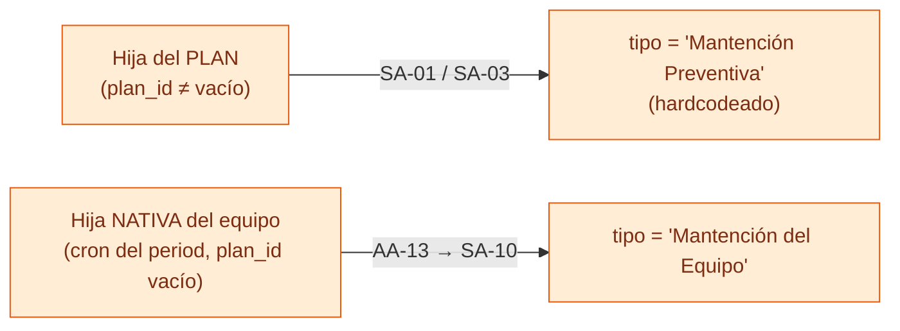

> Así no se confunden en kanban/listas, y el `progress` del plan solo cuenta sus propias hijas.

---

## 13. Tabla resumen: disparadores

| Proceso | Capa que lo inicia | Automatización | SA |
|---|---|---|---|
| P1 Crear plan | Manual (create) | AA-00 On Create | SA-00 |
| P2 Programar | Manual (statusbar → scheduled) | AA-01 | SA-01 |
| P3 Cerrar (cascada) | Manual (statusbar → done/partially_done) | AA-02 | SA-02 |
| P4 Cancelar | Manual (**botón**) | — | SA-04 |
| P5 Sync con punto | Manual (**botón**) | — | SA-03 |
| P6 Proyectar serie | Manual (**botón**) | — | SA-07 |
| P7 Reprogramar fecha | Manual (editar) o cascada | AA-03 | SA-06 |
| P8 Movimiento equipo | Manual / pipeline (cambio de ubicación) | AA-06 + AA-MOV-00 | SA-09, SA-MOV-00 |
| P9 Validaciones | Manual (cualquier guardado) | AA-07…AA-12 | SA-C01…C06 |
| P10 Etiquetar nativas | Automático (cron crea hija) | AA-13 | SA-10 |

---

## 14. Vista integral: un ciclo completo de la serie

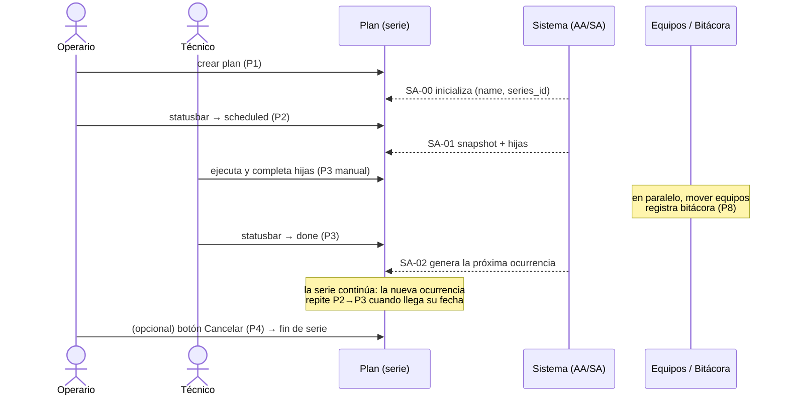

---

## 15. Reglas de oro (resumen ejecutivo)

1. **El plan es del punto.** Cada plan es una ocurrencia de una serie encadenada.
2. **La serie avanza al CERRAR** (`done`/`partially_done`), nunca al crear ni al cancelar.
3. **`scheduled` genera hijas** (snapshot congelado); equipos en Lab/Bodega quedan fuera solos.
4. **Cancelar es terminal** y va por **botón** (SA-04), no por statusbar.
5. **El contrato del punto es el límite duro**: la cascada no genera ocurrencias más allá de `contract_end_date`.
6. **La bitácora es append-only** y se alimenta de cada cambio de ubicación (SA-09).
7. **Las validaciones bloquean** vía `UserError` + rollback; corren primero.
8. **El `period` nativo del equipo coexiste** con el plan y no se gestiona desde acá.
