# Gestión Manual de Excepciones del Inbox

> **Qué es esto:** el runbook para el operario humano. Cuando el pipeline (`processor.py`) no puede resolver una operación de forma automática, deja un registro en el módulo **`x_inbox_integracion`** de Odoo con una
> **etiqueta** (`x_studio_etiqueta`) y un **origen** (`x_studio_origen`). Cada etiqueta tiene un flujo de acción manual que el operario debe ejecutar.
>
> Fuente: `flows/Gestion_intergración.drawio` + `data_processing.inbox()` + los puntos de `processor.py` donde se llama a `inbox()`. Casos de prueba asociados: [`qa/docs/03_casos_transversales.md`](../qa/docs/03_casos_transversales.md) §6.

---

## 1. El principio: el origen indica "cuánto" debe hacer el operario

El campo **`x_studio_origen`** clasifica el nivel de intervención. Es la idea central
del diagrama (las cajas "Gestión Manual" vs "Notificaciones"):

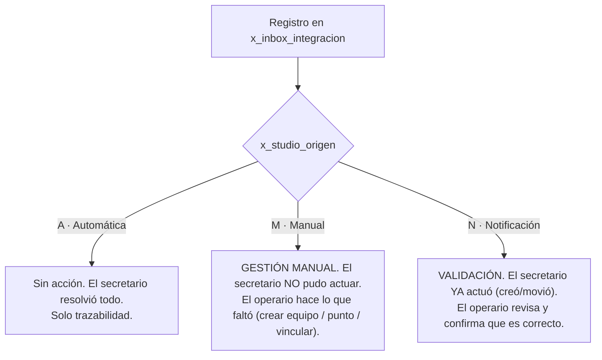

| Origen | Tupla Odoo   | Significado                            | Acción del operario                       |
| ------ | ------------ | -------------------------------------- | ------------------------------------------ |
| `A`  | `[(4, 2)]` | Operación exitosa                     | Ninguna                                    |
| `M`  | `[(4, 1)]` | Falla que requiere acción manual      | **Ejecutar** el flujo de la etiqueta |
| `N`  | `[(4, 3)]` | El pipeline actuó; aviso para validar | **Validar** el cambio                |

> Notificados en cada registro: followers `5205` (Felipe), `172` (Rodrigo), `158` (Juan)
> vía `message_subscribe`. Si el origen es `M` o `N`, además se publica "Caso a ser
> revisado" a `[5205, 172]`. La etiqueta `Creación en espera` notifica específicamente
> a Juan (`158`) para que cree el equipo.

---

## 2. Tabla maestra: etiqueta → disparador → flujo

| Etiqueta (`x_studio_etiqueta`)     | Tupla       | Origen | ¿Cuándo la dispara el secretario?                                                                                                  | Flujo manual                            |
| ------------------------------------ | ----------- | :----: | ------------------------------------------------------------------------------------------------------------------------------------ | --------------------------------------- |
| **S/N no encontrado**          | `[(4,5)]` |   M   | Equipo no está en `maintenance.equipment`, el punto sí existe, y **no** hay transferencia pendiente en `stock.move.line` | [§3.1](#31-sn-no-encontrado)              |
| **Creación en espera**        | `[(4,2)]` |   M   | Equipo no está, el punto existe,**sí** hay transferencia pendiente (`stock.move.line` en tránsito → cliente)             | [§3.2](#32-creación-en-espera)           |
| **Punto no existe en sistema** | `[(4,4)]` |   M   | El punto `[proyecto] punto` no está en `x_maintenance_location`                                                                 | [§3.3](#33-punto-no-existe-en-sistema)    |
| **Cambio de ubicación**       | `[(4,3)]` |   N   | El equipo existe pero su `x_studio_location` ≠ el punto del formulario                                                            | [§4.1](#41-cambio-de-ubicación)          |
| **Sin evento de instalación** | `[(4,6)]` |   N   | El equipo existe pero su `x_studio_location` es `False` (nunca instalado formalmente)                                            | [§4.2](#42-sin-evento-de-instalación-we) |
| **MP sin programar**           | `[(4,1)]` |   N   | (Definida en código pero **actualmente no emitida** — la llamada `inbox()` está comentada en el módulo MP)              | [§4.3](#43-mp-sin-programar)              |

> Las tuplas `[(4, N)]` son IDs de registros de selección en Odoo y **difieren entre
> productivo y test** (ver comentarios `Productivo: N | Test: M` en `data_processing.inbox`).
> Lo estable es el **nombre** de la etiqueta.

---

## 3. Flujos de Gestión Manual (origen M)

### 3.1 S/N no encontrado

El equipo no se encontró por número de serie. La acción depende de **por qué** no se
encontró (es la compuerta central del diagrama):

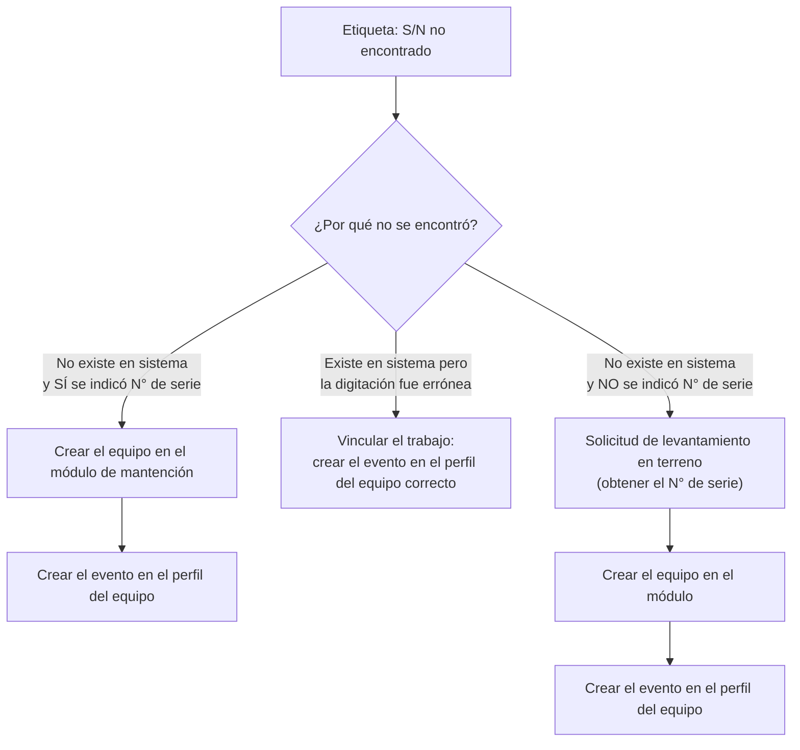

**Al crear el equipo en el módulo, incluir:**

- Cuenta analítica
- Documento de despacho (S/C)
- Cliente
- División (cliente minero)
- Punto de monitoreo
- Equipo responsable: **WE** (equipo de operaciones) | **Cliente** (servicio externo de operaciones)
- Número de serie

**El evento a crear en el perfil del equipo puede ser:** Instalación · Mantenimiento
preventivo · Mantenimiento correctivo · Configuración y ajustes · Calibración.

---

### 3.2 Creación en espera

El equipo no está en el módulo, pero el sistema detectó una **transferencia de stock
pendiente** (el equipo va en tránsito hacia el cliente). No hay que crearlo desde cero:
está por llegar.

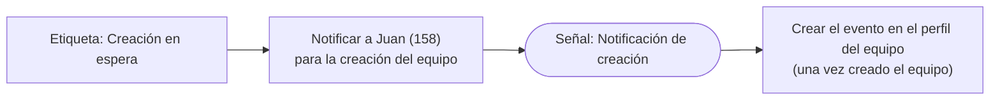

> El pipeline ya publica automáticamente el aviso a Juan (`message_post` a `158` con
> "Crear equipo en módulo de mantención | Dispositivo instalado"). El operario completa
> la creación cuando la transferencia se materializa.

---

### 3.3 Punto no existe en sistema

El punto de monitoreo `[proyecto] punto` del formulario no está registrado en
`x_maintenance_location`. Hay que decidir si **debe** existir:

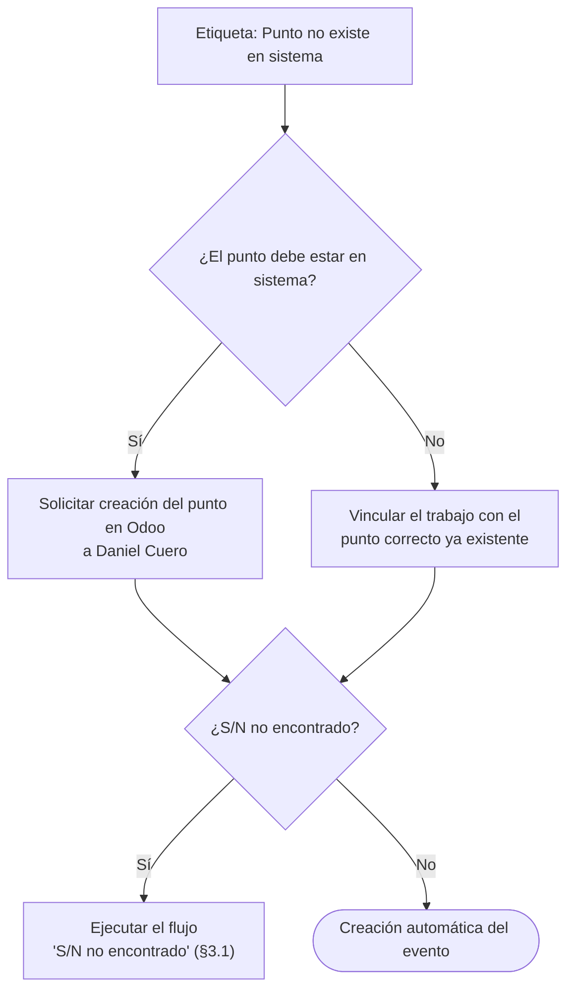

> Lección: este flujo puede **encadenar** con el de S/N. Primero se resuelve el punto;
> si además el equipo no existía, se entra al flujo §3.1; si el equipo ya estaba, el
> evento se crea automáticamente al re-procesar.

---

## 4. Flujos de Notificación (origen N — solo validar)

Aquí el secretario **ya ejecutó** la acción (creó el evento, movió la ubicación). El
operario solo confirma que el resultado es correcto.

### 4.1 Cambio de ubicación

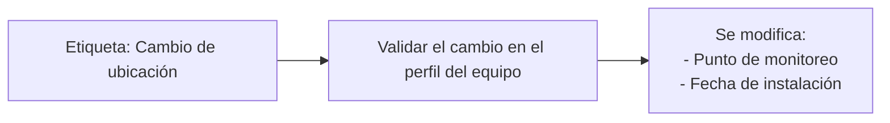

El equipo estaba registrado en otro punto y el pipeline lo movió al punto del
formulario. El operario verifica que el nuevo punto y la fecha de instalación sean
correctos.

### 4.2 Sin evento de instalación We

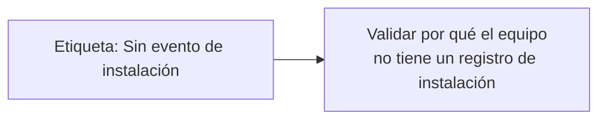

El equipo existe pero nunca tuvo un evento de instalación formal (`x_studio_location`
estaba en `False`). El pipeline procesó el trabajo igual; el operario investiga por qué
faltaba la instalación y regulariza el historial del equipo.

### 4.3 MP sin programar

Etiqueta definida en `data_processing.inbox()` para mantenciones preventivas sin plan
en sistema, pero **la llamada a `inbox()` que la emitiría está comentada** en el módulo
MP de `processor.py` (el caso "sin plan" hoy solo se registra en el resumen interno, no
genera registro de inbox). Documentada aquí por completitud; si se reactiva, el flujo
sería: validar/crear el plan de mantenimiento preventivo del equipo.

---

## 5. Completar el trabajo según el tipo

Resolver el bloqueo (§3) es solo la **primera mitad**. Una vez que el equipo y el punto
existen, el operario debe dejar Odoo en el **mismo estado final** que habría dejado el
pipeline — y esa lógica **cambia según el tipo de trabajo**. Hay dos ejes:

- **Eje A — la solicitud (`maintenance.request`):** ¿se vincula el trabajo a una
  solicitud ya programada/en proceso, o se crea una nueva? La regla difiere por tipo.
- **Eje B — el equipo (`maintenance.equipment`):** solo **I** y **R** actualizan la
  ubicación (`x_studio_location`). MC, CF y MP **no tocan el equipo**.

### 5.0 Qué objeto toca cada tipo (resumen)

| Tipo         | `maintenance_type`                                 | `x_studio_tipo_de_trabajo`                          | Estrategia de selección de solicitud             |   ¿Mueve `x_studio_location`?   |
| ------------ | ---------------------------------------------------- | ----------------------------------------------------- | ------------------------------------------------- | :--------------------------------: |
| **MC** | `corrective`                                       | `Mantención Correctiva`                            | Interruptor (vincular si hay activa, si no crear) |                 No                 |
| **CF** | `preventive`                                       | `Configuración`                                    | Proximidad temporal + archivar anteriores         |                 No                 |
| **MP** | `preventive`                                       | `Mantención Preventiva`                            | Proximidad temporal + archivar anteriores         |                 No                 |
| **I**  | `False` (sin tipo)                                 | `Instalación`                                      | Primera solicitud activa, si no crear             |     **Sí** → al punto     |
| **R**  | `preventive` (Calibración) / `False` (Ext/Inst) | `Extracción` / `Instalación` / `Calibración` | Por subtrabajo (E/I); calibración usa proximidad | **Sí** → 593 / 594 / punto |

> Estados de la solicitud (`stage_id`): **3** = En proceso · **4** = Desechar · **5** = Finalizado.

### 5.1 Estado final común según "¿equipo operativo tras trabajos?"

Vale para MC, CF, MP, I (y para los subtrabajos de R que quedan cerrados):

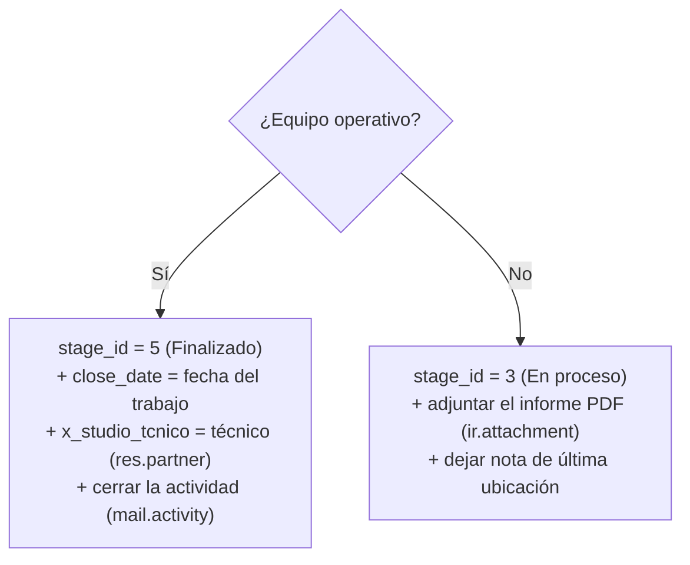

---

### 5.2 MC — Mantención Correctiva (mecanismo de interruptor)

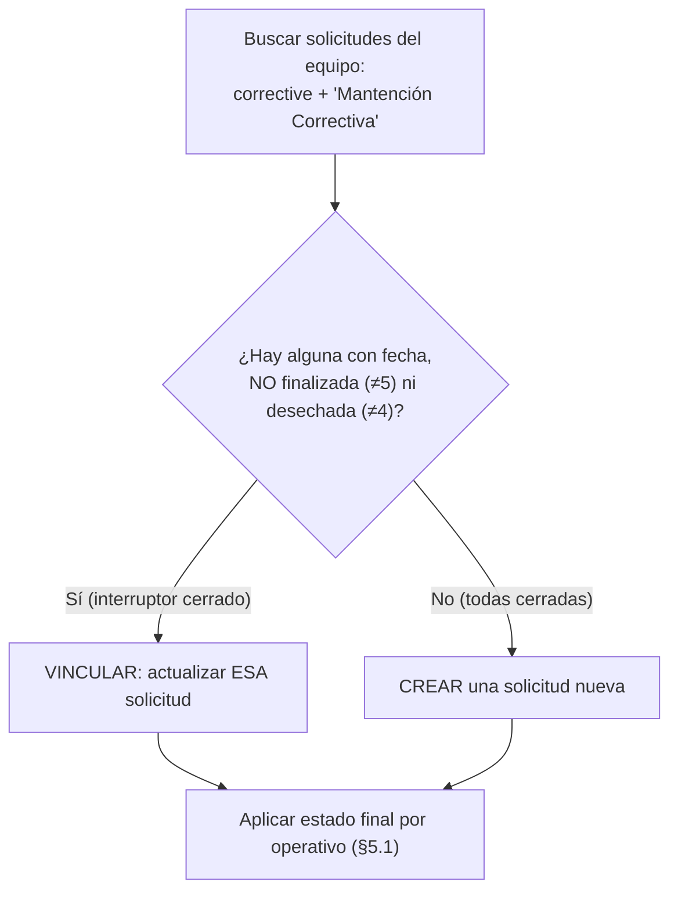

- **No** usa proximidad temporal ni archiva nada.
- **No** modifica el equipo.
- Al crear: `name = "Mantenimiento Correctivo | {tipo} {modelo}"`, `equipment_id`,
  `x_studio_tipo_de_trabajo = "Mantención Correctiva"`, `schedule_date`, `description = obs`.

---

### 5.3 CF — Configuración / 5.4 MP — Mantención Preventiva (proximidad + archivado)

CF y MP comparten exactamente la misma estrategia de selección (cambia el tipo):

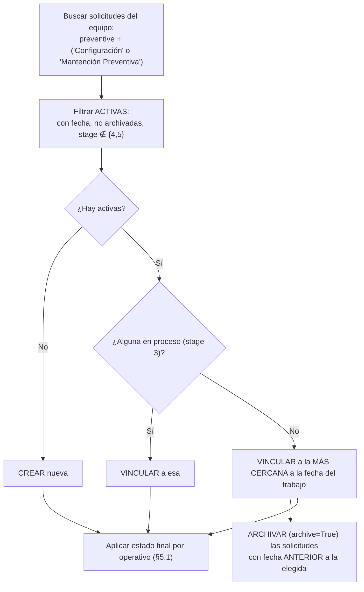

- **Diferencia con MC:** aquí sí se elige por **cercanía de fecha** y se **archivan** las
  solicitudes viejas previas a la elegida. No se modifica el equipo.
- CF arma `description = "
<b>{alcance/Tipo de Ajuste}</b>

{obs}
"`.
- **MP únicamente:** si el equipo **no tiene ninguna** solicitud preventiva, además de
  crear, se registra "Equipo sin plan de mantenimiento en sistema". El operario debería
  verificar/crear el plan de mantenimiento preventivo del equipo.

---

### 5.5 I — Instalación (primera activa + ACTUALIZA EL EQUIPO)

Instalación tiene **dos pasos manuales obligatorios**: mover el equipo y gestionar la
solicitud.

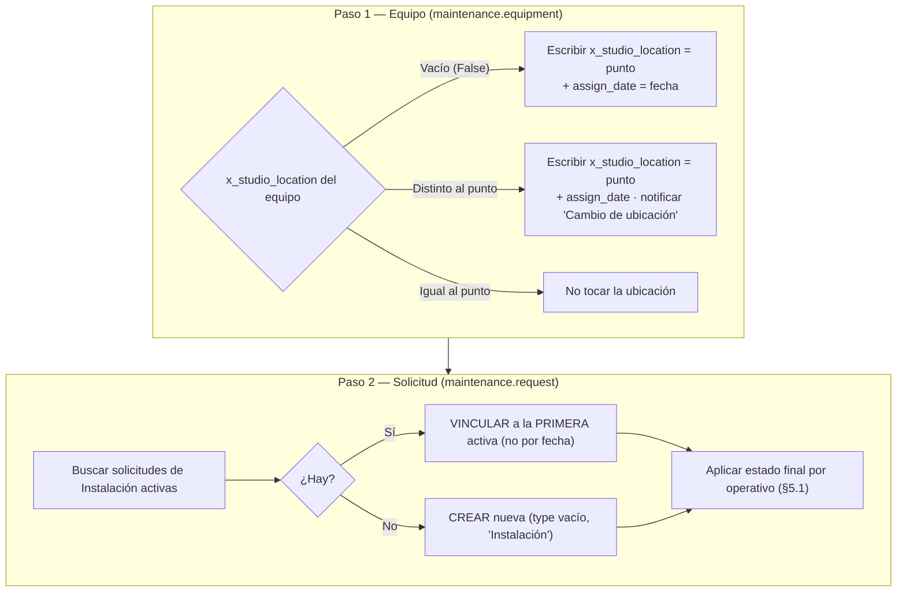

- **Selección distinta a CF/MP:** I toma la **primera** solicitud activa, **no** la más
  cercana, y **no archiva**.
- **Lo crítico (eje B):** si el operario resuelve una excepción de I (p.ej. equipo recién
  creado), debe **escribir la ubicación del equipo** manualmente — el secretario nunca
  llegó a ese paso.

---

### 5.6 R — Reemplazo / Extracción (bifásico + MUEVE EL EQUIPO)

R es el caso que más exige al operario: trabaja un **par de equipos** (el que sale, `E`,
y el que entra, `I`) y **siempre mueve ubicaciones**. Además involucra a **Metrocal**.

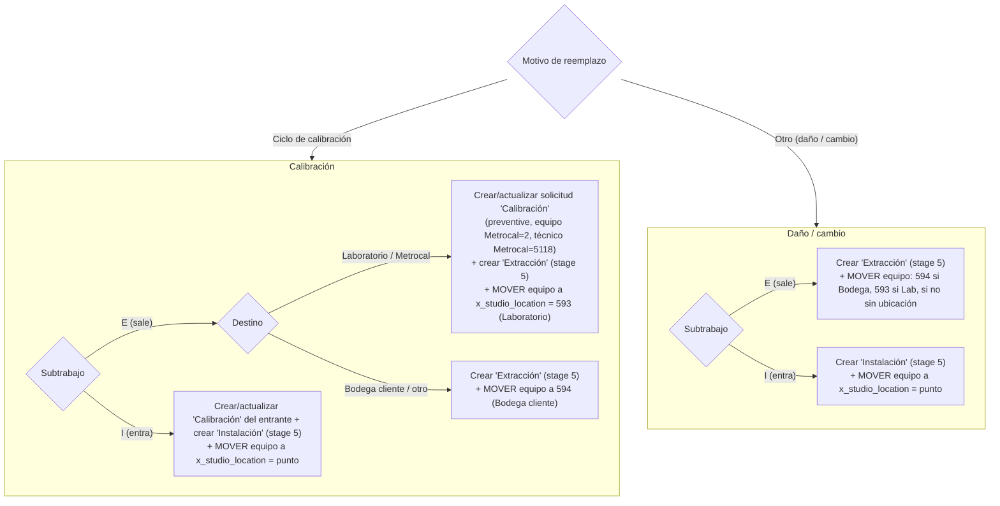

Reglas duras de R que el operario debe respetar:

- **Ubicaciones hardcodeadas:** `593` = Laboratorio | Metrocal · `594` = Bodega cliente.
  El equipo que **entra** siempre va al **punto** del trabajo.
- **Metrocal en calibración:** la solicitud de Calibración usa `maintenance_team_id = 2`
  (Metrocal) y `x_studio_tcnico = 5118` (técnico Metrocal).
- **Tipo de trabajo:** se escriben los literales `Extracción` / `Instalación` /
  `Calibración` en `x_studio_tipo_de_trabajo` (R **no** usa el nombre genérico del módulo).
- **Followers:** toda solicitud de R agrega a `5205` (Felipe) y `172` (Rodrigo).

---

## 6. Matriz: excepción × tipo de trabajo (qué pasos manuales aplican)

Cómo se combinan: la **etiqueta** dice por qué se frenó el secretario (qué bloqueo
resolver, §3-4); el **tipo de trabajo** dice qué completar después (§5). Esta matriz
indica los pasos adicionales por celda.

| Etiqueta \ Tipo                          | MC / CF / MP                                                                       | I (Instalación)                                                             | R (Reemplazo)                                                                                         |
| ---------------------------------------- | ---------------------------------------------------------------------------------- | ---------------------------------------------------------------------------- | ----------------------------------------------------------------------------------------------------- |
| **S/N no encontrado**              | Crear equipo (§3.1) → crear/vincular solicitud según el tipo (§5.2-5.4)        | Crear equipo →**escribir ubicación del equipo** → solicitud (§5.5) | Crear equipo(s) E/I → solicitudes Ext/Inst/Calib →**mover equipo(s)** a 593/594/punto (§5.6) |
| **Creación en espera**            | Esperar/crear equipo (vía Juan, §3.2) → luego solicitud (§5.2-5.4)             | Esperar/crear equipo → ubicación → solicitud                              | Esperar/crear equipo(s) → solicitudes + movimientos de ubicación                                    |
| **Punto no existe**                | Crear/vincular punto (§3.3) → solicitud según tipo                              | Crear punto → ubicación del equipo = punto → solicitud                    | Crear punto → el equipo que entra va a ese punto; el que sale a 593/594                              |
| **Cambio de ubicación** (N)       | Validar punto/fecha en el equipo (§4.1). La solicitud ya la gestionó el pipeline | Validar el movimiento que ya hizo el pipeline al equipo                      | Validar que cada equipo (E/I) quedó en la ubicación correcta (593/594/punto)                        |
| **Sin evento de instalación** (N) | Validar por qué el equipo no tenía instalación (§4.2)                          | Igual + confirmar que ahora quedó asociado al punto                         | Validar el historial de ubicación del equipo saliente/entrante                                       |

**Lectura clave de la matriz (lo que pediste):**

- En **MC / CF / MP** el trabajo manual termina en la **solicitud**: decidir *vincular a
  una programada/en proceso vs crear* (interruptor en MC; proximidad+archivado en CF/MP).
  **Nunca** se modifica el equipo.
- En **I** y **R** hay un **paso adicional obligatorio sobre `maintenance.equipment`**:
  escribir/mover la `x_studio_location`. En R, además, el movimiento depende del subtrabajo
  (sale → 593/594; entra → punto) y la calibración suma la solicitud Metrocal.

---

## 7. Mapa código ↔ flujo (para mantenimiento)

Dónde se dispara cada etiqueta en `processor.py` (verificado en la rama de MC; los demás
módulos replican el mismo pipeline de validación):

| Etiqueta                   | Llamada `inbox(...)` con origen | Condición en código                                                                                                   |
| -------------------------- | --------------------------------- | ----------------------------------------------------------------------------------------------------------------------- |
| Punto no existe en sistema | `'M'`                           | `not id_punto` / `not punto_odoo` (no hay match en `x_maintenance_location`)                                      |
| Creación en espera        | `'M'`                           | `search_read('stock.move.line', domain)` devuelve movimiento (transit→customer, lote = serial, state ∉ done/cancel) |
| S/N no encontrado          | `'M'`                           | equipo no hallado y `stock.move.line` vacío                                                                          |
| Sin evento de instalación | `'N'`                           | equipo hallado con `x_studio_location == False`                                                                       |
| Cambio de ubicación       | `'N'`                           | equipo hallado con `x_studio_location != [proyecto] punto`                                                            |

> Para validar que estos disparadores y followers siguen funcionando tras cambios de
> código, ver los tests de componente (L2) por módulo en `qa/scaffolding/component/`
> (afirman la tupla de etiqueta/origen del registro de inbox) y los casos TC-TR-70..76.
