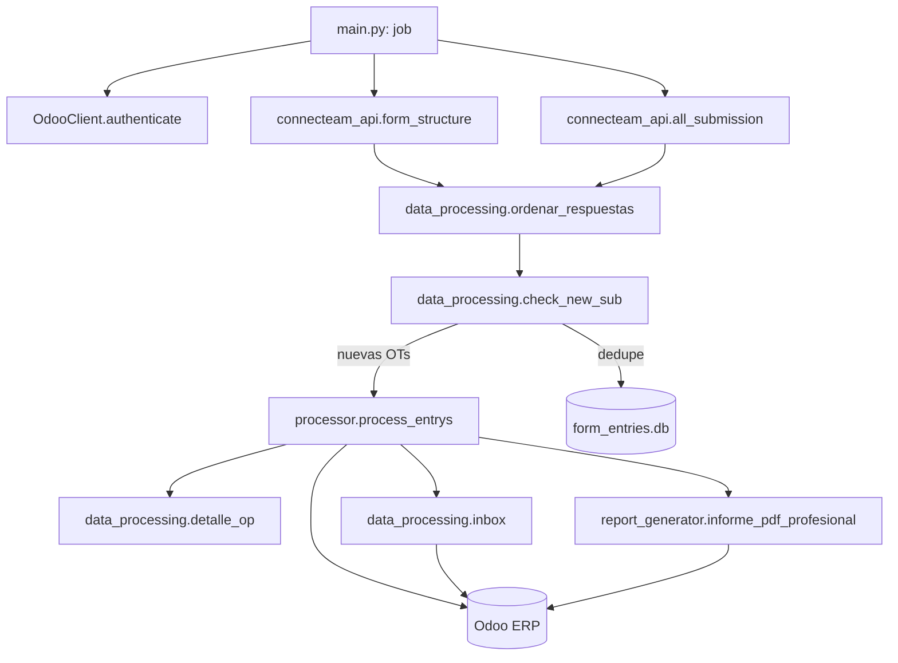

# Pipeline de Registro — Connecteam → Odoo

Pipeline en Python que extrae las respuestas de formularios de mantención/instalación
desde **Connecteam**, las aplana y transforma, y crea/actualiza solicitudes de
mantenimiento (más informes PDF) en **Odoo** vía XML-RPC. Las salidas a
SharePoint/Excel existen pero están **deshabilitadas** en `main.py`.

> La lógica de negocio completa vive en `processor.py`. **No se documenta aquí**:
> ver [`processor_documentation.md`](./processor_documentation.md) para el detalle de
> `process_entrys()`, los módulos por tipo de trabajo (MC, CF, R, I, MP), los
> algoritmos de selección de solicitudes y los mapeos de campos Odoo.

---

## 1. Visión general del flujo



1. **`form_structure()`** baja el esquema del formulario (mapa `questionId → título`).
2. **`all_submission()`** baja las últimas 20 submissions.
3. **`ordenar_respuestas()`** aplana las respuestas anidadas en un `DataFrame`.
4. **`check_new_sub()`** descarta las OTs ya procesadas (estado en `form_entries.db`).
5. **`process_entrys()`** es el corazón: por cada OT/punto/equipo valida en Odoo,
   crea/actualiza solicitudes, genera el PDF y registra notificaciones en el inbox.

---

## 2. Requisitos y ejecución

### Requisitos

- **Python 3.11.9** (igual que CI).
- Dependencias: `pip install -r ../requirements.txt` — el `requirements.txt` está en la
  raíz del repo (un nivel arriba de `pipeline_registro_II/`).

### Variables de entorno

`config.py` y `conn_sharepoint.py` llaman a `load_dotenv()`, así que las variables se
leen desde un archivo **`.env` ubicado en `pipeline_registro_II/`**.

| Variable                                                                                                                    | Uso                                                                           | ¿Obligatoria?                                                                |
| --------------------------------------------------------------------------------------------------------------------------- | ----------------------------------------------------------------------------- | ----------------------------------------------------------------------------- |
| `CONNECTEAM_API_KEY`                                                                                                      | API de Connecteam (submissions, estructura del formulario, usuarios).         | **Sí**                                                                 |
| `ODOO_API_KEY`                                                                                                            | Password / API key de Odoo (la usan tanto el bloque test como el productivo). | **Sí**                                                                 |
| `URL_TEST`, `DB_TEST`, `USER_TEST`                                                                                    | Odoo de**test** — bloque **activo** en `config.py`.            | **Sí** (config actual)                                                 |
| `URL_Odoo`, `DB_Odoo`, `USER_Odoo`                                                                                    | Odoo **productivo** — bloque **comentado** en `config.py`.    | Solo al apuntar a producción                                                 |
| `MS_TENANT`                                                                                                               | Tenant de Microsoft Graph.                                                    | **Sí** — se lee al **importar** `conn_sharepoint` (ver nota). |
| `MS_CLIENT_ID`, `MS_CLIENT_SECRET`                                                                                      | Credenciales de la app de Graph.                                              | Solo si se reactiva SharePoint.                                               |
| `sharepoint_user`, `sharepoint_password`, `sharepoint_url_site`, `sharepoint_site_name`, `sharepoint_doc_library` | Config de SharePoint.                                                         | Solo si se reactiva la salida Excel/SharePoint.                               |

> **Toggle Odoo prod/test:** en `config.py` el bloque activo usa `URL_TEST/DB_TEST/USER_TEST`;
> el productivo (`URL_Odoo/DB_Odoo/USER_Odoo`) está comentado. Se cambia comentando/
> descomentando — no borrar el bloque.
>
> **Por qué `MS_TENANT` es obligatoria aunque SharePoint esté deshabilitado:**
> `main.py` y `main_practice.py` importan `sharepoint_client` al inicio, que a su vez
> importa `conn_sharepoint`, y este lee `os.environ["MS_TENANT"]` **en tiempo de import**.
> Sin esa variable, el script falla antes de arrancar. `MS_CLIENT_ID`/`MS_CLIENT_SECRET`
> solo se necesitan al usar SharePoint efectivamente.

### Ejecución

```bash
# desde pipeline_registro_II/
pip install -r ../requirements.txt

python main.py            # automático: detecta OTs nuevas y las procesa (lo mismo que corre CI)
python main_practice.py   # manual/pruebas: menú; opción 1 = doble filtro OT -> punto
python pdf_generator.py   # genera un PDF suelto (busca la OT en Connecteam o form manual)
python form_simulator.py  # arma submissions de prueba desde form.json

# inspeccionar el estado de dedupe:
sqlite3 form_entries.db "SELECT COUNT(*) FROM processed_entries;"
```

### CI (GitHub Actions)

`main.py` corre con cron `0 11 * * 1-6` (lunes a sábado, 11:00 UTC) según
`../.github/workflows/connecteam-odoo.yml`: instala `requirements.txt`, ejecuta
`python pipeline_registro_II/main.py` y luego **commitea `form_entries.db`** de vuelta
al repo. Ese commit es cómo persiste el estado de dedupe entre corridas (ver § 5).

---

## 3. Puntos de entrada

| Script               | Rol                                                                                                                                                                            |
| -------------------- | ------------------------------------------------------------------------------------------------------------------------------------------------------------------------------ |
| `main.py`          | **Entrada automática.** `job()` corre en GitHub Actions (cron `0 11 * * 1-6`); detecta OTs nuevas vía `check_new_sub` y las procesa. SharePoint/Excel comentado. |
| `main_practice.py` | **Entrada manual / pruebas.** Menú interactivo. Opción 1: procesar OTs específicas con **doble filtro** (OT → punto a procesar dentro de la OT).               |

> La opción 1 de `main_practice.py` permite, tras elegir las OTs, seleccionar qué
> **puntos** procesar dentro de cada OT (los puntos se identifican por el prefijo
> numérico de las columnas, mismo criterio que `process_entrys`).

---

## 4. Scripts del pipeline

| Script                   | Función                                                                                                                                                                                                                           |
| ------------------------ | ---------------------------------------------------------------------------------------------------------------------------------------------------------------------------------------------------------------------------------- |
| `config.py`            | Carga `.env`, fija `FORM_ID`, credenciales Odoo (toggle prod/test comentado) y URLs de SharePoint/logo.                                                                                                                        |
| `connecteam_api.py`    | Cliente HTTP de Connecteam:`form_structure()`, `all_submission()` (últimas 20), `filter_submissions()` (por fecha, hoy hardcodeado), `submissions_by_date_range()` (paginado), `user()` (resuelve nombre del técnico). |
| `odoo_client.py`       | Wrapper XML-RPC (`OdooClient`): `authenticate`, `search`, `search_read`, `read`, `create`, `write`, `message_post`, `message_subscribe`, `action_feedback`.                                                    |
| `data_processing.py`   | `ordenar_respuestas()` (aplana submissions → DataFrame), `check_new_sub()` (dedupe contra SQLite), `detalle_op()` (acumula filas de resumen), `inbox()` (crea registros `x_inbox_integracion` + followers + adjuntos).  |
| `processor.py`         | **Núcleo de negocio.** Ver [`processor_documentation.md`](./processor_documentation.md).                                                                                                                                     |
| `report_generator.py`  | Genera el informe PDF profesional con ReportLab (`informe_pdf_profesional()`).                                                                                                                                                   |
| `pdf_generator.py`     | CLI manual para generar PDFs sueltos (busca OT en Connecteam o formulario desde cero); guarda en `informes_pdf/`.                                                                                                                |
| `excel_manager.py`     | *(Deshabilitado)* Inserta filas de resumen en la tabla Excel de SharePoint (`send_data`/`modify_excel_file`).                                                                                                                |
| `sharepoint_client.py` | *(Deshabilitado)* Clase `Sharepoint`: descarga/sube archivos vía Microsoft Graph.                                                                                                                                             |
| `conn_sharepoint.py`   | *(Deshabilitado)* Autenticación MSAL y helpers GET/PUT contra Graph.                                                                                                                                                            |
| `form_simulator.py`    | Simulador de formularios Connecteam: arma submissions a mano desde `form.json` para probar el pipeline real.                                                                                                                     |

---

## 5. Estado y persistencia

- **`form_entries.db`** (SQLite, tabla `processed_entries`) es el estado de dedupe.
  Se **commitea** desde CI tras cada corrida: ese commit es cómo persiste el estado
  entre ejecuciones. No agregarlo a `.gitignore` ni resetearlo (reprocesaría todo).
- Los errores **no detienen** el pipeline: cada equipo/módulo va envuelto en
  `try/except + traceback.print_exc() + continue`.

---

## 6. Convención de columnas del formulario

- Los puntos visitados se detectan por columnas que empiezan con un dígito
  (p. ej. `1.2 Tipo de trabajo` → punto `1`).
- Las columnas por equipo siguen `{punto}.2.{equipo} {TIPO} ({SUBTIPO}) | {Campo}`
  (p. ej. `1.2.3 MP (I) | Modelo`).
- El proyecto va embebido como `Punto [Proyecto]` y se extrae por regex.

---

## 7. Modelos Odoo tocados

`maintenance.equipment`, `maintenance.request`, `x_maintenance_location`,
`x_inbox_integracion`, `mail.activity`, `ir.attachment`, `stock.move.line`,
`res.partner`. Los campos `x_studio_*` son campos custom de Odoo Studio; sus nombres
no son estables entre upgrades de Odoo.

---

## 8. Documentación relacionada

- [`processor_documentation.md`](./processor_documentation.md) — detalle técnico de `processor.py`.
- `../qa/README.md` — estrategia y suite de pruebas (L1/L2/L3).
- `../qa/RESULTADOS.md` — resultados de QA y observaciones (`OBS-*`).
- `../qa/correcciones_QA.md` — bitácora de correcciones derivadas de QA.
