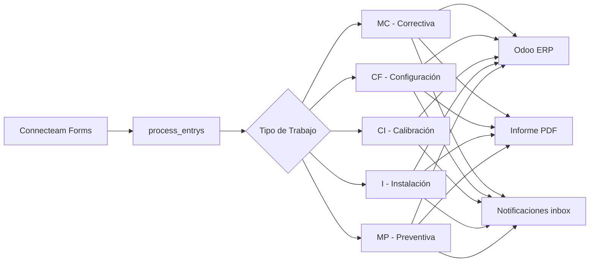
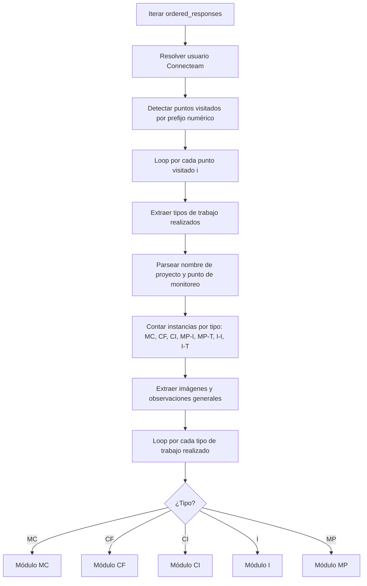
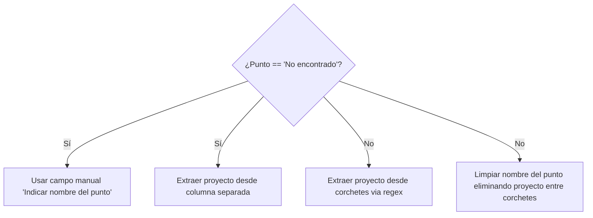
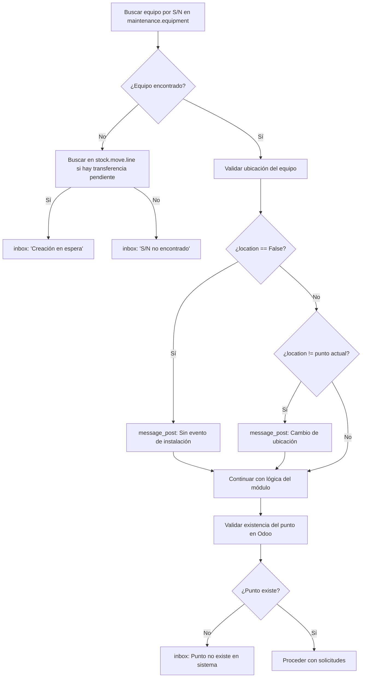
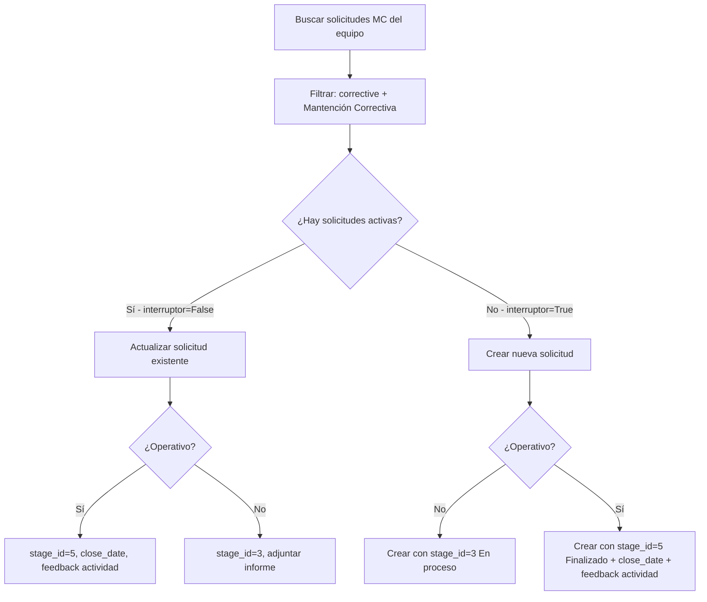
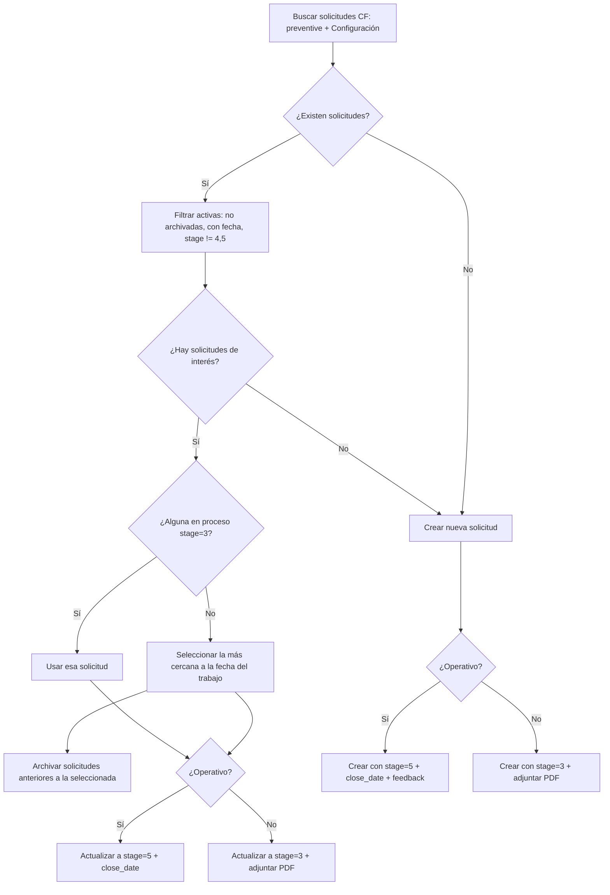
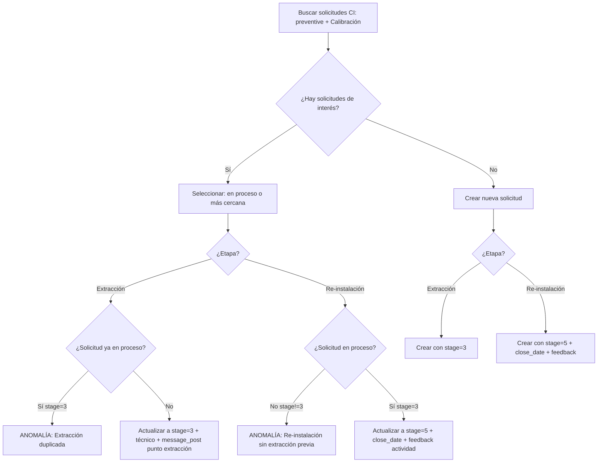
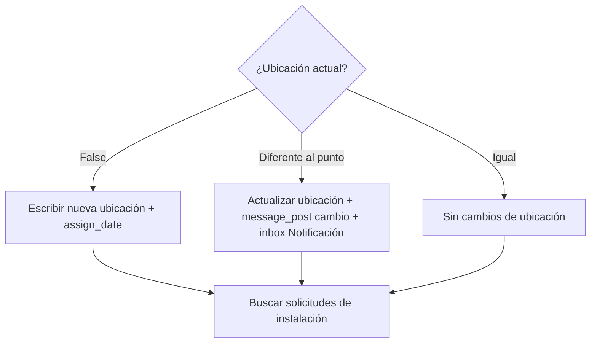
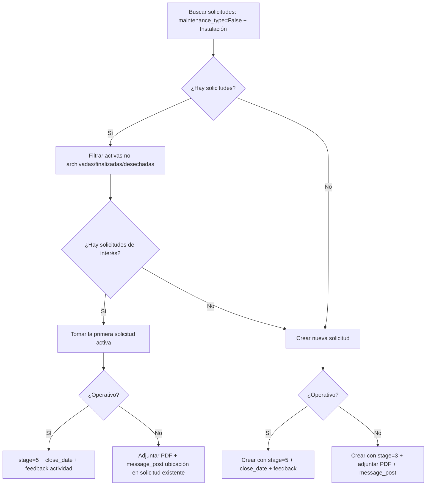

# Documentación Técnica — `processor.py`

> **Archivo:** `pipeline_registro_II/processor.py` · **~3 650 líneas** · Última revisión: Mayo 2026

---

## 1. Visión General

`processor.py` es el **núcleo de procesamiento** del pipeline de registro de mantenciones. Su función es transformar las respuestas de formularios Connecteam en registros operativos dentro de Odoo ERP, generando informes PDF y notificaciones a lo largo del proceso.



---

## 2. Función Principal: `process_entrys()`

### 2.1 Firma y Parámetros

```python
def process_entrys(ordered_responses, API_key_c, resumen, exito, odoo_client, sharepoint_client=None)
```

| Parámetro            | Tipo                 | Descripción                                                 |
| --------------------- | -------------------- | ------------------------------------------------------------ |
| `ordered_responses` | `pd.DataFrame`     | Respuestas del formulario Connecteam ordenadas               |
| `API_key_c`         | `str`              | API key de Connecteam para resolver usuarios                 |
| `resumen`           | `list`             | Acumulador de operaciones con**anomalías**            |
| `exito`             | `list`             | Acumulador de operaciones**exitosas**                  |
| `odoo_client`       | `OdooClient`       | Cliente XML-RPC para interactuar con Odoo                    |
| `sharepoint_client` | `SharepointClient` | *(Deshabilitado)* Cliente para subir archivos a SharePoint |

### 2.2 Dependencias Externas

| Módulo              | Función                      | Propósito                                         |
| -------------------- | ----------------------------- | -------------------------------------------------- |
| `connecteam_api`   | `user()`                    | Resolver ID de usuario → nombre del técnico      |
| `data_processing`  | `detalle_op()`              | Registrar detalle de operación (éxito/anomalía) |
| `data_processing`  | `inbox()`                   | Crear notificación interna en Odoo                |
| `report_generator` | `informe_pdf_profesional()` | Generar informe PDF del trabajo realizado          |

---

## 3. Estructuras de Datos y Configuraciones Globales

*(Definidas dentro del loop principal, líneas 41–81)*

### 3.1 Tipos de Trabajo Soportados

```python
id_tipo_de_trabajo = ['MP', 'MC', 'I', 'CI', 'CF']
```

| ID     | Nombre Completo        | `maintenance_type` en Odoo |
| ------ | ---------------------- | ---------------------------- |
| `MC` | Mantención Correctiva | `corrective`               |
| `MP` | Mantención Preventiva | `preventive`               |
| `I`  | Instalación           | `False` (sin tipo)         |
| `CI` | Calibración           | `preventive`               |
| `CF` | Configuración         | `preventive`               |

### 3.2 Subtipos de MP e Instalación

Tanto MP como I operan sobre dos contextos: **Instrumento (I)** y **Tablero (T)**.

```python
MP_type = ['T', 'I']          # Tablero, Instrumento (Dispositivo)
I_type  = ['I', 'T']          # Instrumento (dispositivo), Tablero
```

### 3.3 Mapeo de Operadores

Diccionario `operators` que mapea **nombre del técnico** → **ID de contacto en Odoo** (modelo `res.partner`). Se usa para asignar el campo `x_studio_tcnico` en las solicitudes de mantenimiento.

### 3.4 Estados de Solicitud en Odoo (`stage_id`)

| ID | Estado     | Significado en el pipeline            |
| -- | ---------- | ------------------------------------- |
| 3  | En proceso | Trabajo iniciado, pendiente de cierre |
| 4  | Desechar   | Equipo dado de baja                   |
| 5  | Finalizado | Trabajo completado exitosamente       |

---

## 4. Flujo de Iteración General



### 4.1 Detección de Puntos Visitados (L84–91)

Se escanean las columnas del DataFrame buscando aquellas que comienzan con un dígito. Cada dígito único representa un **punto de monitoreo visitado**.

```
Columna "1.2 Tipo de trabajo" → punto visitado "1"
Columna "2.1 Punto de monitoreo" → punto visitado "2"
```

### 4.2 Resolución del Punto de Monitoreo (L112–147)



El formato esperado en Connecteam es: `Nombre del Punto [Nombre del Proyecto]`

### 4.3 Conteo de Instancias por Tipo (L166–253)

Para cada tipo de trabajo se cuentan las instancias usando el patrón de columnas:

```
{punto}.2.{equipo} {TIPO} ({SUBTIPO}) | Campo
```

Ejemplo: `1.2.3 MP (I) | Modelo` → tercera instancia de MP tipo Instrumento en el punto 1.

Se generan diccionarios de conteo:

- `conteo_MP = {'I': n, 'T': m}` — MP por subtipo
- `conteo_I  = {'I': n, 'T': m}` — Instalación por subtipo
- `conteo_instancias_MC`, `conteo_instancias_CF`, `conteo_instancias_CI` — contadores simples

### 4.4 Variables Globales del Punto (L263–269)

Extraídas una vez por punto visitado y reutilizadas en todos los módulos:

| Variable     | Fuente                               |
| ------------ | ------------------------------------ |
| `proyecto` | Columna `{i}.1 Proyecto`           |
| `punto`    | Columna `{i}.1 Punto de monitoreo` |
| `ot`       | Columna `#` (número de OT)        |
| `fecha`    | Columna `Fecha visita`             |
| `tecnico`  | Columna `user` (nombre resuelto)   |
| `cliente`  | Columna `Nombre del Cliente`       |

---

## 5. Pipeline Transversal de Validaciones

Todos los módulos (MC, CF, CI, I, MP) comparten un **pipeline de validación** previo a la creación/actualización de solicitudes en Odoo. Este patrón se repite con variaciones menores en cada módulo.



### 5.1 Validación de Ubicación del Equipo

Se consulta `x_studio_location` del equipo. Hay **tres escenarios**:

1. **Sin ubicación (`False`)**: El equipo no tiene un evento de instalación previo. Se notifica vía `message_post` y se registra en `inbox` con prioridad `'N'` (Notificación).
2. **Ubicación diferente**: El equipo está registrado en otro punto. Se notifica el cambio vía `message_post` y se registra en `inbox` como "Cambio de ubicación".
3. **Ubicación coincide**: Flujo normal, sin notificaciones adicionales.

### 5.2 Validación del Punto de Monitoreo

Se busca en `x_maintenance_location` un registro cuyo `x_name` coincida con `[{proyecto}] {punto}`. Si no existe, se registra anomalía y se envía `inbox` con prioridad `'M'` (Manual).

### 5.3 Fallback por S/N No Encontrado

Cuando el serial no se encuentra en `maintenance.equipment`, se busca en `stock.move.line` con dominio:

- `location_usage = 'transit'`
- `location_dest_usage = 'customer'`
- `lot_id.name = serial`
- `state not in ['done', 'cancel']`

Si hay movimiento pendiente → "Creación en espera". Si no → "S/N no encontrado".

---

## 6. Módulo MC — Mantención Correctiva

**Líneas:** 283–882 · **Prefijo columnas:** `{i}.2.{equipo} MC | Campo`

### 6.1 Campos Extraídos

| Campo            | Clave formulario                           |
| ---------------- | ------------------------------------------ |
| `modelo_MC`    | `MC \| Modelo`                            |
| `tipo_MC`      | `MC \| Activo a intervenir`               |
| `serial_MC`    | `MC \| N° de serie`                      |
| `operativo_MC` | `MC \| ¿Equipo operativo tras trabajos?` |
| `obs_MC`       | `MC \| Observación`                      |

### 6.2 Lógica de Solicitudes



**Mecanismo del interruptor MC**: Se itera sobre todas las solicitudes correctivas del equipo. Si alguna tiene `schedule_date`, no está finalizada (!=5) ni desechada (!=4), el interruptor se cierra (`False`) y se **actualiza** esa solicitud. Si todas están cerradas, se **crea** una nueva.

### 6.3 Diferencia por Estado Operativo

| Operativo     | stage_id       | Acciones adicionales                                                  |
| ------------- | -------------- | --------------------------------------------------------------------- |
| **Sí** | 5 (Finalizado) | Asignar `close_date`, `x_studio_tcnico`, cerrar `mail.activity` |
| **No**  | 3 (En proceso) | Adjuntar PDF como `ir.attachment`, `message_post` con ubicación  |

---

## 7. Módulo CF — Configuración

**Líneas:** 884–1589 · **Prefijo columnas:** `{i}.2.{equipo} CF | Campo`

### 7.1 Campos Extraídos

Mismos que MC más: `alcance_CF` → `CF | Tipo de Ajuste`

### 7.2 Lógica de Solicitudes



### 7.3 Selección Inteligente de Solicitud

A diferencia de MC, CF implementa un **algoritmo de selección por proximidad temporal**:

1. **Prioridad 1**: Solicitud en estado "En proceso" (`stage_id=3`)
2. **Prioridad 2**: Solicitud con `schedule_date` más cercana a la `fecha` del trabajo
3. **Efecto colateral**: Las solicitudes con fecha anterior a la seleccionada se **archivan** automáticamente (`archive=True`)

### 7.4 Descripción del Request

El campo `description` se compone como HTML:

```html
<p><b>{alcance_CF}</b></p><p>{obs_CF}</p>
```

---

## 8. Módulo CI — Calibración

**Líneas:** 1593–2220 · **Prefijo columnas:** `{i}.2.{equipo} CI | Campo`

### 8.1 Campos Extraídos

| Campo         | Clave formulario                                            |
| ------------- | ----------------------------------------------------------- |
| `etapa_CI`  | `CI \| Etapa` → `"Extracción"` o `"Re-instalación"` |
| `modelo_CI` | `CI \| Modelo`                                             |
| `serial_CI` | `CI \| N° de serie`                                       |
| `obs_CI`    | `CI \| Observación`                                       |
| `tipo_CI`   | Hardcoded:`'Sonda multiparamétrica'`                     |

### 8.2 Modelo de Dos Fases

CI es el único módulo con un **modelo bifásico** basado en el campo `etapa_CI`:



### 8.3 Validaciones de Coherencia

| Situación                                                             | Resultado                                                            |
| ---------------------------------------------------------------------- | -------------------------------------------------------------------- |
| Extracción cuando la solicitud ya está en proceso (`stage=3`)      | Anomalía: "Extracción cuando la sonda no se encuentra en el punto" |
| Re-instalación cuando la solicitud NO está en proceso (`stage!=3`) | Anomalía: "Re-instalación cuando la sonda no ha sido extraída"    |

### 8.4 Sin Generación de PDF

A diferencia de los otros módulos, CI **no genera informe PDF** ni adjunta archivos `ir.attachment` a las solicitudes.

---

## 9. Módulo I — Instalación

**Líneas:** 2223–2912 · **Prefijo columnas:** `{i}.2.{equipo} I ({t}) | Campo`

### 9.1 Doble Iteración (Instrumento + Tablero)

```python
for t in I_type:  # ['I', 'T']
    for equipo in range(1, conteo_I[t]+1):
```

### 9.2 Campos Extraídos

| Campo           | Clave formulario                                                                                                    |
| --------------- | ------------------------------------------------------------------------------------------------------------------- |
| `modelo_I`    | `I ({t}) \| Modelo`                                                                                                |
| `tipo_I`      | `I ({t}) \| Tipo de {dispositivo/tablero}`                                                                         |
| `serial_I`    | `I ({t}) \| N° de serie`                                                                                          |
| `operativo_I` | `I ({t}) \| ¿Equipo operativo tras trabajos?`                                                                     |
| `obs_I`       | `I ({t}) \| Observación`                                                                                          |
| `alcance_I`   | Hardcoded `'IH \| Habilitación de equipo'` para `t='I'`, o campo `Alcance de la intervención` para `t='T'` |

### 9.3 Gestión de Ubicación (Diferencia clave con otros módulos)

Instalación es el **único módulo que escribe directamente** en `x_studio_location` del equipo:



### 9.4 Lógica de Solicitudes



> **Nota**: A diferencia de CF/MP/CI, la selección de solicitud en I **no usa proximidad temporal**, sino que toma la primera solicitud activa encontrada.

---

## 10. Módulo MP — Mantención Preventiva

**Líneas:** 2914–3653 · **Prefijo columnas:** `{i}.2.{equipo} MP ({t}) | Campo`

### 10.1 Doble Iteración (Instrumento + Tablero)

Igual que Instalación, itera sobre `MP_type = ['T', 'I']`.

### 10.2 Campos Extraídos

| Campo            | Clave formulario                                                |
| ---------------- | --------------------------------------------------------------- |
| `modelo_MP`    | `MP ({t}) \| Modelo`                                           |
| `tipo_MP`      | `MP ({t}) \| {Dispositivo/Tablero} a intervenir`               |
| `serial_MP`    | `MP ({t}) \| N° de serie`                                     |
| `operativo_MP` | `MP ({t}) \| ¿{Dispositivo/Tablero} operativo tras trabajos?` |
| `obs_MP`       | `MP ({t}) \| Observación`                                     |

### 10.3 Lógica de Solicitudes

Estructura idéntica a CF con selección por proximidad temporal y archivado automático. Flujo:

1. Buscar solicitudes: `preventive` + `Mantención Preventiva`
2. Filtrar activas (no archivadas, con fecha, `stage != 4,5`)
3. Si hay solicitudes de interés → priorizar `stage=3`, si no → la más cercana temporalmente + archivar anteriores
4. Si no hay solicitudes → crear nueva + log "Sin plan de mantenimiento"
5. Si operativo=Sí → `stage=5` + `close_date` + feedback. Si No → `stage=3` + adjuntar PDF

### 10.4 Registro "Sin Plan de Mantenimiento"

Cuando el equipo **no tiene solicitudes activas ni históricas**, además de crear la solicitud, se registra en `resumen`:

```
'Equipo sin plan de mantenimiento en sistema'
```

---

## 11. Acciones Transversales Post-Procesamiento

### 11.1 Generación de Informe PDF

Todos los módulos (excepto CI) generan un informe profesional vía `informe_pdf_profesional()` con parámetros: punto, OT, técnico, proyecto, fecha, cliente, tipo, modelo, serial, tipo de trabajo, alcance, punto, observaciones, imágenes y número de equipo.

El PDF se codifica en **base64** para adjuntarse como `ir.attachment` o almacenarse en `x_studio_informe`.

### 11.2 Nomenclatura de Archivos

```
informe_OT-{ot}_{punto}_{tipo}_{equipo}.pdf           # MC, CF, CI, I
informe_OT-{ot}_{punto}_{tipo}_{subtipo}_{equipo}.pdf  # MP (incluye T/I)
```

### 11.3 Registro en Inbox (`inbox()`)

| Prioridad     | Código | Significado                                     |
| ------------- | ------- | ----------------------------------------------- |
| Automática   | `'A'` | Operación exitosa, sin intervención requerida |
| Manual        | `'M'` | Requiere revisión/acción manual               |
| Notificación | `'N'` | Informativa, posible anomalía a validar        |

### 11.4 Gestión de Actividades (`mail.activity`)

Cuando una solicitud se finaliza (`stage=5`), el pipeline busca y cierra la actividad asociada mediante `action_feedback`.

---

## 12. Tabla Comparativa de Módulos

| Característica                      | MC             | CF                 | CI                | I            | MP             |
| ------------------------------------ | -------------- | ------------------ | ----------------- | ------------ | -------------- |
| **Subtipo (I/T)**              | No             | No                 | No                | Sí          | Sí            |
| **Genera PDF**                 | Sí            | Sí                | No                | Sí          | Sí            |
| **Modelo bifásico**           | No             | No                 | Sí (Ext/Re-inst) | No           | No             |
| **Selección por proximidad**  | No             | Sí                | Sí               | No (primera) | Sí            |
| **Archiva solicitudes viejas** | No             | Sí                | Sí               | No           | Sí            |
| **Escribe ubicación equipo**  | No             | No                 | No                | Sí          | No             |
| **`maintenance_type` Odoo**  | `corrective` | `preventive`     | `preventive`    | `False`    | `preventive` |
| **Campo alcance**              | No             | `Tipo de Ajuste` | `Etapa`         | Condicional  | No             |
| **Valida stock.move.line**     | Sí            | Sí                | Sí               | Sí          | Sí            |

---

## 13. Modelos Odoo Utilizados

| Modelo                     | Uso                                                           |
| -------------------------- | ------------------------------------------------------------- |
| `maintenance.equipment`  | Búsqueda de equipos por S/N, lectura/escritura de ubicación |
| `maintenance.request`    | Creación y actualización de solicitudes de mantenimiento    |
| `x_maintenance_location` | Validación de existencia de puntos de monitoreo              |
| `mail.activity`          | Cierre de actividades asociadas a solicitudes                 |
| `ir.attachment`          | Adjuntar informes PDF a solicitudes                           |
| `stock.move.line`        | Verificar transferencias pendientes (fallback S/N)            |

---

## 14. Manejo de Errores

El pipeline utiliza bloques `try/except` anidados con `traceback.print_exc()` para diagnóstico. Los errores **no detienen** la ejecución global; se registra el error y se continúa con `continue` al siguiente equipo/tipo/punto.

| Nivel                                 | Comportamiento ante error          |
| ------------------------------------- | ---------------------------------- |
| Resolución de usuario                | Asigna `"Usuario no encontrado"` |
| Búsqueda de equipo                   | `continue` al siguiente equipo   |
| Creación/actualización de solicitud | `continue` al siguiente equipo   |
| Notificación (message_post)          | `print` del error, no interrumpe |
| Cierre de actividad                   | `continue`, no crítico          |
