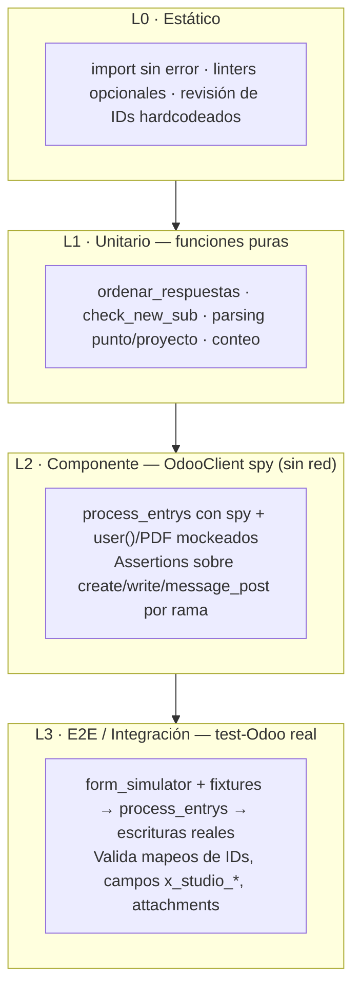

# QA — Integración Connecteam → Odoo

> Carpeta de desarrollo y documentación de pruebas para el pipeline `pipeline_registro_II`.
> Punto de entrada del sistema bajo prueba (SUT): `main.py:job()` → `processor.process_entrys()`.

Esta carpeta contiene **dos cosas**:

1. **Documentación de QA** (`docs/`): estrategia, requisitos, arquitectura de pruebas,
   catálogos de casos por módulo y matriz de trazabilidad. Usa diagramas Mermaid
   (flowcharts, sequence, requirement) que GitHub y VS Code renderizan nativamente.
2. **Scaffolding ejecutable** (`scaffolding/`): suite `pytest` con un *spy* de
   `OdooClient` para aislar la lógica sin escribir en Odoo, más una capa de
   integración (smoke / E2E) contra el **test-Odoo** real.

---

## Mapa de la carpeta

```
qa/
├── README.md                       ← este archivo (índice + cómo correr)
├── docs/
│   ├── 01_estrategia_y_requisitos.md   Objetivos, riesgos, pirámide, requirementDiagram
│   ├── 02_arquitectura_de_pruebas.md   Aislamiento, spy vs test-Odoo, datos, oráculos
│   ├── 03_casos_transversales.md       Validación compartida, dedup, parsing, conteo, PDF, inbox
│   ├── 04_modulo_MC.md                 Mantención Correctiva
│   ├── 05_modulo_CF.md                 Configuración
│   ├── 06_modulo_R.md                  Reemplazo/Extracción (+ Calibración absorbida)
│   ├── 07_modulo_I.md                  Instalación
│   ├── 08_modulo_MP.md                 Mantención Preventiva
│   └── 09_matriz_trazabilidad.md       Requisitos ↔ casos de prueba
└── scaffolding/
    ├── pytest.ini                  Config de pytest (testpaths, markers)
    ├── conftest.py                 Fixtures: schema, submissions, spy, dedup-db temporal
    ├── odoo_spy.py                 Doble de prueba de OdooClient (registra create/write/...)
    ├── requirements-qa.txt         Dependencias extra de QA (pytest)
    ├── unit/
    │   ├── test_data_processing.py     ordenar_respuestas (funciones puras)
    │   └── test_check_new_sub.py       deduplicación SQLite aislada
    ├── component/
    │   └── test_process_entrys_mc.py   plantilla spy-based de process_entrys (módulo MC)
    └── integration/
        ├── README.md                   cómo correr contra test-Odoo
        └── test_smoke_test_odoo.py     smoke E2E (skip si no hay credenciales)
```

---

## Pirámide de pruebas (resumen)



Detalle y justificación en [`docs/01_estrategia_y_requisitos.md`](docs/01_estrategia_y_requisitos.md).

---

## Cómo correr

> Usar siempre el intérprete del venv del proyecto: `/Users/dacm/we/.venv/bin/python`.

```bash
# desde pipeline_registro_II/
PY=/Users/dacm/we/.venv/bin/python

# 1. Instalar dependencias de QA (una vez)
$PY -m pip install -r qa/scaffolding/requirements-qa.txt

# 2. Unitarios + componente (rápidos, SIN red, NO tocan Odoo)
$PY -m pytest qa/scaffolding -m "not integration" -v

# 3. Solo integración contra test-Odoo (ESCRIBE en la instancia de prueba)
#    Requiere .env con el bloque URL_TEST/DB_TEST/USER_TEST/ODOO_API_KEY
#    y RUN_ODOO_INTEGRATION=1 para confirmar intención.
RUN_ODOO_INTEGRATION=1 $PY -m pytest qa/scaffolding -m integration -v
```

`pytest.ini` define `testpaths` y el marker `integration`; `conftest.py` agrega
`pipeline_registro_II/` al `sys.path` para que los tests importen `processor`,
`data_processing`, etc., directamente.

---

## Reglas de oro de este QA

1. **No confíes en "no lanzó excepción".** El pipeline traga errores con
   `try/except + continue` ([processor_documentation §14](../flows/processor_documentation.md)).
   Todo caso debe afirmar **positivamente** un efecto observable (un `create`/`write`
   con tales campos, un registro de inbox, un PDF adjunto), nunca solo ausencia de error.
2. **La integración escribe en Odoo de verdad.** Solo contra `URL_TEST`. Nunca apuntar
   los tests al Odoo productivo. Ver `config.py` (bloque comentado prod vs activo test).
3. **El estado de dedup es global.** `check_new_sub` lee/escribe `form_entries.db`
   commiteado. Los tests usan una DB temporal; jamás muten la real.
4. **Los IDs son load-bearing y difieren prod/test.** Followers, etiquetas, tipos,
   ubicaciones (`593/594`), equipos. La capa L3 es la única que valida que esos IDs
   existan en el test-Odoo.
```
