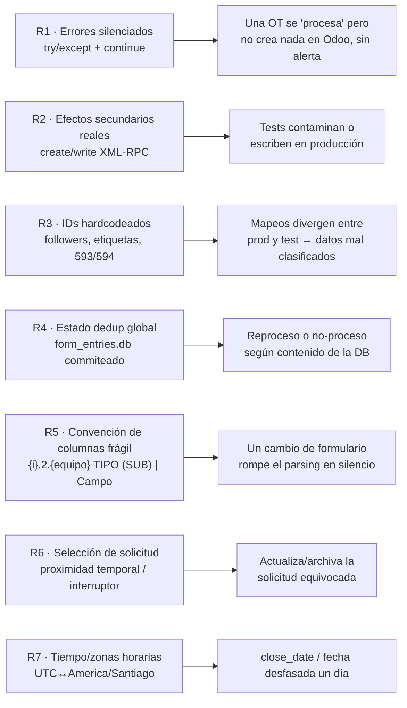
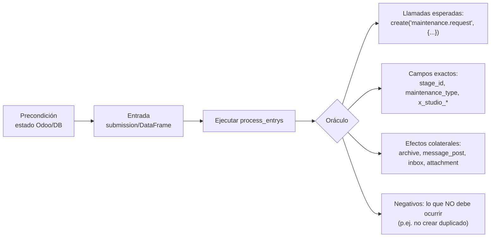

# 01 · Estrategia de Pruebas y Requisitos

> SUT (System Under Test): pipeline `pipeline_registro_II` — `main.job()` →
> `connecteam_api` → `data_processing` → `processor.process_entrys()` → Odoo (XML-RPC).
> Referencia funcional: [`flows/processor_documentation.md`](../../flows/processor_documentation.md).

---

## 1. Objetivo del QA

Garantizar que **cada submission de Connecteam produzca el efecto correcto en Odoo**
(crear/actualizar la solicitud de mantenimiento adecuada, mover ubicaciones de equipo,
adjuntar el PDF correcto, notificar el inbox correcto) y que las **anomalías de datos**
(S/N inexistente, punto inexistente, equipo sin ubicación) se canalicen al inbox con la
prioridad y etiqueta correctas — **sin** corromper estado ni escribir en producción.

---

## 2. Análisis de riesgos (qué puede salir mal)



| ID | Riesgo | Severidad | Capa de prueba que lo mitiga | Origen en código |
|----|--------|-----------|------------------------------|------------------|
| R1 | Errores tragados (`continue`) ocultan fallos | **Alta** | L2 (oráculo positivo), L3 | [doc §14](../../flows/processor_documentation.md) · `processor.py` try/except |
| R2 | Escrituras XML-RPC reales | **Alta** | L2 usa spy; L3 solo test-Odoo | `odoo_client.py` `create/write` |
| R3 | IDs divergentes prod/test | **Alta** | L3 (smoke contra test-Odoo) | `data_processing.inbox()`, `processor.py` `593/594/5118/team 2` |
| R4 | Estado dedup global | Media | L1 (`check_new_sub` con DB temporal) | `data_processing.check_new_sub` |
| R5 | Parsing de columnas frágil | **Alta** | L1 (parsing/conteo) + L2 | `processor.py` L84-253 |
| R6 | Selección de solicitud incorrecta | **Alta** | L2 por módulo | módulos CF/MP/R/MC/I |
| R7 | Desfase de zona horaria | Media | L1 (`ordenar_respuestas`, `detalle_op`) | `data_processing` `ZoneInfo` |

---

## 3. Niveles / pirámide de pruebas

| Nivel | Qué prueba | Aislamiento | Velocidad | Toca Odoo |
|-------|-----------|-------------|-----------|-----------|
| **L0 Estático** | Imports válidos, IDs hardcodeados inventariados | total | instantáneo | no |
| **L1 Unitario** | Funciones puras: `ordenar_respuestas`, parsing, conteo, `check_new_sub` | total (DB temporal) | ms | no |
| **L2 Componente** | `process_entrys` por rama, con **spy** de OdooClient + `user()`/PDF mockeados | spy (sin red) | s | no (spy) |
| **L3 Integración/E2E** | Submission → escritura real, valida IDs/campos | test-Odoo real | min | **sí (test)** |

**Por qué esta forma:** la lógica de negocio vive monolítica en `process_entrys`
(~4500 líneas, una sola función con ramas anidadas). No es unit-testeable pieza por
pieza sin refactor, así que el peso recae en **L2 (componente con spy)**: se invoca
`process_entrys` completo con un DataFrame fabricado y un `OdooClient` espía que
registra cada `create/write/message_post`, y se afirma sobre esas llamadas. L3 cubre
lo único que el spy no puede: que los IDs/campos `x_studio_*` existan y sean válidos
en un Odoo real.

---

## 4. Estrategia del oráculo (cómo se decide pass/fail)

Dado el riesgo R1, **el oráculo nunca es "no hubo excepción"**. Cada caso define:



En **L2** el oráculo inspecciona `spy.calls` (lista de tuplas registradas).
En **L3** el oráculo hace `search_read` post-ejecución en el test-Odoo.

---

## 5. Requisitos verificables (requirementDiagram)

Los requisitos se agrupan por área. Cada uno se enlaza a casos en la
[matriz de trazabilidad](09_matriz_trazabilidad.md).

```mermaid
requirementDiagram

requirement REQ_ING {
  id: "REQ-ING-1"
  text: "Toda submission nueva (no en form_entries.db) debe procesarse exactamente una vez."
  risk: high
  verifymethod: test
}

requirement REQ_PARSE {
  id: "REQ-PARSE-1"
  text: "El pipeline detecta puntos visitados por prefijo numérico y parsea proyecto/punto desde 'Punto [Proyecto]'."
  risk: high
  verifymethod: test
}

requirement REQ_VAL_SN {
  id: "REQ-VAL-SN-1"
  text: "S/N no hallado en maintenance.equipment cae a stock.move.line; si hay transferencia pendiente => 'Creación en espera', si no => 'S/N no encontrado'."
  risk: high
  verifymethod: test
}

requirement REQ_VAL_LOC {
  id: "REQ-VAL-LOC-1"
  text: "Ubicación del equipo: False => 'Sin evento de instalación'; distinta => 'Cambio de ubicación'; igual => flujo normal."
  risk: high
  verifymethod: test
}

requirement REQ_VAL_PT {
  id: "REQ-VAL-PT-1"
  text: "Si el punto [proyecto] punto no existe en x_maintenance_location => inbox prioridad M."
  risk: medium
  verifymethod: test
}

requirement REQ_REQSEL {
  id: "REQ-REQSEL-1"
  text: "La selección/creación de solicitud sigue el algoritmo del módulo (interruptor MC, proximidad CF/MP/R, primera-activa I)."
  risk: high
  verifymethod: test
}

requirement REQ_STAGE {
  id: "REQ-STAGE-1"
  text: "Equipo operativo => stage 5 + close_date + feedback de actividad; no operativo => stage 3 + PDF adjunto."
  risk: high
  verifymethod: test
}

requirement REQ_PDF {
  id: "REQ-PDF-1"
  text: "Cada módulo genera el PDF con la nomenclatura correcta y lo adjunta como ir.attachment / x_studio_informe."
  risk: medium
  verifymethod: test
}

requirement REQ_INBOX {
  id: "REQ-INBOX-1"
  text: "El inbox se crea con origen (A/M/N), etiqueta, tipo y followers correctos."
  risk: medium
  verifymethod: test
}

requirement REQ_ISO {
  id: "REQ-ISO-1"
  text: "Las pruebas no escriben en Odoo productivo ni mutan form_entries.db real."
  risk: high
  verifymethod: inspection
}

element Pipeline {
  type: "SUT"
}

Pipeline - satisfies -> REQ_ING
Pipeline - satisfies -> REQ_PARSE
Pipeline - satisfies -> REQ_VAL_SN
Pipeline - satisfies -> REQ_VAL_LOC
Pipeline - satisfies -> REQ_VAL_PT
Pipeline - satisfies -> REQ_REQSEL
Pipeline - satisfies -> REQ_STAGE
Pipeline - satisfies -> REQ_PDF
Pipeline - satisfies -> REQ_INBOX
```



---

## 6. Alcance

**Dentro de alcance:** `data_processing`, `processor` (MC/CF/R/I/MP), `connecteam_api`
(parsing de respuestas), `inbox`, generación/adjunto de PDF, dedup.

**Fuera de alcance (por ahora):** SharePoint/Excel (rutas comentadas en `main.py`),
el render visual del PDF (se valida que se genera y adjunta, no su layout),
GitHub Actions cron (se documenta como riesgo operacional, no se prueba aquí).

---

## 7. Criterios de entrada/salida

- **Entrada a QA:** rama con `import processor` exitoso y `.env` test-Odoo configurado.
- **Salida (Definition of Done de un ciclo):** L1+L2 verdes; matriz de trazabilidad sin
  requisitos en estado *No cubierto* para los de `risk: high`; smoke L3 verde contra test-Odoo.
```
