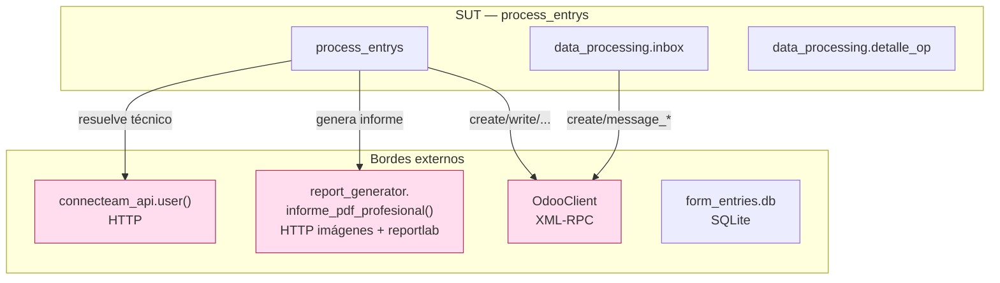
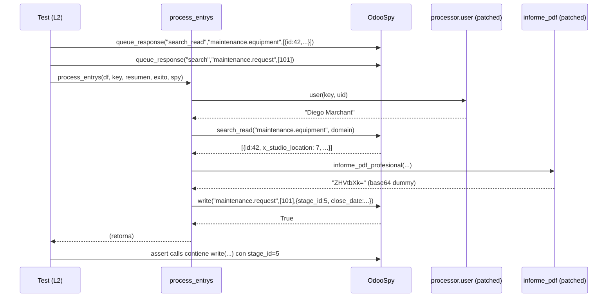
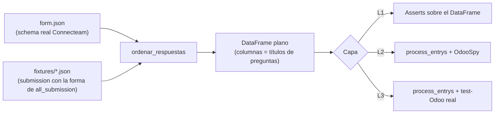
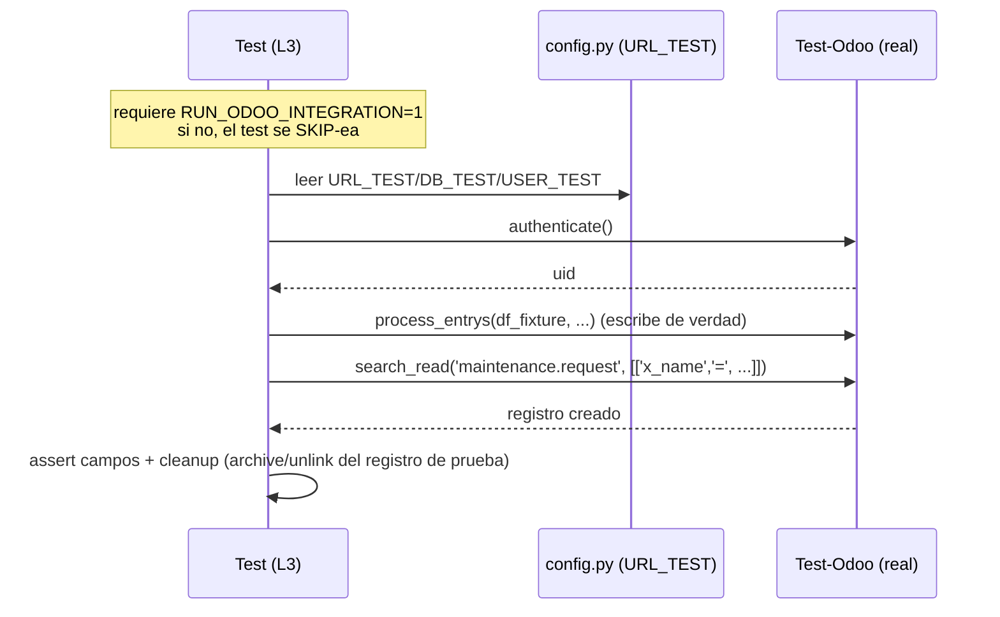

# 02 · Arquitectura de Pruebas

> Cómo se aísla el SUT, cómo fluyen los datos de prueba, y qué hace cada doble de prueba.

---

## 1. Vista de aislamiento

El pipeline tiene **tres bordes externos**: Connecteam (HTTP), Odoo (XML-RPC) y el
disco (`form_entries.db`, PDFs). La estrategia es cortar cada borde según el nivel.



| Borde | L1 unitario | L2 componente | L3 integración |
|-------|-------------|---------------|----------------|
| `connecteam_api.user()` | n/a | **monkeypatch** `processor.user` → nombre fijo | real (técnico real) |
| `informe_pdf_profesional()` | n/a | **monkeypatch** `processor.informe_pdf_profesional` → base64 dummy | real (genera PDF) |
| `OdooClient` | n/a | **OdooSpy** (registra, no envía) | real (test-Odoo) |
| `form_entries.db` | DB temporal | no se invoca (`check_new_sub` está fuera de `process_entrys`) | DB temporal o copia |

> **Detalle crítico de monkeypatching:** `processor.py` hace
> `from connecteam_api import user`, `from data_processing import detalle_op, inbox`,
> `from report_generator import informe_pdf_profesional` (líneas 6-8). Esos nombres
> quedan **rebindeados en el namespace `processor`**. Por eso se parchea
> `processor.user` / `processor.informe_pdf_profesional`, **no** `connecteam_api.user`.
> Parchear el módulo origen no tiene efecto sobre la referencia ya importada.

---

## 2. El OdooSpy

`OdooSpy` implementa la **misma interfaz** que `OdooClient` (`create`, `write`,
`search`, `search_read`, `read`, `message_post`, `message_subscribe`,
`action_feedback`, `execute_kw`) pero:

- **No abre conexión** ni autentica.
- **Registra** cada llamada en `self.calls` (lista de objetos `Call(method, model, args, kwargs)`).
- **Devuelve respuestas programables**: los tests pre-cargan qué debe devolver cada
  `search`/`search_read` para simular el estado de Odoo (equipo existe, solicitudes
  activas, etc.).



Programar respuestas de `search`/`search_read` es lo que permite construir las
**precondiciones** ("hay una solicitud activa cercana", "no hay equipo", etc.) sin Odoo.

---

## 3. Flujo de datos de prueba (fixtures)



Dos fuentes de DataFrame:

1. **Fixtures JSON** (`simulated_submissions/`, generadas por `form_simulator.py`):
   forma idéntica a `all_submission()`. Se pasan por `ordenar_respuestas(schema, sub)`
   para obtener el DataFrame real. **Preferido** porque ejercita también el parser.
2. **DataFrame fabricado a mano** en el test: filas/columnas construidas directamente
   siguiendo la convención `{i}.2.{equipo} TIPO (SUB) | Campo`. Útil para casos límite
   difíciles de capturar interactivamente.

> El catálogo de fixtures vive en [`scaffolding/integration/README.md`](../scaffolding/integration/README.md)
> y se cruza con los casos en cada doc de módulo.

---

## 4. Capa L3 — integración contra test-Odoo



**Salvaguardas L3:**

- Se ejecuta **solo** con `RUN_ODOO_INTEGRATION=1` (gate explícito) y marker `integration`.
- `config.py` debe tener **activo el bloque `URL_TEST`** (no el productivo). El smoke
  test L3 verifica al inicio que `ODOO_URL` contiene el host de test y aborta si no.
- Idealmente cada test L3 **limpia** lo que creó (o usa OTs con prefijo reservado de QA),
  para no inflar el test-Odoo. Documentado como convención, no siempre automatizable
  porque `process_entrys` no devuelve los IDs que creó.

---

## 5. Por qué `process_entrys` no se parte en unidades

`process_entrys` es una sola función con el loop principal y las 5 ramas de módulo
inline (sin sub-funciones extraíbles). Testear "solo el módulo MC" significa, hoy,
**invocar toda la función** con un DataFrame que solo contenga trabajo MC. El spy
filtra el ruido: assertas únicamente sobre las llamadas Odoo relevantes.

> **Recomendación de testabilidad (mejora futura, fuera de alcance de QA):** extraer
> cada módulo a una función `_procesar_mc(df_visita, ctx, odoo)` permitiría unit tests
> directos. Mientras no ocurra, L2 con spy es el sustituto pragmático.
```
