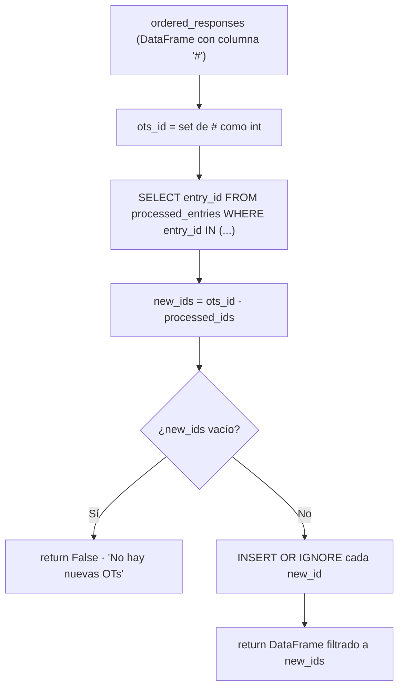
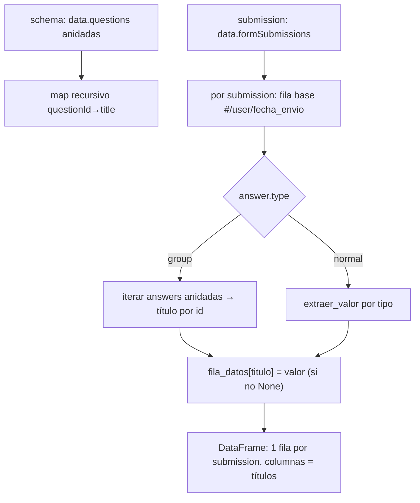
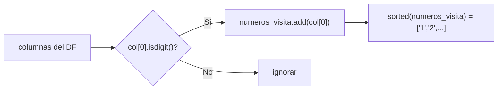
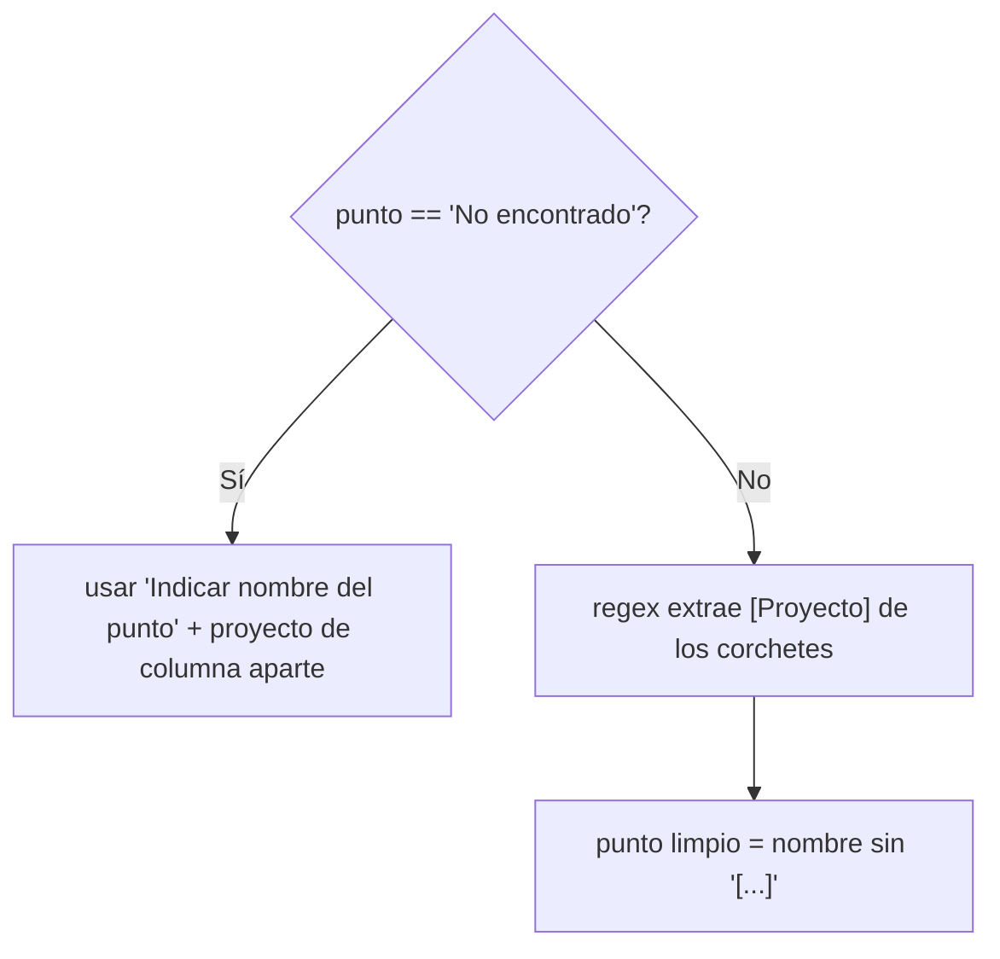
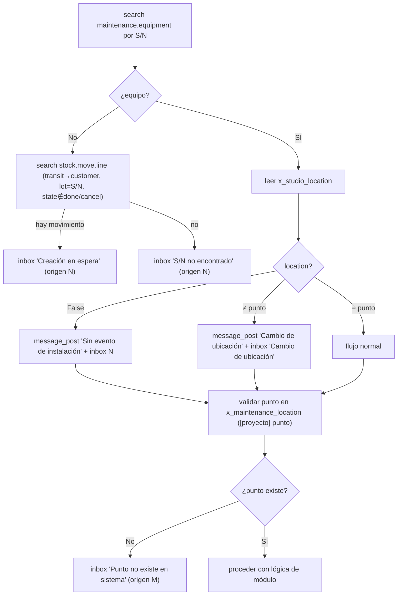
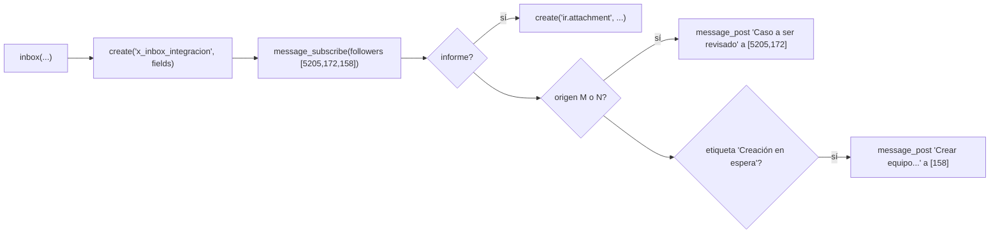

# 03 · Casos Transversales

> Pruebas de la maquinaria **compartida por todos los módulos**: ingestión/dedup,
> parsing de puntos y proyectos, conteo de instancias, el pipeline de validación
> (S/N → ubicación → punto), generación de PDF y registro en inbox.
> Estos casos se ejecutan **antes** que los de módulo: si fallan, los de módulo no son confiables.

IDs de caso: `TC-TR-NN`. Cobertura de requisitos en [matriz](09_matriz_trazabilidad.md).

---

## 1. Ingestión y deduplicación — `check_new_sub`

Capa **L1** (DB temporal). Ref: `data_processing.check_new_sub`.



| Caso | Precondición (DB) | Entrada (#) | Resultado esperado | Verifica |
|------|-------------------|-------------|--------------------|----------|
| TC-TR-01 | DB vacía | {9, 10} | Devuelve DF con filas 9 y 10; DB ahora contiene 9,10 | REQ-ING-1 |
| TC-TR-02 | DB tiene {9} | {9, 10} | Devuelve DF con **solo** 10; DB contiene 9,10 | REQ-ING-1 |
| TC-TR-03 | DB tiene {9,10} | {9, 10} | Devuelve `False` (no DataFrame) | REQ-ING-1 |
| TC-TR-04 | DB vacía | {} (DF sin filas) | No agrega nada; no crashea | borde |
| TC-TR-05 | tabla `processed_entries` ausente | {9} | Captura `sqlite3.Error`, devuelve `[]` (lista vacía) | robustez |
| TC-TR-06 | `#` como string `"9"` y `"9.0"` | mezcla | `int(i)` normaliza; sin duplicar | R5/casting |

> **Hallazgo de testabilidad:** `check_new_sub` calcula la ruta de DB internamente
> (`os.path.dirname(__file__)`), así que **siempre apunta a `form_entries.db` real**.
> El test la aísla con `monkeypatch` sobre `data_processing.sqlite3.connect` para
> redirigir a una DB temporal con la tabla pre-creada. **Nunca** correr este test sin
> ese aislamiento (mutaría el estado commiteado → REQ-ISO-1).

> **Contrato de retorno inconsistente:** devuelve `DataFrame` | `False` | `[]` según
> el caso. `main.py` solo chequea `isinstance(..., pd.DataFrame) and not empty`, así que
> `False`/`[]` se tratan igual; aun así, los tests fijan el tipo exacto por caso para
> detectar regresiones.

---

## 2. Aplanado de respuestas — `ordenar_respuestas`

Capa **L1** (función pura). Ref: `data_processing.ordenar_respuestas`.



| Caso | Entrada | Resultado esperado | Verifica |
|------|---------|--------------------|----------|
| TC-TR-10 | submission con grupo anidado | columnas de preguntas internas presentes con su título | REQ-PARSE-1 |
| TC-TR-11 | `yesNo` selectedIndex 0 / 1 | `"Sí"` / `"No"` | mapeo |
| TC-TR-12 | `datetime` timestamp epoch | string `YYYY-MM-DD HH:MM:SS` en **America/Santiago** | R7 |
| TC-TR-13 | `image` con 2 URLs | lista `[url1, url2]` | parsing |
| TC-TR-14 | `multipleChoice` multi | `"a, b"` (join por coma) | parsing |
| TC-TR-15 | answer `wasHidden=True` | la columna **no aparece** (valor None se descarta) | REQ-PARSE-1 |
| TC-TR-16 | submission vacía / sin answers | DataFrame vacío o fila solo con #/user | borde |
| TC-TR-17 | `description` type | devuelve None → no genera columna | parsing |

> **Nota de TZ (TC-TR-12):** `extraer_valor` interpreta el epoch como **UTC** y convierte
> a Santiago para mostrar. Más adelante `detalle_op` vuelve a parsear ese string como
> UTC y reconvierte — verificar que no haya doble conversión que corra la fecha (R7).

---

## 3. Detección de puntos y parsing proyecto/punto

Capa **L1** sobre el DataFrame, y **L2** dentro de `process_entrys` (L84-147).

### 3.1 Detección de puntos visitados



| Caso | Columnas presentes | `numeros_visita` esperado | Verifica |
|------|--------------------|--------------------------:|----------|
| TC-TR-20 | `1.1 ...`, `1.2 ...`, `Fecha visita ` | `['1']` | REQ-PARSE-1 |
| TC-TR-21 | `1.* ...` y `2.* ...` | `['1','2']` | multipunto |
| TC-TR-22 | ninguna columna empieza con dígito | `[]` → no procesa nada | borde |
| TC-TR-23 | `10.1 ...` (punto de dos dígitos) | **`['1']` — DEFECTO: solo toma `col[0]`** | R5 (defecto) |

> **TC-TR-23 documenta un límite real:** el código usa `col[0]` (un solo carácter), así que
> un punto "10" se detecta como "1". El caso queda registrado como *expected-fail* /
> defecto conocido para que QA lo vigile; no es un falso positivo del test.

### 3.2 Parsing de `Punto [Proyecto]`



| Caso | Valor de la celda | proyecto / punto esperado | Verifica |
|------|-------------------|---------------------------|----------|
| TC-TR-30 | `Pozo BN6 [Las Tórtolas]` | proyecto=`Las Tórtolas`, punto=`Pozo BN6` | REQ-PARSE-1 |
| TC-TR-31 | `No encontrado` + campo manual | usa nombre manual + proyecto de columna separada | rama manual |
| TC-TR-32 | `Punto sin corchetes` | proyecto vacío / punto = literal (comportamiento a fijar) | borde |
| TC-TR-33 | corchetes anidados o `]` extra | regex no debe romper; documentar resultado | R5 |

### 3.3 Conteo de instancias por tipo (L166-253)

Patrón de columna: `{punto}.2.{equipo} {TIPO} ({SUBTIPO}) | Campo`.

| Caso | Columnas | conteo esperado | Verifica |
|------|----------|-----------------|----------|
| TC-TR-40 | `1.2.1 MP (I) \| Modelo`, `1.2.2 MP (I) \| Modelo` | `conteo_MP['I'] == 2` | REQ-PARSE-1 |
| TC-TR-41 | `1.2.1 MP (T) \| ...` y `1.2.1 MP (I) \| ...` | `{'T':1,'I':1}` | subtipos |
| TC-TR-42 | `1.2.1 R (E) \| ...`, `1.2.1 R (I) \| ...` | `conteo_R == {'E':1,'I':1}` | módulo R |
| TC-TR-43 | `1.2.1 MC \| ...` (sin subtipo) | `conteo_instancias_MC == 1` | MC |
| TC-TR-44 | columnas de dos puntos mezcladas (1.* y 2.*) | conteo por punto no se cruza | aislamiento punto |

---

## 4. Pipeline de validación compartido (S/N → ubicación → punto)

Capa **L2** (spy). Es el patrón que todos los módulos ejecutan antes de crear/actualizar.
Ref: [processor_documentation §5](../../flows/processor_documentation.md).



| Caso | Estado simulado (spy responses) | Efecto esperado (assert sobre spy) | Verifica |
|------|----------------------------------|------------------------------------|----------|
| TC-TR-50 | equipo no existe, **sí** hay `stock.move.line` pendiente | `create('x_inbox_integracion', …)` con etiqueta `'Creación en espera'`, origen `N`; **no** se crea `maintenance.request` | REQ-VAL-SN-1 |
| TC-TR-51 | equipo no existe, **no** hay movimiento | inbox etiqueta `'S/N no encontrado'`, origen `N`; no se crea request | REQ-VAL-SN-1 |
| TC-TR-52 | equipo existe, `x_studio_location = False` | `message_post` "sin evento de instalación" + inbox origen `N`; **continúa** al flujo | REQ-VAL-LOC-1 |
| TC-TR-53 | equipo existe, `location ≠ punto actual` | `message_post` "cambio de ubicación" + inbox `'Cambio de ubicación'`; continúa | REQ-VAL-LOC-1 |
| TC-TR-54 | equipo existe, `location = punto` | sin notificaciones de ubicación; va directo a lógica de módulo | REQ-VAL-LOC-1 |
| TC-TR-55 | punto no existe en `x_maintenance_location` | inbox `'Punto no existe en sistema'` origen `M` | REQ-VAL-PT-1 |
| TC-TR-56 | punto existe | sin inbox de punto; procede | REQ-VAL-PT-1 |

> El dominio de `stock.move.line` a verificar (TC-TR-50/51):
> `location_usage='transit'`, `location_dest_usage='customer'`, `lot_id.name=S/N`,
> `state not in ['done','cancel']` ([doc §5.3](../../flows/processor_documentation.md)).
> El test debe afirmar que el `search`/`search_read` se hizo con **ese** dominio.

---

## 5. Generación y adjunto de PDF

Capa **L2** (PDF mockeado: se afirma la *invocación* y la nomenclatura, no el render)
y **L3** (genera el PDF real). Ref: [doc §11.1-11.2](../../flows/processor_documentation.md).

| Caso | Módulo / entrada | Nombre de archivo esperado | Verifica |
|------|------------------|----------------------------|----------|
| TC-TR-60 | MC, OT=145, punto=`Pozo_BN6` | `informe_OT-145_Pozo_BN6_MC_1.pdf` | REQ-PDF-1 |
| TC-TR-61 | MP (I), OT=203, punto `Lora_Dren_T4` | `informe_OT-203_Lora_Dren_T4_MP_I_1.pdf` | REQ-PDF-1 |
| TC-TR-62 | R (par E/I), OT=236, `Pozo_P7` | `informe_OT-236_Pozo_P7_R_E_1.pdf` y `..._R_I_1.pdf` | REQ-PDF-1 |
| TC-TR-63 | no operativo | el PDF se adjunta como `ir.attachment` (mimetype pdf, base64) | REQ-PDF-1 |

> Los nombres de TC-TR-60/61/62 están calibrados contra archivos reales ya generados en
> `informes_pdf/` (p.ej. `informe_OT-203_Lora_Dren_T4_MP_I_1.pdf`). Sirven de **golden names**.

---

## 6. Registro en inbox — `inbox()`

Capa **L2** (spy). Ref: `data_processing.inbox` + [doc §11.3](../../flows/processor_documentation.md).



| Caso | Entrada | Assert (spy) | Verifica |
|------|---------|--------------|----------|
| TC-TR-70 | origen `A` (éxito) | `create` con `x_studio_origen=[(4,2)]`, `x_studio_stage_id` según etapa; **sin** message_post de revisión | REQ-INBOX-1 |
| TC-TR-71 | origen `M` | message_post "Caso a ser revisado" a partners `[5205,172]` | REQ-INBOX-1 |
| TC-TR-72 | origen `N` | igual que M (rama `M or N`) | REQ-INBOX-1 |
| TC-TR-73 | etiqueta `'Creación en espera'` | message_post extra "Crear equipo…" a `[158]` | REQ-INBOX-1 |
| TC-TR-74 | `id_tipo` mapea a tipo correcto | `x_studio_e_i` = `tipo[id_tipo]` (p.ej. `'Caudalímetro' → [(4,7)]`) | R3 |
| TC-TR-75 | `id_etiqueta = False` | `x_studio_etiqueta = False` (no crashea por KeyError) | borde |
| TC-TR-76 | siempre | `message_subscribe` con followers `[5205,172,158]` | REQ-INBOX-1 |

> **Mapas dependientes de entorno (R3):** los diccionarios `tipo`, `origen`,
> `etiquetas`, `estados`, `carpetas` traen comentarios `Productivo: N | Test: M`.
> En **L2** solo se valida que `inbox()` use el valor del diccionario actual; la
> validación de que ese ID exista en Odoo es **L3** (smoke). El comentario in-file
> indica que **Test difiere de Productivo** para varios tipos → vigilar al promover.

> **Discrepancia documentada:** la docstring de `inbox()` lista followers `172/147/158`
> (Rodrigo/Emir/Juan) pero el código real suscribe `[5205, 172, 158]` (Felipe en vez de
> Emir). El caso TC-TR-76 afirma el **valor real del código**, no el comentario.
```
