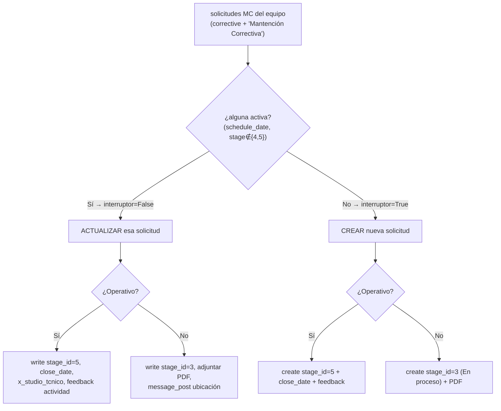
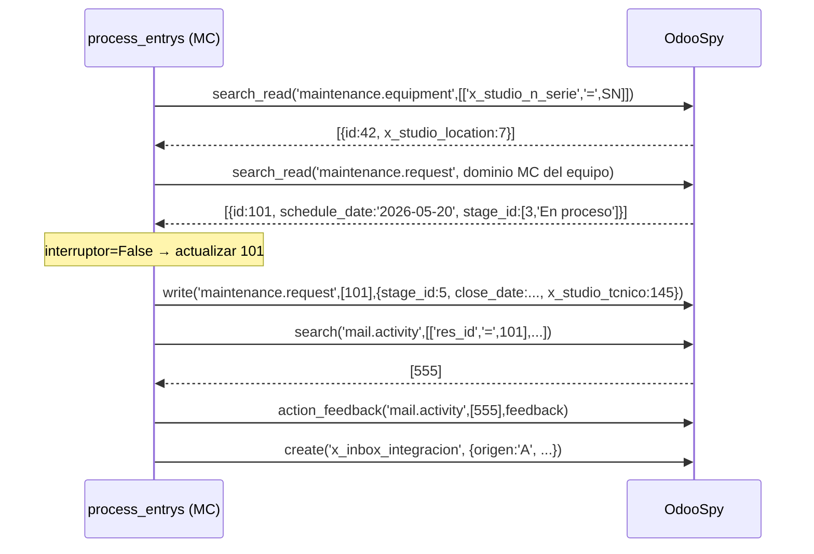

# 04 · Módulo MC — Mantención Correctiva

> Ref. funcional: [processor_documentation §6](../../flows/processor_documentation.md) ·
> `processor.py` L283-882 · `maintenance_type = corrective`.
> Prereq: los [casos transversales](03_casos_transversales.md) (validación S/N/ubicación/punto)
> deben estar verdes; aquí se asume equipo encontrado y ubicación resuelta salvo que el caso diga otra cosa.

IDs de caso: `TC-MC-NN`.

---

## 1. Diagrama de decisión bajo prueba



**Interruptor MC:** se itera sobre todas las solicitudes correctivas; si alguna tiene `schedule_date` y no está finalizada (≠5) ni desechada (≠4), `interruptor=False` → se **actualiza** esa; si todas están cerradas, `interruptor=True` → se **crea**.

---

## 2. Secuencia (rama: existe activa + operativo=Sí)



---

## 3. Matriz de casos

| Caso     | Precondición (spy)                                            | Entrada clave    | Resultado esperado (oráculo positivo)                                                                                                            | Req                       |
| -------- | -------------------------------------------------------------- | ---------------- | ------------------------------------------------------------------------------------------------------------------------------------------------- | ------------------------- |
| TC-MC-01 | Equipo OK;**hay** solicitud activa stage=3               | operativo=Sí    | `write` sobre esa solicitud con `stage_id=5`, `close_date`, `x_studio_tcnico`; `action_feedback` sobre la actividad; inbox origen `A` | REQ-REQSEL-1, REQ-STAGE-1 |
| TC-MC-02 | Equipo OK; hay solicitud activa                                | operativo=No     | `write` `stage_id=3`; `create('ir.attachment')` con el PDF; `message_post` con ubicación; **sin** `action_feedback`              | REQ-STAGE-1, REQ-PDF-1    |
| TC-MC-03 | Equipo OK;**todas** las solicitudes cerradas (stage 5/4) | operativo=Sí    | `create('maintenance.request', {maintenance_type:'corrective', stage_id:5, close_date,...})`; feedback                                          | REQ-REQSEL-1, REQ-STAGE-1 |
| TC-MC-04 | Equipo OK; sin solicitudes                                     | operativo=No     | `create` con `stage_id=3`; PDF adjunto; **no** `write` a solicitud previa                                                             | REQ-REQSEL-1              |
| TC-MC-05 | Equipo OK; hay 2 activas (una stage=3, otra con fecha)         | operativo=Sí    | el interruptor toma la activa correcta (no crea nueva)                                                                                            | REQ-REQSEL-1              |
| TC-MC-06 | **S/N no existe**, sin movimiento                        | —               | inbox `'S/N no encontrado'`; **no** se crea/actualiza request                                                                             | REQ-VAL-SN-1              |
| TC-MC-07 | S/N no existe,**con** `stock.move.line`                | —               | inbox `'Creación en espera'`                                                                                                                   | REQ-VAL-SN-1              |
| TC-MC-08 | Equipo `x_studio_location=False`                             | operativo=Sí    | message_post "sin evento instalación" + inbox `N`; aun así procesa la solicitud                                                               | REQ-VAL-LOC-1             |
| TC-MC-09 | Equipo location ≠ punto                                       | operativo=Sí    | message_post "cambio de ubicación" + inbox; procesa                                                                                              | REQ-VAL-LOC-1             |
| TC-MC-10 | Punto no existe en sistema                                     | operativo=Sí    | inbox `'Punto no existe en sistema'` origen `M`                                                                                               | REQ-VAL-PT-1              |
| TC-MC-11 | 2 equipos MC en el mismo punto (`1.2.1 MC`, `1.2.2 MC`)    | ambos operativos | dos ciclos independientes; dos PDFs; nombres `..._MC_1` y `..._MC_2`                                                                          | REQ-PARSE-1, REQ-PDF-1    |
| TC-MC-12 | Campos extraídos                                              | —               | el `create/write` lleva `obs_MC`, `modelo_MC`, `serial_MC` en los campos correctos                                                        | mapeo                     |

**Campos MC** (oráculo de TC-MC-12): `MC | Modelo`, `MC | Activo a intervenir`, `MC | N° de serie`, `MC | ¿Equipo operativo tras trabajos?`, `MC | Observación`
([doc §6.1](../../flows/processor_documentation.md)).

---

## 4. Casos negativos (lo que NO debe pasar)

| Caso     | Escenario            | Aserción negativa                                                      |
| -------- | -------------------- | ----------------------------------------------------------------------- |
| TC-MC-N1 | Hay solicitud activa | **No** se crea una `maintenance.request` nueva (solo `write`) |
| TC-MC-N2 | operativo=Sí        | **No** queda `stage_id=3` colgado                               |
| TC-MC-N3 | S/N no encontrado    | **No** hay ningún `create('maintenance.request')`              |

---

## 5. Notas de implementación para el test (L2)

- Construir un DataFrame de una fila con columnas: globales (`#`, `user`, `Fecha visita `, `Nombre del Cliente`), del punto (`1.1 Punto de monitoreo`, `1.2 Tipo de trabajo a realizar = "MC"`, `1.3 ...`, `1.4 ...`) y de equipo (`1.2.1 MC | Modelo`, `… | N° de serie`, `… | ¿Equipo operativo tras trabajos?`, `… | Observación`, `… | Activo a intervenir`).
- Programar el spy: `search_read('maintenance.equipment', …)` → equipo; el `search` de solicitudes → según el caso; `search('mail.activity', …)` → `[555]` para que el feedback tenga a quién cerrar.
- Parchear `processor.user` → `"Diego Marchant"` (existe en `operators` → 145) y  `processor.informe_pdf_profesional` → base64 dummy.
- Ver plantilla ejecutable en [`scaffolding/component/test_process_entrys_mc.py`](../scaffolding/component/test_process_entrys_mc.py).

```

```
