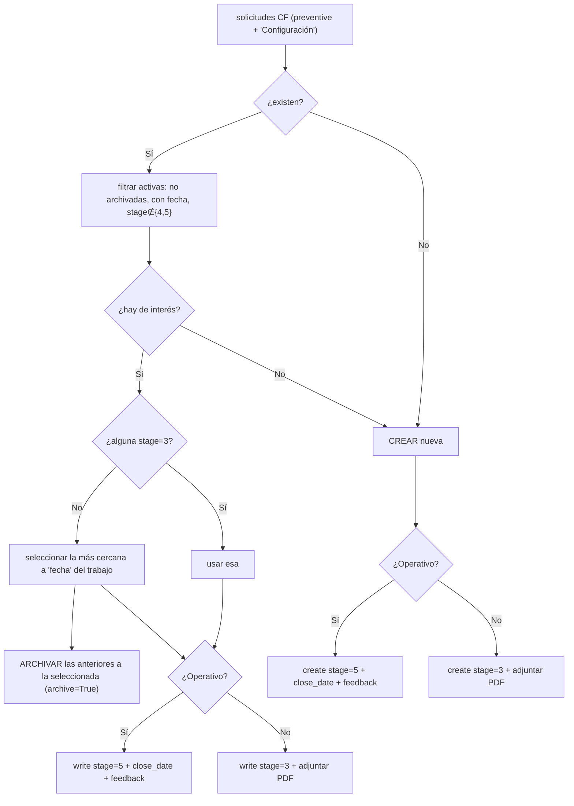
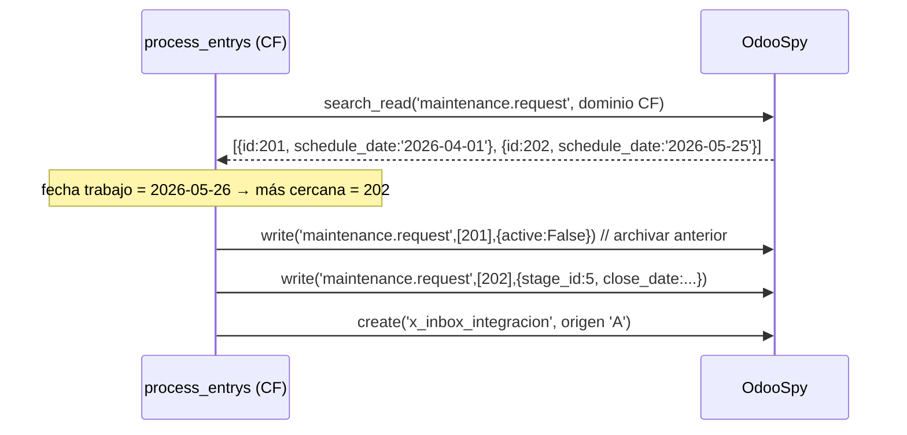

# 05 · Módulo CF — Configuración

> Ref: [processor_documentation §7](../../flows/processor_documentation.md) ·
> `processor.py` L884-1589 · `maintenance_type = preventive`, mantención `'Configuración'`.
> Diferencia clave con MC: **selección de solicitud por proximidad temporal** + **archivado automático**.

IDs de caso: `TC-CF-NN`. Prereq: [transversales](03_casos_transversales.md) verdes.

---

## 1. Diagrama de decisión



**Algoritmo de selección (CF):** Prioridad 1 = solicitud en `stage=3`. Prioridad 2 =
la de `schedule_date` más cercana a `fecha`. **Efecto colateral:** archiva las de
fecha anterior a la seleccionada.

---

## 2. Secuencia (rama: varias solicitudes, ninguna stage=3 → proximidad + archivado)



---

## 3. Matriz de casos

| Caso | Precondición (spy) | Entrada | Resultado esperado | Req |
|------|--------------------|---------|--------------------|-----|
| TC-CF-01 | Sin solicitudes CF | operativo=Sí | `create` `preventive`/`Configuración`, `stage=5`, `close_date`, feedback | REQ-REQSEL-1, REQ-STAGE-1 |
| TC-CF-02 | Sin solicitudes | operativo=No | `create` `stage=3` + PDF adjunto | REQ-STAGE-1, REQ-PDF-1 |
| TC-CF-03 | 1 solicitud `stage=3` | operativo=Sí | `write` sobre ESA (prioridad 1), `stage=5`; **no** archiva ni crea | REQ-REQSEL-1 |
| TC-CF-04 | 3 solicitudes con fechas distintas, ninguna stage=3 | fecha=hoy | selecciona la más cercana; `write active=False` a las anteriores; `write stage=5` a la elegida | REQ-REQSEL-1 |
| TC-CF-05 | solicitudes pero todas stage∈{4,5} o archivadas | operativo=Sí | `create` nueva (no había "de interés") | REQ-REQSEL-1 |
| TC-CF-06 | seleccionada por proximidad | operativo=No | `write stage=3` + PDF; archivado de anteriores ocurre igual | REQ-STAGE-1 |
| TC-CF-07 | `description` del request | — | HTML `<p><b>{alcance_CF}</b></p><p>{obs_CF}</p>` | mapeo |
| TC-CF-08 | S/N no existe / punto no existe | — | inbox correspondiente; sin create de request | REQ-VAL-SN-1, REQ-VAL-PT-1 |
| TC-CF-09 | empate de proximidad (dos fechas equidistantes) | — | comportamiento determinista documentado (cuál gana) | borde R6 |

**Campo de alcance CF:** `CF | Tipo de Ajuste` → `alcance_CF`
([doc §7.1, §7.4](../../flows/processor_documentation.md)).

---

## 4. Casos negativos

| Caso | Escenario | Aserción negativa |
|------|-----------|-------------------|
| TC-CF-N1 | hay stage=3 | **No** archiva nada (la rama de archivado es solo del path de proximidad) |
| TC-CF-N2 | una sola solicitud activa | **No** se llama `write active=False` sobre ella |
| TC-CF-N3 | operativo=Sí | **No** se adjunta PDF como attachment de "en proceso" |

> **Riesgo R6 (selección/archivado):** TC-CF-04 es el caso de mayor valor — verifica
> que se actualice la solicitud correcta **y** que el archivado no toque la elegida ni
> las posteriores. El oráculo debe afirmar el conjunto exacto de IDs archivados.
```
