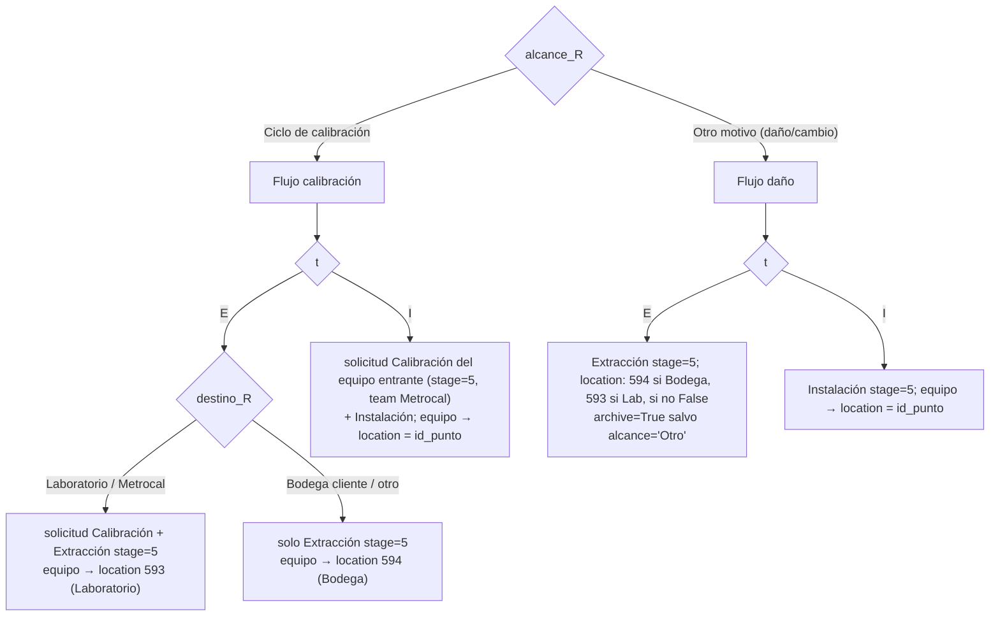
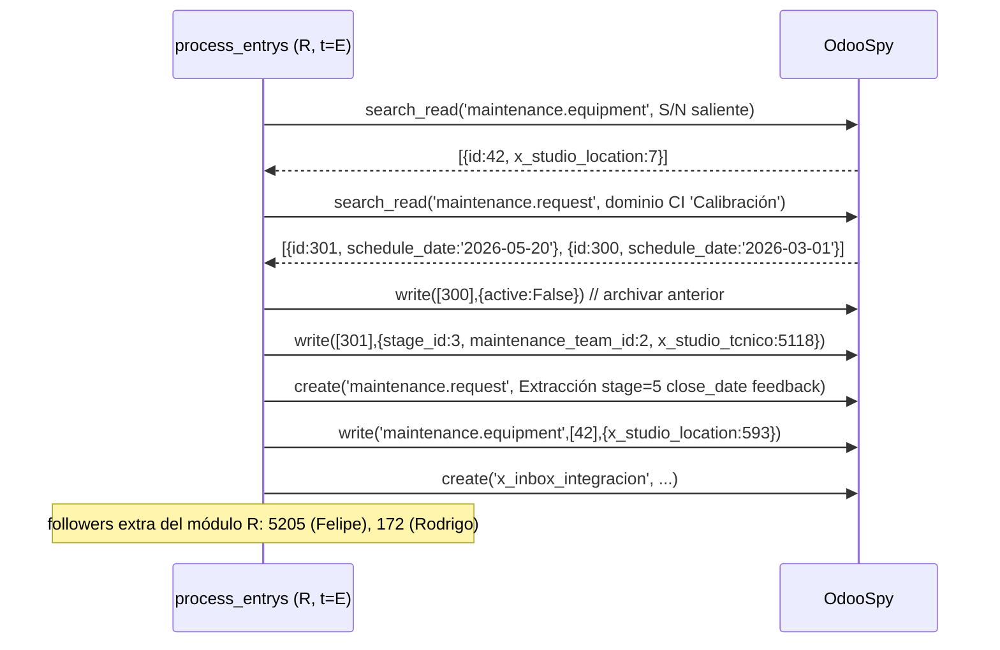

# 06 · Módulo R — Reemplazo / Extracción

> Ref: [processor_documentation §8](../../flows/processor_documentation.md) ·
> `processor.py` L1631-2913. Es el **módulo más complejo**: modelo bifásico (`alcance_R`) × dos subtrabajos (`R_type = ['E','I']`) × subdestinos.
>

IDs de caso: `TC-R-NN`. Prereq: [transversales](03_casos_transversales.md) verdes.
Por su complejidad, **este módulo concentra la mayor densidad de casos**.

---

## 1. Estructura del espacio de pruebas

Un reemplazo es un **par**: la pieza que sale (`t='E'`) y la que entra (`t='I'`). La rama depende de `alcance_R` y, para E, de `destino_R`.



---

## 2. Tabla de combinaciones (matriz de decisión)

| # | alcance_R             | t | destino_R            | Solicitudes Odoo                                                                   | Ubicación final equipo |
| - | --------------------- | - | -------------------- | ---------------------------------------------------------------------------------- | ----------------------- |
| 1 | Ciclo de calibración | E | Laboratorio/Metrocal | Calibración (update o create stage=3, team=2, tec=5118) **+** Extracción stage=5 | `593`                 |
| 2 | Ciclo de calibración | E | Bodega cliente       | solo Extracción stage=5                                                           | `594`                 |
| 3 | Ciclo de calibración | I | —                   | Calibración (del entrante) stage=5 + Instalación stage=5                         | `id_punto`            |
| 4 | Otro motivo           | E | Bodega cliente       | Extracción stage=5                                                                | `594`                 |
| 5 | Otro motivo           | E | Laboratorio/Metrocal | Extracción stage=5                                                                | `593`                 |
| 6 | Otro motivo           | E | (otro/None)          | Extracción stage=5                                                                | `False`               |
| 7 | Otro motivo           | I | —                   | Instalación stage=5                                                               | `id_punto`            |

> **Constantes hardcoded a vigilar (R3):** `593`=Laboratorio, `594`=Bodega cliente,
> `maintenance_team_id=2` (Metrocal), `x_studio_tcnico=5118` (Metrocal). **Difieren
> prod/test** → la capa L3 valida que existan en el test-Odoo.

---

## 3. Secuencia (combinación 1: calibración + E + Laboratorio, con solicitud CI existente)



---

## 4. Matriz de casos

| Caso    | Combinación / precondición                     | Entrada                     | Resultado esperado                                                                                                       | Req                       |
| ------- | ------------------------------------------------ | --------------------------- | ------------------------------------------------------------------------------------------------------------------------ | ------------------------- |
| TC-R-01 | #1 con solicitud Calibración existente (varias) | E, Lab                      | archiva anteriores;`write` la elegida a stage=3+team2+tec5118; `create` Extracción stage=5; equipo→`593`         | REQ-REQSEL-1, REQ-STAGE-1 |
| TC-R-02 | #1 sin solicitud Calibración previa             | E, Lab                      | `create` Calibración stage=3 (team2) **+** `create` Extracción stage=5; equipo→`593`                      | REQ-REQSEL-1              |
| TC-R-03 | #2                                               | E, Bodega cliente           | solo `create` Extracción stage=5; equipo→`594`; **no** crea Calibración                                     | REQ-STAGE-1               |
| TC-R-04 | #3 con Calibración del entrante en proceso      | I                           | `write` Calibración entrante stage=5 (team2, tec Metrocal); `create` Instalación stage=5; equipo→`id_punto`     | REQ-REQSEL-1              |
| TC-R-05 | #3 sin solicitud previa del entrante             | I                           | crea según lógica; equipo→`id_punto` con `assign_date=fecha`                                                      | REQ-REQSEL-1              |
| TC-R-06 | #4                                               | E, Bodega                   | `create` Extracción stage=5; equipo→`594`; `archive=True`                                                        | mapeo                     |
| TC-R-07 | #5                                               | E, Lab                      | Extracción stage=5; equipo→`593`                                                                                     | mapeo                     |
| TC-R-08 | #6                                               | E, alcance='Otro'           | Extracción stage=5; equipo→`False`; **archive NO** (excepción `alcance=='Otro'`)                            | borde                     |
| TC-R-09 | #7                                               | I                           | Instalación stage=5; equipo→`id_punto`                                                                               | mapeo                     |
| TC-R-10 | par completo E+I en una submission               | E e I                       | dos ciclos;**un PDF por par**: `informe_OT-{ot}_{punto}_R_E_1.pdf` y `..._R_I_1.pdf`                           | REQ-PDF-1                 |
| TC-R-11 | followers                                        | cualquier create de request | la solicitud agrega followers `5205` y `172`                                                                         | REQ-INBOX-1               |
| TC-R-12 | `x_studio_tipo_de_trabajo`                     | E / I / Calibración        | escribe literales `'Extracción'` / `'Instalación'` / `'Calibración'` (NO usa `id_mantencion[id]`)             | mapeo                     |
| TC-R-13 | S/N saliente no existe                           | E                           | inbox `'S/N no encontrado'`/`'Creación en espera'`; sin movimiento de ubicación                                    | REQ-VAL-SN-1              |
| TC-R-14 | PDF: R pasa `t` como `trabajo`               | —                          | `informe_pdf_profesional(..., trabajo=t, ...)` con `t∈{'E','I'}`; report_generator mapea a extracción/instalación | REQ-PDF-1                 |

**Campos R:** generales (`R | Tipo equipo/instrumento a reemplazar`, `R | Observación`,
`R | Motivo de reemplazo`) y por subtipo (`R ({t}) | Modelo`, `R ({t}) | N° de serie`,
`R (E) | Destino` solo para E) ([doc §8.2](../../flows/processor_documentation.md)).

---

## 5. Casos negativos

| Caso    | Escenario                 | Aserción negativa                                                                                                         |
| ------- | ------------------------- | -------------------------------------------------------------------------------------------------------------------------- |
| TC-R-N1 | #2 (calibración, E, Lab) | la Extracción se crea**stage=5**, no queda en 3/4 colgado                                                           |
| TC-R-N2 | #3 (t=I)                  | el equipo entrante**no** va a 593/594, va a `id_punto`                                                             |
| TC-R-N3 | alcance='Otro' (E)        | **no** se llama `write active=False` sobre la Extracción                                                          |
| TC-R-N4 | cualquiera                | el `create` de request **no** usa `id_mantencion[id]` (sería 'Reemplazo/Extracción'/'Calibración' equivocado) |

> **Trampas conocidas (de la doc §8.8) que QA debe encapsular en asserts:**
> el filtro `like="{i}.2.{equipo} R"` arrastra columnas `R (E)|`/`R (I)|` (duplicados que
> `to_dict` colapsa); el conteo de prefijos R corta en `R (`. Frágiles ante cambios de
> formulario → TC-TR-42 (conteo) + TC-R-10 (par) son la red de seguridad.

```

```
