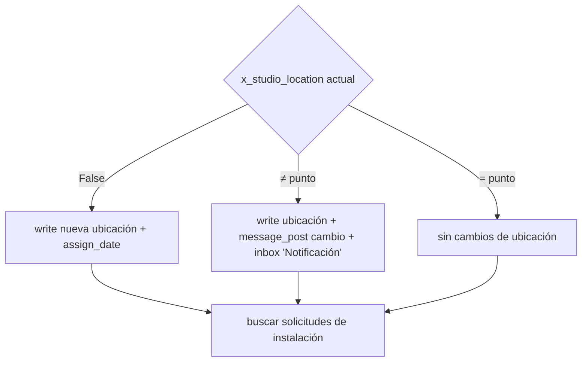
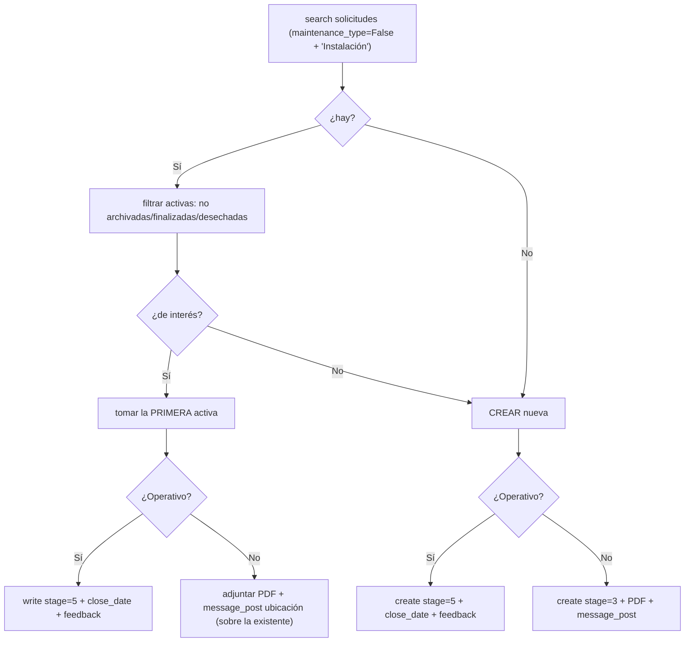

# 07 · Módulo I — Instalación

> Ref: [processor_documentation §9](../../flows/processor_documentation.md) ·
> `processor.py` L2917-3605 · `maintenance_type = False`, mantención `'Instalación'`.
> Particularidad: **único módulo (junto con R) que escribe `x_studio_location`** del equipo,
> y selecciona la **primera solicitud activa** (sin proximidad temporal).
> Itera sobre `I_type = ['I','T']` (Instrumento, Tablero).

IDs de caso: `TC-I-NN`. Prereq: [transversales](03_casos_transversales.md) verdes.

---

## 1. Gestión de ubicación (lo distintivo de I)



## 2. Selección de solicitud (primera activa, NO proximidad)



---

## 3. Matriz de casos

| Caso | Precondición (spy) | Entrada | Resultado esperado | Req |
|------|--------------------|---------|--------------------|-----|
| TC-I-01 | equipo `location=False`; sin solicitudes | t=I, operativo=Sí | `write('maintenance.equipment', loc=id_punto, assign_date=fecha)`; `create` request stage=5 + feedback | REQ-VAL-LOC-1, REQ-STAGE-1 |
| TC-I-02 | equipo `location≠punto`; sin solicitudes | t=I, operativo=Sí | `write` nueva ubicación; `message_post` cambio; inbox `N`; `create` request stage=5 | REQ-VAL-LOC-1 |
| TC-I-03 | equipo `location=punto`; **hay** solicitud activa | t=I, operativo=Sí | **no** reescribe ubicación; `write` la primera activa a stage=5 + feedback | REQ-REQSEL-1 |
| TC-I-04 | hay 2 solicitudes activas | operativo=Sí | toma la **primera** (no la más cercana); solo una `write` | REQ-REQSEL-1 |
| TC-I-05 | sin solicitudes | operativo=No | `create` stage=3 + PDF adjunto + message_post | REQ-STAGE-1, REQ-PDF-1 |
| TC-I-06 | hay solicitud activa | operativo=No | adjunta PDF a la existente + message_post; **no** crea nueva | REQ-PDF-1 |
| TC-I-07 | t=T (Tablero) | operativo=Sí | usa `alcance_I` = campo `Alcance de la intervención`; PDF `..._I_T_1.pdf` | mapeo |
| TC-I-08 | t=I (Instrumento) | — | `alcance_I` hardcoded `'IH \| Habilitación de equipo'`; PDF `..._I_I_1.pdf` | mapeo |
| TC-I-09 | dos equipos (`I (I)` y `I (T)`) en un punto | ambos | dos ciclos; dos PDFs distintos | REQ-PARSE-1 |
| TC-I-10 | S/N no existe | — | inbox `'S/N no encontrado'`/`'Creación en espera'`; **no** escribe ubicación | REQ-VAL-SN-1 |

**Campos I:** `I ({t}) | Modelo`, `I ({t}) | Tipo de {dispositivo/tablero}`,
`I ({t}) | N° de serie`, `I ({t}) | ¿Equipo operativo tras trabajos?`,
`I ({t}) | Observación` ([doc §9.2](../../flows/processor_documentation.md)).

---

## 4. Casos negativos

| Caso | Escenario | Aserción negativa |
|------|-----------|-------------------|
| TC-I-N1 | `location = punto` | **No** se llama `write` sobre `maintenance.equipment` para ubicación |
| TC-I-N2 | hay solicitud activa | **No** se crea request nueva |
| TC-I-N3 | varias activas | **No** se aplica selección por proximidad (debe ser la primera) |

> **Diferencia que QA debe blindar:** I usa *primera activa*, CF/MP/R usan *proximidad*.
> TC-I-04 vs TC-CF-04 son el par que evita que un refactor "unifique" mal las estrategias.
```
