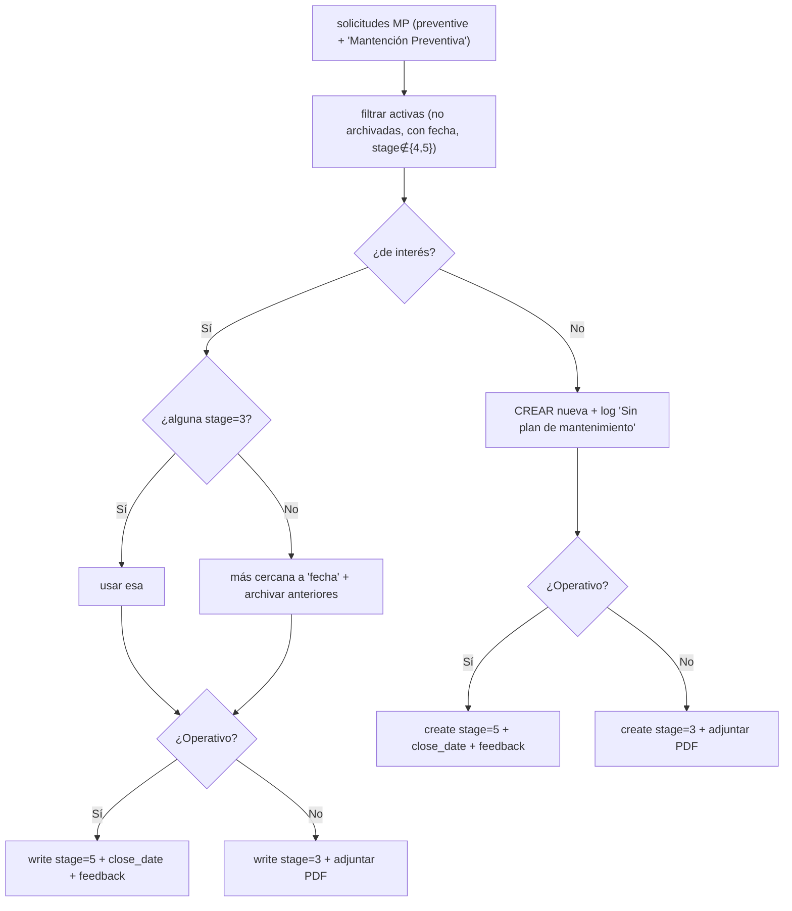

# 08 · Módulo MP — Mantención Preventiva

> Ref: [processor_documentation §10](../../flows/processor_documentation.md) ·
> `processor.py` L3608-4345 · `maintenance_type = preventive`, mantención `'Mantención Preventiva'`.
> Estructura **idéntica a CF** (proximidad temporal + archivado), pero itera sobre
> `MP_type = ['T','I']` (Tablero, Instrumento) y registra "Sin plan de mantenimiento".

IDs de caso: `TC-MP-NN`. Prereq: [transversales](03_casos_transversales.md) verdes.

---

## 1. Diagrama de decisión



---

## 2. Matriz de casos

| Caso | Precondición (spy) | Entrada | Resultado esperado | Req |
|------|--------------------|---------|--------------------|-----|
| TC-MP-01 | sin solicitudes (ni activas ni históricas) | t=I, operativo=Sí | `create` stage=5 + feedback **y** registro en `resumen` con `'Equipo sin plan de mantenimiento en sistema'` | REQ-REQSEL-1, REQ-STAGE-1 |
| TC-MP-02 | 1 solicitud stage=3 | operativo=Sí | `write` esa a stage=5; no archiva ni crea | REQ-REQSEL-1 |
| TC-MP-03 | 3 solicitudes activas, ninguna stage=3 | fecha=hoy | `write` la más cercana a stage=5; archiva anteriores | REQ-REQSEL-1 |
| TC-MP-04 | seleccionada por proximidad | operativo=No | `write` stage=3 + PDF; archivado de anteriores igual | REQ-STAGE-1, REQ-PDF-1 |
| TC-MP-05 | t=T y t=I en mismo punto | ambos | dos ciclos; PDFs `..._MP_T_1.pdf` y `..._MP_I_1.pdf` | REQ-PARSE-1, REQ-PDF-1 |
| TC-MP-06 | S/N no existe | — | inbox correspondiente; sin create de request | REQ-VAL-SN-1 |
| TC-MP-07 | punto no existe | — | inbox `'Punto no existe en sistema'` origen `M` | REQ-VAL-PT-1 |
| TC-MP-08 | "Sin plan" + etiqueta inbox | sin solicitudes | inbox con etiqueta `'MP sin programar'` (`[(4,1)]` prod / `[(4,2)]` test) | REQ-INBOX-1, R3 |

**Campos MP:** `MP ({t}) | Modelo`, `MP ({t}) | {Dispositivo/Tablero} a intervenir`,
`MP ({t}) | N° de serie`, `MP ({t}) | ¿{...} operativo tras trabajos?`,
`MP ({t}) | Observación` ([doc §10.2](../../flows/processor_documentation.md)).

---

## 3. Casos negativos

| Caso | Escenario | Aserción negativa |
|------|-----------|-------------------|
| TC-MP-N1 | hay stage=3 | **No** archiva nada |
| TC-MP-N2 | hay plan/solicitud | **No** registra "Sin plan de mantenimiento" |
| TC-MP-N3 | operativo=Sí | **No** queda stage=3 |

---

## 4. Reutilización de pruebas CF↔MP

Como MP y CF comparten el algoritmo de selección/archivado, los tests de proximidad
(TC-CF-04 / TC-MP-03) deben compartir un **helper paramétrico** en el scaffolding
(misma fábrica de solicitudes, distinto `maintenance_type`/mantención). Así una
regresión en el algoritmo se detecta en ambos módulos sin duplicar lógica de test.

> **Par de regresión clave:** TC-MP-03 (MP usa proximidad) vs TC-I-04 (I usa primera).
> Si alguien "homogeneiza" la selección, uno de los dos debe ponerse rojo.
```
